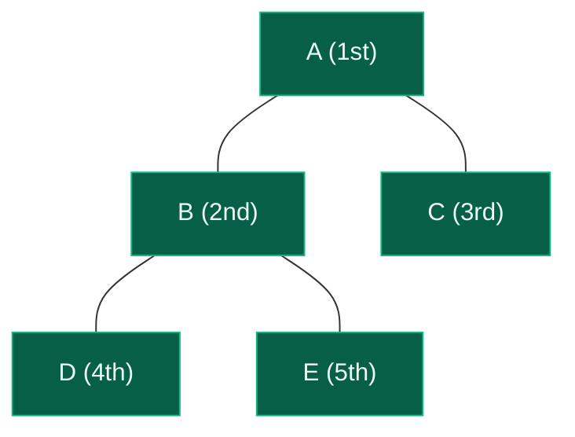
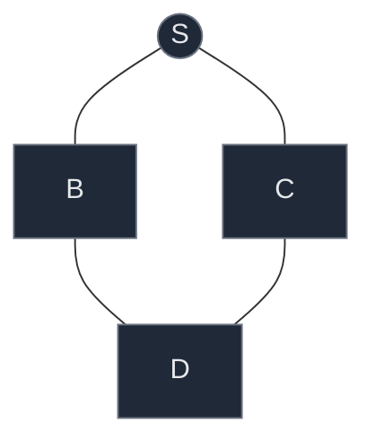
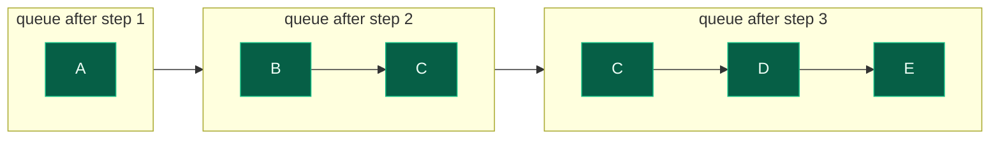

# 03. Breadth First Search

Breadth First Search (BFS) explores a graph level by level: visit the source, then everyone one edge away, then everyone two edges away, and so on. The mechanism that makes this happen is a queue — first in, first out — paired with a `visited` structure that stops a graph's cycles from turning a traversal into an infinite loop. Once the queue-and-visited pattern is comfortable here, it reappears almost unchanged in shortest-path-in-unweighted-graph problems, multi-source BFS, rotten oranges, word ladder, and level-order tree traversal.

## 1. The Core Idea

Take a small graph with five nodes:



Starting BFS at `A`, the adjacency list is `A: [B, C]`, `B: [A, D, E]`, `C: [A]`, `D: [B]`, `E: [B]`. BFS visits `A` first (distance 0), then everything one edge away — `B` and `C` (distance 1) — before touching anything two edges away — `D` and `E` (distance 2). The traversal order is `A, B, C, D, E`.

```text
Level 0:   A
Level 1:   B   C
Level 2:   D   E
```

Nothing at level 2 is ever visited before level 1 finishes. That guarantee — finish the current distance before starting the next — is the entire definition of "breadth first."

## 2. Why a Queue (not a Stack)

BFS needs FIFO behavior: whichever node was *discovered* first should be *processed* first, because that node belongs to an earlier (or equal) level than anything discovered after it.

```text
FRONT                REAR
  |                    |
[ B ][ C ][ D ][ E ]
```

Walk it through on the same graph:

```text
queue = [A]                 -> pop A, discover B, C
queue = [B, C]               -> pop B, discover D, E
queue = [C, D, E]            -> pop C, nothing new (A already visited)
queue = [D, E]                -> pop D, nothing new (B already visited)
queue = [E]                    -> pop E, nothing new (B already visited)
queue = []                      -> done
```

Notice `C` — a level-1 node — sits in the queue ahead of `D` and `E` — level-2 nodes — purely because it was discovered first. A stack (LIFO) would instead pop the most recently discovered node next, which would dive toward one branch before finishing the current level — that is DFS's behavior, not BFS's. The queue is what turns "discovery order" into "level order" for free.

## 3. The Visited Array — Why It Is Essential

Graphs, unlike trees, can have cycles and multiple paths between the same two nodes. Without tracking which nodes have already been discovered, the same node can be pushed into the queue repeatedly, and a cyclic graph can make BFS loop forever.

There is also a subtler rule: **mark a node visited the moment it is discovered (pushed), not when it is later popped and processed.** Consider a diamond shape where both `B` and `C` point to a shared node `D`:



If `visited[D]` is only set when `D` is popped, both `B` and `C` — processed one after another while `D` is still waiting in the queue — will each see `D` as "unvisited" and push it again, producing a duplicate:

```text
Wrong (mark on pop):
  process B -> sees D unvisited -> queue = [C, D]
  process C -> sees D unvisited (not marked yet!) -> queue = [D, D]   # duplicate

Correct (mark on push):
  process B -> mark D visited, queue = [C, D]
  process C -> D already visited -> queue = [D]                       # no duplicate
```

Think of it as "reserve the seat when you book the ticket, not after the journey is complete."

## 4. Algorithm and Code

```text
queue.push(start)
visited[start] = True
while queue is not empty:
    node = queue.pop_front()
    process(node)
    for neighbour in adjacency[node]:
        if neighbour not visited:
            visited[neighbour] = True
            queue.push(neighbour)
```

```python
from collections import deque


def bfs(graph, start):
    # Track every vertex discovered so far to avoid revisiting it.
    visited = {start}
    # deque gives O(1) append and O(1) popleft, unlike a plain list.
    queue = deque([start])
    # Collect vertices in the order BFS discovers and processes them.
    traversal = []

    while queue:
        # Remove the vertex waiting longest at the front of the queue.
        node = queue.popleft()
        traversal.append(node)
        # Look at every neighbour of the current vertex.
        for neighbour in graph[node]:
            # Only queue a neighbour the first time it is discovered.
            if neighbour not in visited:
                visited.add(neighbour)
                queue.append(neighbour)

    return traversal
```

A common beginner mistake is using a plain Python list with `queue.pop(0)` instead of `deque.popleft()`. `pop(0)` has to shift every remaining element left, costing `O(n)` per removal, which can degrade an entire BFS toward `O(V^2 + E)`. `deque` supports `append` and `popleft` in `O(1)`, which is what keeps BFS at `O(V + E)`.

## 5. Dry Run on a Worked Example

Using the same five-node graph (`A: [B, C]`, `B: [A, D, E]`, `C: [A]`, `D: [B]`, `E: [B]`), starting BFS at `A`:

| Step | Pop | Discover | Queue after | Visited |
|:---|:---|:---|:---|:---|
| 1 | — | — | [A] | \{A\} |
| 2 | A | B, C | [B, C] | \{A, B, C\} |
| 3 | B | D, E | [C, D, E] | \{A, B, C, D, E\} |
| 4 | C | — (A visited) | [D, E] | same |
| 5 | D | — (B visited) | [E] | same |
| 6 | E | — (B visited) | [] | same |

Final traversal: `A, B, C, D, E`.



## 6. BFS on a Grid (4-directional)

A grid is simply a graph in disguise: every cell `(r, c)` is a node, and its neighbours are the (up to) four cells reachable by moving one step up, down, left, or right.

```text
(r-1, c)
    |
(r, c-1) -- (r, c) -- (r, c+1)
    |
(r+1, c)
```

The BFS mechanism is unchanged — queue, visited, neighbours — only the neighbour-generation step differs: instead of reading an adjacency list, generate the four (or fewer, near the edges) candidate coordinates and skip any that fall outside the grid or are already visited or blocked. This is exactly the setup needed later in this topic for flood fill, number of islands, rotten oranges, and shortest-path-in-a-matrix problems.

```python
from collections import deque


def bfs_grid(grid, start_r, start_c):
    rows, cols = len(grid), len(grid[0])
    visited = {(start_r, start_c)}
    queue = deque([(start_r, start_c)])
    order = []

    while queue:
        r, c = queue.popleft()
        order.append((r, c))
        # Four cardinal directions: up, down, left, right.
        for dr, dc in ((-1, 0), (1, 0), (0, -1), (0, 1)):
            nr, nc = r + dr, c + dc
            in_bounds = 0 <= nr < rows and 0 <= nc < cols
            if in_bounds and (nr, nc) not in visited and grid[nr][nc] != 1:
                visited.add((nr, nc))
                queue.append((nr, nc))

    return order
```

## 7. Time and Space Complexity

With an adjacency list:

- **Vertex work:** each vertex is pushed into the queue at most once (guaranteed by `visited`), so total vertex processing is `O(V)`.
- **Edge work:** every vertex's adjacency list is scanned once when that vertex is processed. For an undirected graph, each edge appears in two adjacency lists, contributing `2E` total neighbour checks — still `O(E)`.
- **Total time:** `O(V + E)`.
- **Auxiliary space:** `visited`, `queue`, and the output list can each hold up to `V` entries, so `O(V)`. Including the graph representation itself brings it to `O(V + E)`.

If the graph is stored as an **adjacency matrix** instead, finding a vertex's neighbours means scanning an entire row of length `V`, for every one of the `V` vertices — `O(V^2)` — regardless of how sparse the actual graph is.

| Representation | BFS time | Extra space for the graph |
|:---|:---|:---|
| Adjacency list | O(V + E) | O(V + E) |
| Adjacency matrix | O(V^2) | O(V^2) |

## 8. Common Mistakes

| Mistake | Why it breaks | Fix |
|:---|:---|:---|
| Marking visited on pop instead of on push | A node can be enqueued multiple times before it is first processed | Mark `visited[neighbour] = True` at the moment it is pushed |
| Using `list.pop(0)` for the queue | Each removal shifts all remaining elements, `O(n)` per pop | Use `collections.deque` with `popleft()` |
| Forgetting `visited` entirely | Cycles cause nodes to be re-enqueued forever | Always track discovered nodes before pushing |
| Running BFS once on a disconnected graph | Only the starting node's component gets visited | Loop over all vertices, calling BFS from every unvisited one |
| Assuming BFS gives one fixed traversal order | Nodes at the same level can be visited in either order depending on adjacency-list ordering | Only the level grouping is guaranteed, not intra-level order |
| Assuming BFS works the same on a weighted graph | BFS's shortest-path guarantee only holds when every edge has equal weight (1) | Use Dijkstra's algorithm for weighted shortest paths |

## 9. Try It Yourself

```python
from collections import deque


def bfs(graph, start):
    visited = {start}
    queue = deque([start])
    traversal = []
    while queue:
        node = queue.popleft()
        traversal.append(node)
        for neighbour in graph[node]:
            if neighbour not in visited:
                visited.add(neighbour)
                queue.append(neighbour)
    return traversal


def bfs_full_graph(graph):
    # Handles disconnected graphs by restarting BFS from every unvisited vertex.
    visited = set()
    traversal = []
    for start in graph:
        if start not in visited:
            visited.add(start)
            queue = deque([start])
            while queue:
                node = queue.popleft()
                traversal.append(node)
                for neighbour in graph[node]:
                    if neighbour not in visited:
                        visited.add(neighbour)
                        queue.append(neighbour)
    return traversal


def bfs_grid(grid, start_r, start_c):
    rows, cols = len(grid), len(grid[0])
    visited = {(start_r, start_c)}
    queue = deque([(start_r, start_c)])
    order = []
    while queue:
        r, c = queue.popleft()
        order.append((r, c))
        for dr, dc in ((-1, 0), (1, 0), (0, -1), (0, 1)):
            nr, nc = r + dr, c + dc
            in_bounds = 0 <= nr < rows and 0 <= nc < cols
            if in_bounds and (nr, nc) not in visited and grid[nr][nc] != 1:
                visited.add((nr, nc))
                queue.append((nr, nc))
    return order


# The shared example graph: A: [B, C], B: [A, D, E], C: [A], D: [B], E: [B]
graph = {
    "A": ["B", "C"],
    "B": ["A", "D", "E"],
    "C": ["A"],
    "D": ["B"],
    "E": ["B"],
}
assert bfs(graph, "A") == ["A", "B", "C", "D", "E"]

# Disconnected graph: two separate components
disconnected = {0: [1, 2], 1: [0], 2: [0], 3: [4], 4: [3]}
assert bfs_full_graph(disconnected) == [0, 1, 2, 3, 4]

# 4-directional grid BFS from the top-left corner, 1 = wall
grid = [
    [0, 0, 1],
    [0, 1, 0],
    [0, 0, 0],
]
order = bfs_grid(grid, 0, 0)
assert order[0] == (0, 0)
assert (1, 1) not in order  # wall cell is never visited
assert set(order) == {(0, 0), (1, 0), (0, 1), (2, 0), (2, 1), (2, 2), (1, 2)}

print("All tests passed")
```
