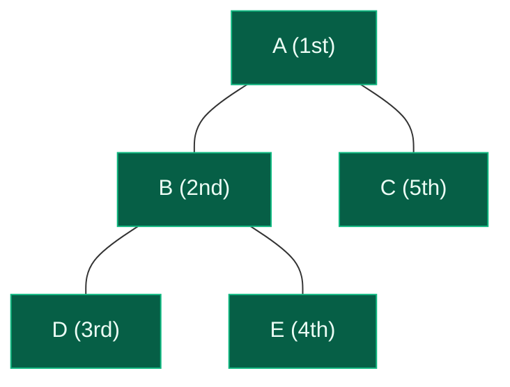
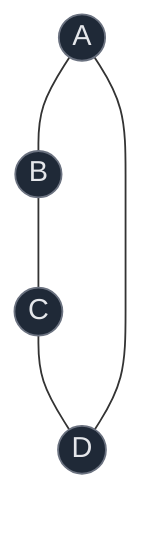
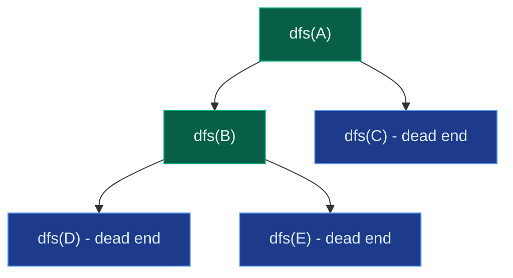

# 04. Depth First Search

Depth First Search (DFS) explores a graph the opposite way BFS does: pick a neighbour, go as deep as possible along that path, and only turn back — backtrack — once there is nowhere new left to go. Where BFS's mechanism is a queue, DFS's mechanism is a stack, whether that stack is an explicit data structure or the implicit call stack behind a recursive function. The same `visited` discipline from BFS is still essential, and the same small graph makes the contrast between the two traversals easy to see directly.

## 1. The Core Idea

Using the identical graph from the BFS note — `A: [B, C]`, `B: [A, D, E]`, `C: [A]`, `D: [B]`, `E: [B]` — DFS starting at `A` picks the first neighbour, `B`, dives into `B`'s first unvisited neighbour, `D`, hits a dead end (D's only neighbour, `B`, is already visited), backtracks to `B`, takes its next neighbour, `E`, hits another dead end, backtracks all the way to `A`, and finally visits `C`.



Traversal order: `A, B, D, E, C` — compare this against BFS's `A, B, C, D, E` on the exact same graph. BFS finished the whole first level (`B`, `C`) before touching level two. DFS instead rode the `B` branch all the way to its leaves (`D`, `E`) before ever reaching `C`.

```text
DFS:  A -> B -> D  (dead end, D's only neighbour is visited)
           backtrack to B -> E  (dead end)
      backtrack to B -> nothing left
      backtrack to A -> C  (dead end)
      done
```

## 2. Recursive vs Iterative (explicit stack) DFS

**Recursive DFS** relies on the language's own call stack — every recursive call is implicitly pushed, and returning from it is implicitly a pop:

```text
TOP
+----------+
| dfs(E)   |
+----------+
| dfs(B)   |
+----------+
| dfs(A)   |
+----------+
BOTTOM
```

**Iterative DFS** makes that stack explicit with a list or `collections.deque` used as a stack (`append`/`pop` from the same end):

```python
def dfs_iterative(graph, start):
    visited = {start}
    stack = [start]
    traversal = []
    while stack:
        node = stack.pop()
        traversal.append(node)
        # Push in reverse so the first-listed neighbour is popped (and thus visited) first,
        # matching the order recursive DFS would naturally take.
        for neighbour in reversed(graph[node]):
            if neighbour not in visited:
                visited.add(neighbour)
                stack.append(neighbour)
    return traversal
```

Reversing the neighbour order matters: a stack is LIFO, so whatever is pushed *last* is popped *first*. Pushing neighbours in their natural left-to-right order would cause the *last* neighbour to be explored first — the opposite of what recursive DFS does by calling itself on the first neighbour immediately.

Both styles compute the same thing; the difference is purely about where the "pending work" stack lives.

| Feature | Recursive DFS | Iterative DFS |
|:---|:---|:---|
| Stack | Language call stack | Explicit list/deque |
| Code | Short, elegant | Slightly longer |
| Very deep graphs | Risk of stack overflow / `RecursionError` | Safer — bounded only by available memory |
| Time complexity | O(V + E) | O(V + E) |

## 3. The Visited Array — Why It Is Essential

Exactly as with BFS, a graph can contain cycles, and DFS without a `visited` check will walk in circles forever:



Without `visited`, `dfs(A) -> dfs(B) -> dfs(C) -> dfs(D) -> dfs(A) -> ...` never terminates. The fix is the same rule as BFS: **mark a node visited the instant DFS enters it**, before exploring any of its neighbours.

```python
def dfs(node, graph, visited):
    visited[node] = True          # mark immediately on entry
    for neighbour in graph[node]:
        if not visited[neighbour]:
            dfs(neighbour, graph, visited)
```

Delaying the mark until after the neighbour loop (or forgetting it) reopens the door to infinite recursion on any cyclic graph.

## 4. Algorithm and Code

```text
dfs(node):
    mark node visited
    process(node)
    for neighbour in adjacency[node]:
        if neighbour not visited:
            dfs(neighbour)
```

```python
def dfs(graph, node, visited, traversal):
    # Mark the current node visited the moment DFS enters it.
    visited.add(node)
    traversal.append(node)
    # Explore every neighbour of the current node.
    for neighbour in graph[node]:
        # Go deeper only into neighbours DFS has not already discovered.
        if neighbour not in visited:
            dfs(graph, neighbour, visited, traversal)


def dfs_traversal(graph, start):
    visited = set()
    traversal = []
    dfs(graph, start, visited, traversal)
    return traversal
```

The mental skeleton, worth memorizing over the exact syntax: **mark, process, recurse on unvisited neighbours.**

## 5. Dry Run on a Worked Example

Same graph: `A: [B, C]`, `B: [A, D, E]`, `C: [A]`, `D: [B]`, `E: [B]`. Starting at `A`:

```text
dfs(A)                     visited={A}          traversal=[A]
  dfs(B)                   visited={A,B}        traversal=[A,B]
    dfs(D)                 visited={A,B,D}      traversal=[A,B,D]
      (D's only neighbour B is visited) -> return
    (back in B, next neighbour E)
    dfs(E)                 visited={A,B,D,E}    traversal=[A,B,D,E]
      (E's only neighbour B is visited) -> return
    (back in B, no neighbours left) -> return
  (back in A, next neighbour C)
  dfs(C)                   visited={A,B,D,E,C}  traversal=[A,B,D,E,C]
    (C's only neighbour A is visited) -> return
(back in A, no neighbours left) -> return
```

Final traversal: `A, B, D, E, C`.



The recursion tree above is literally the shape of the call stack over time — `dfs(D)` and `dfs(E)` are both children of `dfs(B)`, and each returns (pops) before its sibling starts.

## 6. DFS on a Grid (4-directional)

A grid is a graph exactly as it was for BFS — each cell `(r, c)` is a node with up to four neighbours (up, down, left, right) — only the *order* of exploration changes, since DFS commits to one direction and rides it out before trying the next.

```python
def dfs_grid(grid, r, c, visited, order):
    rows, cols = len(grid), len(grid[0])
    visited.add((r, c))
    order.append((r, c))
    for dr, dc in ((-1, 0), (1, 0), (0, -1), (0, 1)):
        nr, nc = r + dr, c + dc
        in_bounds = 0 <= nr < rows and 0 <= nc < cols
        if in_bounds and (nr, nc) not in visited and grid[nr][nc] != 1:
            dfs_grid(grid, nr, nc, visited, order)
```

This recursive flood-fill pattern is the direct basis for number-of-islands, flood fill, and surrounded-regions problems later in this topic — each one is "run DFS from a cell, mark everything reachable, count how many separate runs it takes to cover the whole grid."

## 7. BFS vs DFS — When Each Is Preferred

| Property | BFS | DFS |
|:---|:---|:---|
| Data structure | Queue | Stack / recursion |
| Exploration pattern | Level by level | One path at a time, then backtrack |
| Shortest path (unweighted graph) | Yes — guaranteed | No — first discovery is not necessarily shortest |
| Typical use cases | Shortest path, level-order processing, multi-source spread | Connected components, cycle detection, topological sort, backtracking |
| Memory pattern on a wide graph | Can hold many nodes in the queue at once | Usually holds one path's worth of nodes |

The reason DFS cannot promise shortest paths: it can dive down a long path to a target before ever trying a much shorter path that happens to sit later in some node's adjacency list. BFS's level-by-level guarantee is precisely what DFS gives up in exchange for simple, stack-based backtracking — which is why DFS instead powers backtracking-style problems (permutations, subsets, path existence) where "explore fully, then undo" is the actual goal.

## 8. Time and Space Complexity

With an adjacency list, the argument mirrors BFS exactly:

- **Vertex work:** `visited` guarantees each vertex is entered at most once — `O(V)`.
- **Edge work:** each vertex's adjacency list is scanned once; across an undirected graph every edge is counted twice — `O(E)`.
- **Total time:** `O(V + E)`.
- **Auxiliary space:** `visited` and the output traversal are each `O(V)`. The recursion stack (or explicit stack) can hold up to `V` frames in the worst case — a straight chain graph `0 - 1 - 2 - ... - (V-1)` recurses `V` deep — so recursion-stack space is also `O(V)`. Including the adjacency-list storage itself: `O(V + E)`.

| Representation | DFS time | Extra space for the graph |
|:---|:---|:---|
| Adjacency list | O(V + E) | O(V + E) |
| Adjacency matrix | O(V^2) (scanning a full row per vertex) | O(V^2) |

A practical warning specific to recursive DFS: Python's default recursion limit (commonly 1000) can be hit on a long chain-shaped graph well before `V` gets astronomically large, raising `RecursionError`. Iterative DFS with an explicit stack sidesteps this entirely.

## 9. Common Mistakes

| Mistake | Why it breaks | Fix |
|:---|:---|:---|
| Forgetting `visited` | Cyclic graphs cause infinite recursion | Mark every node visited the moment DFS enters it |
| Marking visited too late (after the neighbour loop) | A node can be re-entered before it is marked, on some graph shapes | Mark immediately on entry, before recursing on neighbours |
| Running DFS once on a disconnected graph | Only the starting node's component gets visited | Loop over all vertices, calling DFS from every unvisited one |
| Assuming DFS gives shortest path | DFS can discover a target through a long path before a short one | Use BFS when the shortest path in an unweighted graph is required |
| Pushing neighbours in the wrong order for iterative DFS | Produces a different (still valid, but confusing) order than the equivalent recursive DFS | Push neighbours in `reversed()` order when using an explicit stack |
| Deep recursion on a long chain graph | Python's recursion limit raises `RecursionError` before completion | Use iterative DFS, or raise `sys.setrecursionlimit` cautiously |

## 10. Try It Yourself

```python
import sys


def dfs(graph, node, visited, traversal):
    visited.add(node)
    traversal.append(node)
    for neighbour in graph[node]:
        if neighbour not in visited:
            dfs(graph, neighbour, visited, traversal)
    return traversal


def dfs_traversal(graph, start):
    return dfs(graph, start, set(), [])


def dfs_iterative(graph, start):
    visited = {start}
    stack = [start]
    traversal = []
    while stack:
        node = stack.pop()
        traversal.append(node)
        for neighbour in reversed(graph[node]):
            if neighbour not in visited:
                visited.add(neighbour)
                stack.append(neighbour)
    return traversal


def dfs_full_graph(graph):
    # Handles disconnected graphs by restarting DFS from every unvisited vertex.
    visited = set()
    traversal = []
    for start in graph:
        if start not in visited:
            dfs(graph, start, visited, traversal)
    return traversal


def dfs_grid(grid, r, c, visited=None, order=None):
    if visited is None:
        visited, order = set(), []
    rows, cols = len(grid), len(grid[0])
    visited.add((r, c))
    order.append((r, c))
    for dr, dc in ((-1, 0), (1, 0), (0, -1), (0, 1)):
        nr, nc = r + dr, c + dc
        in_bounds = 0 <= nr < rows and 0 <= nc < cols
        if in_bounds and (nr, nc) not in visited and grid[nr][nc] != 1:
            dfs_grid(grid, nr, nc, visited, order)
    return order


# The same shared example graph used in the BFS note.
graph = {
    "A": ["B", "C"],
    "B": ["A", "D", "E"],
    "C": ["A"],
    "D": ["B"],
    "E": ["B"],
}
assert dfs_traversal(graph, "A") == ["A", "B", "D", "E", "C"]
assert dfs_iterative(graph, "A") == ["A", "B", "D", "E", "C"]

# BFS visited A,B,C,D,E in that order; DFS visited A,B,D,E,C -- same graph, different order.
bfs_order = ["A", "B", "C", "D", "E"]
dfs_order = dfs_traversal(graph, "A")
assert bfs_order != dfs_order
assert set(bfs_order) == set(dfs_order)

# Disconnected graph: two separate components
disconnected = {0: [1, 2], 1: [0], 2: [0], 3: [4], 4: [3]}
assert dfs_full_graph(disconnected) == [0, 1, 2, 3, 4]

# 4-directional grid DFS from the top-left corner, 1 = wall
grid = [
    [0, 0, 1],
    [0, 1, 0],
    [0, 0, 0],
]
order = dfs_grid(grid, 0, 0)
assert order[0] == (0, 0)
assert (1, 1) not in order  # wall cell is never visited
assert set(order) == {(0, 0), (1, 0), (0, 1), (2, 0), (2, 1), (2, 2), (1, 2)}

# A long chain can overflow Python's default recursion limit -- a real DFS caveat.
chain = {i: [i + 1] for i in range(1500)}
chain[1500] = []
try:
    sys.setrecursionlimit(500)  # deliberately too small for the chain
    dfs_traversal(chain, 0)
    assert False, "should never reach here"
except RecursionError:
    pass
finally:
    sys.setrecursionlimit(3000)

print("All tests passed")
```
