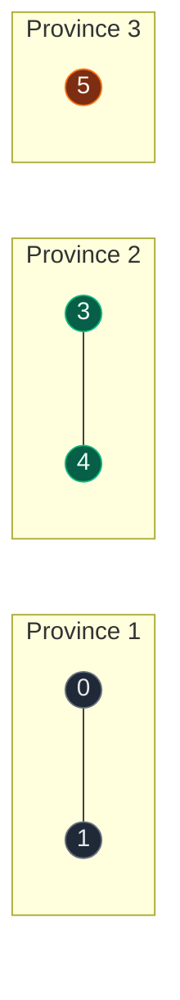
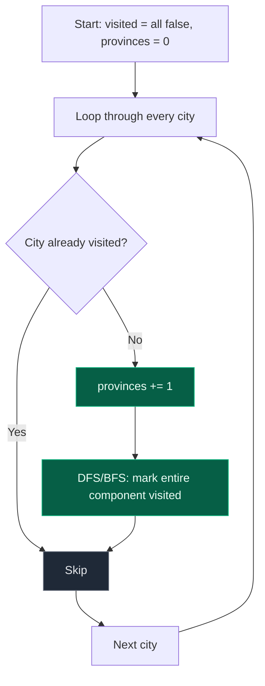

# 01. 547. Number of Provinces

| Difficulty | Pattern | Source | Time | Space |
|:---:|:---:|:---:|:---:|:---:|
| **Medium** | Connected Components (BFS/DFS) | [547. Number of Provinces](https://leetcode.com/problems/number-of-provinces/) | `O(n^2)` | `O(n)` |

## 1. Problem Statement

There are `n` cities. Some of them are directly connected, others are not. If city `a` is directly connected to city `b`, and city `b` is directly connected to city `c`, then city `a` is indirectly connected to city `c`.

A **province** is a group of directly or indirectly connected cities, with no other cities outside the group.

Given an `n x n` matrix `isConnected` where `isConnected[i][j] = 1` if the `i`th city and the `j`th city are directly connected, and `isConnected[i][j] = 0` otherwise, return the total number of **provinces**.

### Examples

```text
Input:  isConnected = [[1,1,0],[1,1,0],[0,0,1]]
Output: 2

Input:  isConnected = [[1,0,0],[0,1,0],[0,0,1]]
Output: 3
```

### Constraints

- `1 <= n <= 200`
- `n == isConnected.length`
- `n == isConnected[i].length`
- `isConnected[i][j]` is `1` or `0`
- `isConnected[i][i] == 1`
- `isConnected[i][j] == isConnected[j][i]`

## 2. Core Theory

The first move is a translation, and it is the whole problem: **"province" means "connected component"**. The input just happens to arrive as an adjacency **matrix** instead of an edge list or an adjacency list.

```text
Matrix problem
      ↓
Think of a graph
      ↓
Connected Components
      ↓
DFS/BFS
```

Once you see it that way, the algorithm is the generic connected-components template: loop over every node, and whenever you find one that has not been visited yet, that unvisited node is proof that no previously-explored component could reach it — so it must be the start of a brand-new component. Run BFS or DFS from it, mark everything reachable, and increment the counter once per fresh start.

```python
for city in range(n):
    if not visited[city]:
        provinces += 1
        dfs(city)          # or bfs(city)
```

**Reading the matrix as a graph.** `isConnected[i][j] == 1` means city `i` and city `j` share a direct edge. Two structural facts about this matrix matter:

- The diagonal is always `1` (`isConnected[i][i] == 1`) — a city is trivially connected to itself. This self-loop is irrelevant to the province count and is normally skipped when generating neighbours.
- The matrix is **symmetric** (`isConnected[i][j] == isConnected[j][i]`) because the graph is undirected — an edge from `i` to `j` is the same edge as `j` to `i`.

**Two ways to get the neighbours of a city.** The tutor material builds an explicit adjacency list first (scan the whole matrix once, and for every `i != j` with `isConnected[i][j] == 1`, append `j` to `graph[i]`), then runs BFS on that list. That is a fine way to *learn* the transformation, but it costs an extra `O(n^2)` of storage in the worst (dense) case. Since the matrix **already is** a valid adjacency structure — `isConnected[city]` is exactly the row of neighbours for `city` — the cleaner solution skips building the list at all and scans the row directly inside DFS/BFS. Both are shown below.

**Why counting happens outside the traversal, not inside it.** A common misread is to increment the counter for every node DFS visits. That would count *cities*, not *groups*. The counter must increase only when the outer loop finds an unvisited node — i.e., only once per fresh DFS/BFS start:

```text
Every fresh DFS/BFS start
        =
One connected component
        =
One province
```





**Union-Find as the classic alternative.** Instead of traversal, you can process every `isConnected[i][j] == 1` pair as a "union" operation on a disjoint-set structure, then count the number of distinct roots at the end. It reaches the same `O(n^2)` time (you still must scan the matrix) but with near-`O(n)` extra space and near-constant-time unions/finds. Union-Find is covered as its own topic later — for this problem, DFS/BFS on the matrix is simpler to write and just as asymptotically optimal, so that is the recommended interview answer here.

## 3. Edge Cases

| Case | Input | Expected | Why it matters |
|:---|:---|:---:|:---|
| Single city | `[[1]]` | `1` | Loop body runs once, no neighbours to scan |
| All connected | `[[1,1,1],[1,1,1],[1,1,1]]` | `1` | One DFS/BFS swallows every city |
| None connected (besides self) | `[[1,0,0],[0,1,0],[0,0,1]]` | `3` | Every city starts its own province |
| Chain (indirect connectivity) | `[[1,1,0],[1,1,1],[0,1,1]]` | `1` | City 0 and city 2 are only indirectly connected through city 1, but still one province |
| Already-visited neighbour | any matrix with a cycle, e.g. `[[1,1,1],[1,1,1],[1,1,1]]` | matches component count | Visited check must prevent re-traversal/infinite loop |

## 4. Approach 1 — Matrix to Adjacency List, then BFS

### Intuition

This is the most explicit way to see the transformation: physically build a graph representation from the matrix, then run standard BFS on it, counting how many times a fresh BFS has to start.

### Approach

1. Scan the full matrix once. For every `i != j` with `isConnected[i][j] == 1`, append `j` to `graph[i]` (self-loops on the diagonal are skipped — they never help distinguish components).
2. Keep a `visited` set shared across the whole run.
3. Loop over every city. If it is unvisited, increment `provinces` and run BFS from it, marking every reachable city visited.
4. Return `provinces`.

### Dry Run

```text
isConnected = [[1,1,0],[1,1,0],[0,0,1]]

adjacency list:
0 -> [1]
1 -> [0]
2 -> []

visited = {}, provinces = 0

node 0: unvisited -> BFS(0) visits {0,1} -> visited = {0,1}, provinces = 1
node 1: already visited -> skip
node 2: unvisited -> BFS(2) visits {2}    -> visited = {0,1,2}, provinces = 2

answer = 2
```

### Code

```python
# Define the class solution
from collections import deque


class Solution:

    # Build an adjacency list from the connectivity matrix
    def build_adj_list(self, isConnected):
        # Number of cities
        n = len(isConnected)
        # Create an empty neighbour list for every city
        graph = {i: [] for i in range(n)}
        # Examine every matrix row
        for i in range(n):
            # Examine every matrix column
            for j in range(n):
                # Ignore self-connections, keep real edges
                if i != j and isConnected[i][j] == 1:
                    graph[i].append(j)
        return graph

    # BFS that consumes one entire connected component
    def bfs(self, graph, visited, start):
        # Create BFS queue and seed it with the starting city
        queue = deque([start])
        # Mark starting city visited immediately
        visited.add(start)
        # Explore this connected component fully
        while queue:
            node = queue.popleft()
            for neighbour in graph[node]:
                if neighbour not in visited:
                    visited.add(neighbour)
                    queue.append(neighbour)

    # Define the method
    def findCircleNum(self, isConnected):
        # Convert matrix into adjacency list
        graph = self.build_adj_list(isConnected)
        # Cities already assigned to a discovered province
        visited = set()
        # Count connected components
        provinces = 0
        # Examine every city
        for node in graph:
            # An unvisited city starts a completely new province
            if node not in visited:
                self.bfs(graph, visited, node)
                provinces += 1
        return provinces
```

### Complexity

| Measure | Complexity | Why |
|:---|:---:|:---|
| **Time** | `O(n^2)` | Building the adjacency list scans the whole `n x n` matrix; BFS over the resulting graph is `O(V + E)`, and `E` can itself be up to `O(n^2)` for a dense matrix |
| **Space** | `O(n^2)` | The adjacency list can store up to `O(n^2)` edges in the worst (fully-connected) case, plus `O(n)` for `visited` and the queue |

## 5. Approach 2 (Optimal) — DFS/BFS Directly on the Matrix

### Intuition

The matrix is already a valid graph representation. `isConnected[city]` is the row of neighbours for `city` — there is no need to copy it into a separate adjacency list. Scan the row directly during traversal instead.

### Approach

1. Keep a `visited` boolean array of size `n` and a `provinces` counter.
2. For each city, if unvisited, increment `provinces` and run DFS (or BFS) from it.
3. Inside the traversal, treat `isConnected[city][neighbour] == 1` as "there is an edge from `city` to `neighbour`" and recurse/enqueue into unvisited neighbours.
4. Return `provinces`.

### Dry Run

```text
isConnected =
      0 1 2 3 4 5
0     1 1 1 0 0 0
1     1 1 0 0 0 0
2     1 0 1 0 0 0
3     0 0 0 1 1 0
4     0 0 0 1 1 0
5     0 0 0 0 0 1

visited = [F,F,F,F,F,F], provinces = 0

city 0: unvisited -> provinces = 1
  dfs(0): visited[0]=T
    row 0 -> city 1 unvisited -> dfs(1): visited[1]=T (no new neighbours)
    row 0 -> city 2 unvisited -> dfs(2): visited[2]=T (no new neighbours)
  visited = [T,T,T,F,F,F]

city 1: visited -> skip
city 2: visited -> skip

city 3: unvisited -> provinces = 2
  dfs(3): visited[3]=T
    row 3 -> city 4 unvisited -> dfs(4): visited[4]=T
  visited = [T,T,T,T,T,F]

city 4: visited -> skip

city 5: unvisited -> provinces = 3
  dfs(5): visited[5]=T
  visited = [T,T,T,T,T,T]

answer = 3
```

The DFS calls form a **forest**, not a single tree — one tree per province:

```text
DFS(0)          DFS(3)          DFS(5)
├── DFS(1)      └── DFS(4)
└── DFS(2)

3 roots = 3 provinces
```

### Code

```python
# Define the class solution
class Solution:

    # Define the method
    def findCircleNum(self, isConnected: list) -> int:

        # Number of cities
        n = len(isConnected)

        # Track whether each city already belongs to a discovered province
        visited = [False] * n

        # Count connected components
        provinces = 0

        # Define DFS traversal directly on the matrix row
        def dfs(city):
            # Mark the current city as discovered
            visited[city] = True
            # Scan the full row: every column is a candidate neighbour
            for neighbour in range(n):
                # A direct connection to an undiscovered city continues the DFS
                if isConnected[city][neighbour] == 1 and not visited[neighbour]:
                    dfs(neighbour)

        # Examine every city because the graph may be disconnected
        for city in range(n):
            # An undiscovered city belongs to a brand-new province
            if not visited[city]:
                provinces += 1
                dfs(city)

        # Return total number of provinces
        return provinces
```

**BFS variant** (same idea, iterative queue instead of recursion — useful when recursion depth is a concern):

```python
# Define the class solution
from collections import deque


class Solution:

    # Define the method
    def findCircleNum(self, isConnected: list) -> int:

        # Number of cities
        n = len(isConnected)

        # Track discovered cities
        visited = [False] * n

        # Count connected components
        provinces = 0

        # Examine every city
        for city in range(n):

            # Already part of an existing province
            if visited[city]:
                continue

            # Otherwise we discovered a new province
            provinces += 1

            # Start BFS from this city
            queue = deque([city])
            visited[city] = True

            # Explore this entire province
            while queue:
                current = queue.popleft()
                for neighbour in range(n):
                    if isConnected[current][neighbour] == 1 and not visited[neighbour]:
                        visited[neighbour] = True
                        queue.append(neighbour)

        return provinces
```

### Complexity

| Measure | Complexity | Why |
|:---|:---:|:---|
| **Time** | `O(n^2)` | Each of the `n` cities is visited exactly once, and each visit scans a full row of `n` entries |
| **Space** | `O(n)` | Only the `visited` array plus the recursion stack (DFS) or queue (BFS); no extra adjacency structure is built |

This matches the required optimal complexity and needs no extra graph storage — the matrix itself doubles as the adjacency structure.

## 6. Common Mistakes

| Mistake | Why it breaks | Fix |
|:---|:---|:---|
| Only scanning `isConnected[i][j]` for `j > i` | Since the matrix is symmetric you might think half is redundant, but skipping entries can miss neighbours if the traversal direction is mixed up | Scan the full row `isConnected[city][neighbour]` for all `neighbour` in `range(n)`; symmetry is a property to know about, not an optimization to lean on incorrectly |
| Incrementing `provinces` inside the DFS/BFS body (every node visited) | Counts cities, not components | Increment only in the outer loop, exactly once per fresh unvisited start |
| Rebuilding/resetting `visited` for every city before traversing | Re-explores the same province repeatedly, inflating the count | Use one shared `visited` array/set across the entire outer loop |
| Forgetting the diagonal is always `1` and treating it as a real edge to a "new" city | Harmless for correctness here since `city == neighbour` is already visited, but wastes a check and confuses adjacency-list builders that don't skip `i == j` | Explicitly skip `i == j` when building an adjacency list; when scanning the matrix directly it's naturally a no-op since the city is marked visited before the diagonal is checked |

## 7. Interview Follow-ups

**Q: Can you solve this with Union-Find instead of BFS/DFS?**

A: Yes. Initialize `n` singleton sets. For every `isConnected[i][j] == 1` with `i != j`, union `i` and `j`. At the end, count the number of distinct roots (or track a running count that decrements on every successful union starting from `n`). Time stays `O(n^2)` because you still scan the matrix, but with path compression and union by rank/size, the union/find operations are nearly `O(1)` amortized. Union-Find is the standard alternative here and generalizes better to dynamic connectivity (edges added over time).

**Q: Why is scanning the matrix directly better than building an adjacency list first?**

A: Both are `O(n^2)` time, but the matrix-direct approach needs no extra `O(n^2)` graph storage — `isConnected[city]` already gives the neighbours for free. The adjacency-list version is worth knowing because it's the general pattern for graphs given as edge lists, but for this specific matrix input it's strictly more memory than necessary.

**Q: What changes if the graph were directed (connectivity is one-way)?**

A: "Province" would need redefining — strongly connected components (mutual reachability) rather than plain reachability. That requires Kosaraju's or Tarjan's algorithm, not plain DFS/BFS, since `isConnected[i][j] == 1` no longer implies `isConnected[j][i] == 1`.

**Q: How would you adapt this if cities were given as an edge list instead of a matrix?**

A: Build an adjacency list directly from the edge list (`O(V + E)` instead of `O(n^2)`), then run the exact same outer-loop-plus-DFS/BFS template. The connected-components pattern itself never changes — only how you generate a node's neighbours does.

## 8. Interview Explanation

> I treat each city as a graph vertex and each `1` in `isConnected[i][j]` as an undirected edge. A province is exactly a connected component. I keep a `visited` array and loop over every city; whenever I find an unvisited one, that means it belongs to a new component I haven't discovered yet, so I increment the province count and run DFS (or BFS) to mark every city reachable from it. Since the graph is already given as an adjacency matrix, I traverse it directly instead of building a separate adjacency list — each city's row is scanned once during its own traversal. That gives `O(n^2)` time and `O(n)` auxiliary space, which is optimal since the input itself forces at least `O(n^2)` work to read.

## 9. Verify

```python
def find_circle_num(isConnected):
    n = len(isConnected)
    visited = [False] * n
    provinces = 0

    def dfs(city):
        visited[city] = True
        for neighbour in range(n):
            if isConnected[city][neighbour] == 1 and not visited[neighbour]:
                dfs(neighbour)

    for city in range(n):
        if not visited[city]:
            provinces += 1
            dfs(city)

    return provinces


# LeetCode examples
assert find_circle_num([[1, 1, 0], [1, 1, 0], [0, 0, 1]]) == 2
assert find_circle_num([[1, 0, 0], [0, 1, 0], [0, 0, 1]]) == 3

# Single city
assert find_circle_num([[1]]) == 1

# All connected
assert find_circle_num([[1, 1, 1], [1, 1, 1], [1, 1, 1]]) == 1

# None connected besides self
assert find_circle_num([[1, 0, 0], [0, 1, 0], [0, 0, 1]]) == 3

# Chain: indirect connectivity still counts as one province
assert find_circle_num([[1, 1, 0], [1, 1, 1], [0, 1, 1]]) == 1

# Larger mixed example
assert find_circle_num([
    [1, 1, 1, 0, 0, 0],
    [1, 1, 0, 0, 0, 0],
    [1, 0, 1, 0, 0, 0],
    [0, 0, 0, 1, 1, 0],
    [0, 0, 0, 1, 1, 0],
    [0, 0, 0, 0, 0, 1],
]) == 3

print("All tests passed")
```
