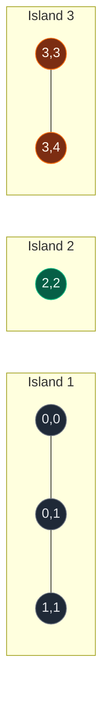
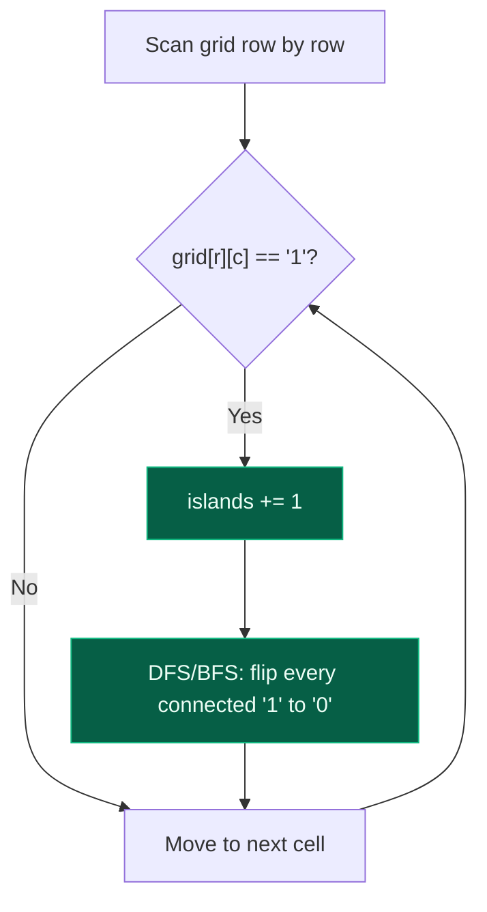

# 02. 200. Number of Islands

| Difficulty | Pattern | Source | Time | Space |
|:---:|:---:|:---:|:---:|:---:|
| **Medium** | Connected Components (BFS/DFS on a grid) | [200. Number of Islands](https://leetcode.com/problems/number-of-islands/) | `O(m*n)` | `O(m*n)` worst case |

## 1. Problem Statement

Given an `m x n` 2D binary grid `grid` which represents a map of `'1'`s (land) and `'0'`s (water), return the number of **islands**.

An island is surrounded by water and is formed by connecting adjacent lands **horizontally or vertically**. You may assume all four edges of the grid are all surrounded by water.

### Examples

```text
Input:
grid = [
  ["1","1","1","1","0"],
  ["1","1","0","1","0"],
  ["1","1","0","0","0"],
  ["0","0","0","0","0"]
]
Output: 1

Input:
grid = [
  ["1","1","0","0","0"],
  ["1","1","0","0","0"],
  ["0","0","1","0","0"],
  ["0","0","0","1","1"]
]
Output: 3
```

### Constraints

- `m == grid.length`
- `n == grid[i].length`
- `1 <= m, n <= 300`
- `grid[i][j]` is `'0'` or `'1'`

## 2. Core Theory

Number of Islands is the exact same connected-components idea as Number of Provinces — only the graph representation changes. Instead of an adjacency **matrix**, the graph is hidden inside a 2D **grid**.

```text
NUMBER OF PROVINCES                    NUMBER OF ISLANDS
Input:  adjacency matrix               Input:  2-D grid
Node:   city                           Node:   land cell (r, c)
Neighbour: isConnected[i][j] == 1      Neighbour: adjacent land cell
Component: province                    Component: island
Algorithm: outer city loop + DFS/BFS   Algorithm: outer cell loop + DFS/BFS
```

The one real difference is **how neighbours are generated**. In a normal graph, an adjacency list hands you the neighbours directly. Here, they come from a fixed **direction array** applied to the current coordinate:

```python
directions = [(1, 0), (-1, 0), (0, 1), (0, -1)]   # down, up, right, left
```

For LeetCode 200, movement is only **4-directional** (horizontal/vertical) — diagonal neighbours are *not* connected, even though they touch at a corner:

```text
1 0        top-left "1" and bottom-right "1" are diagonal only
0 1        -> NOT the same island (answer 2, not 1)
```

**The algorithm is identical to Number of Provinces otherwise:** scan every cell; whenever an unvisited land cell (`'1'`) is found, that is proof no earlier traversal could reach it, so it starts a brand-new island — increment the counter and run DFS/BFS to consume the whole component.

```python
for row in range(rows):
    for col in range(cols):
        if grid[row][col] == "1":
            islands += 1
            dfs(row, col)
```

**Marking visited: separate matrix vs. mutating the grid in place.** Two options:

- **Approach A** — a separate `visited[m][n]` boolean matrix, left untouched, checked alongside `grid[r][c] == '1'`.
- **Approach B** — mutate the grid itself: once a land cell is discovered, flip it `'1' -> '0'`. A cell that is `'0'` is then either "always was water" or "already visited land" — either way, DFS should stop there, so a single check (`grid[r][c] != '1'`) does the job of both a water-check and a visited-check.

**Why mutating in place is safe here.** We are **counting** components, not searching for a specific path, and every land cell is visited by exactly one DFS/BFS call over the life of the algorithm (once flipped to `'0'` it can never trigger — or be re-entered by — another traversal). There is nothing to backtrack or restore, since no later step ever needs to know "was this originally land." That makes the mutation approach both correct and the more space-efficient default, saving an entire `O(m*n)` visited matrix. (If the interviewer says "do not modify the input," fall back to Approach A — shown below.)





**Step-by-step flood spread**, using `grid = [[1,1,0],[1,1,0],[0,0,1]]` starting DFS at `(0,0)`:

```text
Step 0 (start)      Step 1: visit(0,0)    Step 2: visit(1,0)    Step 3: visit(1,1)   Step 4: visit(0,1)
1 1 0                0 1 0                 0 1 0                 0 0 0                0 0 0
1 1 0                1 1 0                 0 1 0                 0 0 0                0 0 0
0 0 1                0 0 1                 0 0 1                 0 0 1                0 0 1

Entire first island (0,0)-(0,1)-(1,0)-(1,1) consumed by one DFS -> islands = 1
Outer loop then finds (2,2) untouched -> islands = 2
```

## 3. Edge Cases

| Case | Input | Expected | Why it matters |
|:---|:---|:---:|:---|
| Empty grid | `[]` | `0` | Must guard `len(grid) == 0` before indexing `grid[0]` |
| Single cell, land | `[["1"]]` | `1` | Smallest non-trivial case, no neighbours exist |
| Single cell, water | `[["0"]]` | `0` | Outer loop never triggers a DFS |
| All water | `[["0","0"],["0","0"]]` | `0` | No land cell ever satisfies the trigger condition |
| All land | `[["1","1"],["1","1"]]` | `1` | One DFS/BFS consumes the entire grid; stresses worst-case `O(m*n)` recursion depth |

## 4. Approach 1 — Separate Visited Matrix (Input Preserved)

### Intuition

Identical traversal logic to the mutation approach, but instead of destroying the input, track discovery state in its own `visited` grid. Use this whenever the interviewer says the input grid must remain unmodified.

### Approach

1. Allocate `visited = [[False]*cols for _ in range(rows)]`.
2. Scan every cell; when `grid[r][c] == '1' and not visited[r][c]`, increment `islands` and DFS/BFS from `(r, c)`.
3. Inside the traversal, a neighbour is explorable only if it is in-bounds, is land, and is not yet visited.

### Code

```python
# Define the class solution
class Solution:

    # Define the method
    def numIslands(self, grid: list) -> int:

        # Grid dimensions
        rows = len(grid)
        if rows == 0:
            return 0
        cols = len(grid[0])

        # Separate visited matrix; input grid stays untouched
        visited = [[False] * cols for _ in range(rows)]

        # Count connected components
        islands = 0

        # DFS explores one entire island using the visited matrix
        def dfs(r, c):
            visited[r][c] = True
            for dr, dc in [(1, 0), (-1, 0), (0, 1), (0, -1)]:
                nr, nc = r + dr, c + dc
                if (
                    0 <= nr < rows
                    and 0 <= nc < cols
                    and grid[nr][nc] == "1"
                    and not visited[nr][nc]
                ):
                    dfs(nr, nc)

        # Scan every cell in the grid
        for r in range(rows):
            for c in range(cols):
                if grid[r][c] == "1" and not visited[r][c]:
                    islands += 1
                    dfs(r, c)

        return islands
```

### Complexity

| Measure | Complexity | Why |
|:---|:---:|:---|
| **Time** | `O(m*n)` | Every cell is visited at most once; each visit checks 4 neighbours (constant work) |
| **Space** | `O(m*n)` | The extra `visited` matrix costs `O(m*n)`, plus `O(m*n)` worst-case recursion stack if the whole grid is one island |

## 5. Approach 2 (Optimal, Recommended) — Mutate the Grid In Place

### Intuition

Since counting islands never needs to know the *original* content of a cell once it has been consumed, flip visited land to `'0'` directly. One data structure — the grid — now carries both terrain and visited status, eliminating the separate matrix.

### Approach

1. Scan every cell. When `grid[r][c] == "1"`, increment `islands` and DFS/BFS from `(r, c)`.
2. The DFS base case does triple duty: return immediately if the coordinate is **out of bounds**, **water**, or **already-visited land** (all collapse to `grid[r][c] != "1"` after a visited cell is flipped to `"0"`).
3. Otherwise flip the cell to `"0"` and recurse into all 4 neighbours.

### Dry Run

```text
grid =
1 1 0
1 1 0
0 0 1

islands = 0

(0,0) == "1" -> islands = 1, dfs(0,0)
  dfs(0,0): grid[0][0] = "0"
    down  (1,0) == "1" -> dfs(1,0)
      dfs(1,0): grid[1][0] = "0"
        down  (2,0) == "0" -> stop
        up    (0,0) == "0" -> stop (already consumed)
        right (1,1) == "1" -> dfs(1,1)
          dfs(1,1): grid[1][1] = "0"
            neighbours (0,1)="1" -> dfs(0,1)
              dfs(0,1): grid[0][1] = "0", no new land neighbours
    (all of island 1 now "0")

grid after island 1:
0 0 0
0 0 0
0 0 1

(0,1),(1,0),(1,1) are "0" now -> outer loop skips them
(2,2) == "1" -> islands = 2, dfs(2,2) consumes just itself (no land neighbours)

answer = 2
```

### Code

```python
# Define the class solution
class Solution:

    # Define the method
    def numIslands(self, grid: list) -> int:

        # Grid dimensions
        rows = len(grid)
        if rows == 0:
            return 0
        cols = len(grid[0])

        # Count connected components
        islands = 0

        # DFS consumes one entire island by mutating the grid
        def dfs(row, col):
            # Invalid position, water, or already-visited land: all mean stop
            if (
                row < 0
                or row >= rows
                or col < 0
                or col >= cols
                or grid[row][col] != "1"
            ):
                return
            # Mark this land cell visited by turning it into water
            grid[row][col] = "0"
            # Explore all four directions
            dfs(row + 1, col)
            dfs(row - 1, col)
            dfs(row, col + 1)
            dfs(row, col - 1)

        # Scan every cell in the grid
        for row in range(rows):
            for col in range(cols):
                # An untouched land cell starts a brand-new island
                if grid[row][col] == "1":
                    islands += 1
                    dfs(row, col)

        return islands
```

**BFS variant** (iterative, avoids recursion depth limits on very large all-land grids):

```python
# Define the class solution
from collections import deque


class Solution:

    # Define the method
    def numIslands(self, grid: list) -> int:

        rows = len(grid)
        if rows == 0:
            return 0
        cols = len(grid[0])

        islands = 0

        for row in range(rows):
            for col in range(cols):
                # Every unvisited land cell starts one island
                if grid[row][col] == "1":
                    islands += 1
                    # Start BFS and mark the seed cell immediately
                    queue = deque([(row, col)])
                    grid[row][col] = "0"
                    while queue:
                        r, c = queue.popleft()
                        for dr, dc in [(1, 0), (-1, 0), (0, 1), (0, -1)]:
                            nr, nc = r + dr, c + dc
                            if (
                                0 <= nr < rows
                                and 0 <= nc < cols
                                and grid[nr][nc] == "1"
                            ):
                                # Mark before enqueueing to avoid duplicate enqueues
                                grid[nr][nc] = "0"
                                queue.append((nr, nc))

        return islands
```

### Complexity

| Measure | Complexity | Why |
|:---|:---:|:---|
| **Time** | `O(m*n)` | Each cell is processed at most once overall (a visited cell can never trigger, or be re-entered by, another traversal); each processed cell does 4 constant-time neighbour checks |
| **Space** | `O(m*n)` worst case | No separate visited matrix is needed (`O(1)` extra beyond the input), but the DFS recursion stack (or BFS queue) can hold up to `O(m*n)` cells if the entire grid is one connected island |

## 6. Common Mistakes

| Mistake | Why it breaks | Fix |
|:---|:---|:---|
| Checking `grid[nr][nc] == "1"` before checking `0 <= nr < rows and 0 <= nc < cols` | Indexing a negative or out-of-range coordinate raises an `IndexError` (or silently wraps with negative indices in Python, corrupting the traversal) | Always test the boundary condition first so the `and` short-circuits before the grid is ever indexed |
| Using an 8-direction neighbour check (including diagonals) | LeetCode 200 defines islands via 4-directional adjacency only; diagonal cells are not the same island | Restrict directions to `(1,0), (-1,0), (0,1), (0,-1)` |
| Marking a cell visited only when it is popped from the BFS queue, not when it is enqueued | The same cell can be enqueued multiple times by different neighbours before any of them process it, wasting work and (in pathological cases) inflating the effective work done per cell | Mark visited (or flip to `'0'`) at the moment of discovery/enqueue, not at dequeue time |
| Forgetting to guard `len(grid) == 0` before reading `grid[0]` | Raises an `IndexError` on the empty-grid edge case | Return `0` immediately when `rows == 0` |

## 7. Interview Follow-ups

**Q: How would you solve this without modifying the input grid?**

A: Use a separate `visited[m][n]` boolean matrix instead of mutating cells to `'0'` (see Approach 1). Time stays `O(m*n)`; space grows by an extra `O(m*n)` for the visited matrix.

**Q: What if diagonal neighbours also counted as connected?**

A: Extend the direction array to all 8 offsets: `(-1,-1),(-1,0),(-1,1),(0,-1),(0,1),(1,-1),(1,0),(1,1)`. Everything else — the outer loop, the counting rule, the complexity — stays exactly the same; only neighbour generation changes.

**Q: Can you return the actual shape of each island, not just the count?**

A: Yes — during each DFS/BFS, record the relative coordinates visited (e.g., `(dr, dc)` offsets from the starting cell) into a list, and collect one such shape per island. Comparing these shape signatures (as a canonical tuple, e.g. sorted or path-normalized) across islands is exactly LeetCode 694, Number of Distinct Islands, later in this topic.

**Q: How does this generalize beyond islands?**

A: The template — scan every cell, and whenever it satisfies some trigger condition and is unvisited, increment a counter and DFS/BFS to consume the whole connected region — reappears in Flood Fill, Max Area of Island, Number of Enclaves, Closed Islands, Rotting Oranges, and 01 Matrix. Only the trigger condition and what happens during the traversal change.

## 8. Interview Explanation

> I model each land cell as a graph vertex, where two land cells share an edge if they are horizontally or vertically adjacent. Each island is then exactly one connected component. I scan every cell in the grid; whenever I find an unvisited land cell, I increment the island count and run DFS (or BFS) to visit the entire connected component. I mark cells visited by flipping them from `'1'` to `'0'` in place, which avoids needing a separate visited matrix — this is safe because we're only counting components, not searching for a specific path, so nothing later needs the original value back. Since every cell is processed at most once and each check is 4 constant-time neighbour lookups, this is `O(m*n)` time. The DFS recursion stack (or BFS queue) can hold up to `O(m*n)` cells in the worst case where the whole grid is a single island.

## 9. Verify

```python
def num_islands(grid):
    rows = len(grid)
    if rows == 0:
        return 0
    cols = len(grid[0])
    islands = 0

    def dfs(row, col):
        if (
            row < 0
            or row >= rows
            or col < 0
            or col >= cols
            or grid[row][col] != "1"
        ):
            return
        grid[row][col] = "0"
        dfs(row + 1, col)
        dfs(row - 1, col)
        dfs(row, col + 1)
        dfs(row, col - 1)

    for row in range(rows):
        for col in range(cols):
            if grid[row][col] == "1":
                islands += 1
                dfs(row, col)

    return islands


# LeetCode examples
grid1 = [
    list("11110"),
    list("11010"),
    list("11000"),
    list("00000"),
]
assert num_islands(grid1) == 1

grid2 = [
    list("11000"),
    list("11000"),
    list("00100"),
    list("00011"),
]
assert num_islands(grid2) == 3

# Empty grid
assert num_islands([]) == 0

# Single cell, land
assert num_islands([["1"]]) == 1

# Single cell, water
assert num_islands([["0"]]) == 0

# All water
assert num_islands([["0", "0"], ["0", "0"]]) == 0

# All land
assert num_islands([["1", "1"], ["1", "1"]]) == 1

# Diagonal-only touch counts as two separate islands (4-directional rule)
assert num_islands([["1", "0"], ["0", "1"]]) == 2

print("All tests passed")
```
