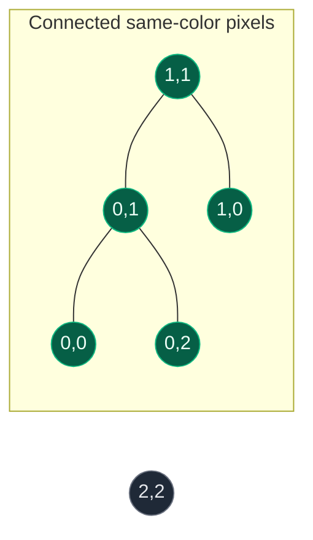
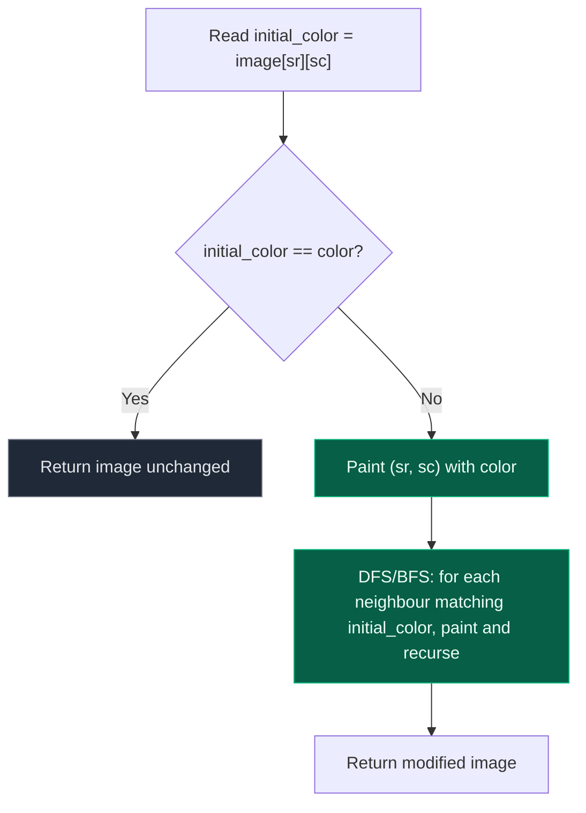

# 03. 733. Flood Fill

| Difficulty | Pattern | Source | Time | Space |
|:---:|:---:|:---:|:---:|:---:|
| **Easy** | Connected Components (BFS/DFS on a grid) | [733. Flood Fill](https://leetcode.com/problems/flood-fill/) | `O(m*n)` | `O(m*n)` worst case |

## 1. Problem Statement

You are given an `m x n` grid `image` representing pixel values, and three integers `sr`, `sc`, and `color`. Perform a **flood fill** on the image starting from the pixel `image[sr][sc]`:

1. Begin with the starting pixel and change its color to `color`.
2. Perform the same process for each pixel that is **directly adjacent** (sharing a side, horizontally or vertically) and has the **same color** as the starting pixel.
3. Keep repeating for neighbours of the *updated* pixels, matching against the *original* starting color.
4. Stop when there are no more adjacent pixels of the original color to update.

Return the modified image.

### Examples

```text
Input:  image = [[1,1,1],[1,1,0],[1,0,1]], sr = 1, sc = 1, color = 2
Output: [[2,2,2],[2,2,0],[2,0,1]]
Explanation: From (sr, sc) = (1, 1), all pixels connected by a path of the
same starting color (1) are repainted 2. The bottom-right 1 is not
connected (only diagonally adjacent) so it stays 1.

Input:  image = [[0,0,0],[0,0,0]], sr = 0, sc = 0, color = 0
Output: [[0,0,0],[0,0,0]]
Explanation: The starting pixel is already colored 0, the same as the
target color, so nothing changes.
```

### Constraints

- `m == image.length`
- `n == image[i].length`
- `1 <= m, n <= 50`
- `0 <= image[i][j], color < 2^16`
- `0 <= sr < m`
- `0 <= sc < n`

## 2. Core Theory

Flood Fill is the same 4-directional grid traversal as Number of Islands, applied to a different action: instead of *counting* connected regions, we **paint** one connected region.

```text
NUMBER OF ISLANDS                       FLOOD FILL
Trigger: unvisited land cell            Trigger: pixel matching the start color
Action:  islands += 1, then consume     Action:  repaint pixel, then spread
Result:  count of components            Result:  one component repainted
```

There is exactly one region to process here (the region containing `(sr, sc)`), so there is no outer scanning loop and no counter — DFS/BFS starts once, from the given seed cell, and consumes exactly the connected component that pixel belongs to.

```python
initial_color = image[sr][sc]
dfs(sr, sc)   # or bfs(sr, sc) — paints the whole component containing (sr, sc)
```

**The critical trap: `color == initial_color`.** If the new color is the same as the pixel's current color, a naive recursive flood fill on a grid that "marks visited by overwriting the color" never actually changes anything — but worse, if the code does not separately track which pixels have been visited, it can re-enter the same pixel forever, because "already painted" and "still needs painting" become indistinguishable when the paint color equals the original color. This must be guarded explicitly, or the visited check must be made independent of color equality.

```text
initial_color == color?
  -> painting a cell doesn't change what future comparisons see
  -> a naive `if pixel == initial_color: paint and recurse` never terminates
```

Two ways to guard against this, both shown below:

- **Early return** — if `image[sr][sc] == color`, return the image unmodified immediately. This is also required by Example 2 above, where a no-op is the *correct* answer, not just a safety measure.
- **Track visited state independently of color** — for BFS/DFS implementations that keep a separate `ans` output grid (rather than mutating `image` directly), check `ans[nr][nc] != color` (not-yet-painted) in addition to `image[nr][nc] == initial_color`, so a cell already painted this color is never re-enqueued even if `initial_color == color`.

The recommended solution below uses the **early-return guard**, which is the simplest and cheapest fix and is required either way to satisfy the "no-op when already the target color" example.





**Step-by-step spread**, using `image = [[1,1,1],[1,1,0],[1,0,1]]`, `sr=1, sc=1, color=2`:

```text
Step 0 (start)     Step 1: paint(1,1)   Step 2: paint(0,1)   Step 3: paint(1,0)   Step 4: paint(0,0),(0,2)
1 1 1               1 1 1                1 2 1                1 2 1                2 2 2
1 1 0               1 2 0                1 2 0                2 2 0                2 2 0
1 0 1               1 0 1                1 0 1                1 0 1                1 0 1

Final: [[2,2,2],[2,2,0],[2,0,1]]  -- bottom-right 1 untouched (diagonal only, and originally a different color anyway)
```

## 3. Edge Cases

| Case | Input | Expected | Why it matters |
|:---|:---|:---:|:---|
| Start already target color | `image=[[0,0,0],[0,0,0]], sr=0, sc=0, color=0` | unchanged image | Must be a no-op — this is also the infinite-recursion trap if unguarded |
| Single-pixel image | `image=[[5]], sr=0, sc=0, color=9` | `[[9]]` | Smallest case; no neighbours exist, loop body never fires |
| Entire image one color | `image=[[1,1],[1,1]], sr=0, sc=0, color=2` | `[[2,2],[2,2]]` | Whole grid is one connected region; stresses full traversal |
| Diagonal-only same-color neighbour | `image=[[1,0],[0,1]], sr=0, sc=0, color=2` | `[[2,0],[0,1]]` | Confirms 4-directional adjacency only; the diagonal `1` must stay `1` |

## 4. Approach 1 — BFS (Iterative Queue)

### Intuition

Start a queue at the seed pixel, repaint it immediately, then repeatedly pop a pixel and enqueue any of its 4 neighbours that still hold the *original* color.

### Approach

1. Read `initial_color = image[sr][sc]`. If `initial_color == color`, return the image unchanged (guards the infinite-loop trap and satisfies the no-op example).
2. Push `(sr, sc)` onto a queue and paint it `color` immediately.
3. While the queue is non-empty: pop `(x, y)`, check its 4 neighbours; for each in-bounds neighbour still equal to `initial_color`, paint it `color` and push it.
4. Return the mutated image.

### Dry Run

```text
image = [[1,1,1],[1,1,0],[1,0,1]], sr=1, sc=1, color=2
initial_color = image[1][1] = 1  (!= 2, proceed)

queue = [(1,1)], image[1][1] = 2

pop (1,1): neighbours (1,2)=0 no, (2,1)=0 no, (0,1)=1 yes -> paint,push; (1,0)=1 yes -> paint,push
  queue = [(0,1), (1,0)]

pop (0,1): neighbours (0,2)=1 yes -> paint,push; (0,0)=1 yes -> paint,push; (1,1)=2 no (already painted)
  queue = [(1,0), (0,2), (0,0)]

pop (1,0): neighbours (0,0)=2 no, (2,0)=1 yes -> paint,push; (1,1)=2 no
  queue = [(0,2), (0,0), (2,0)]

pop (0,2), (0,0), (2,0): no unpainted same-color neighbours remain

image = [[2,2,2],[2,2,0],[2,0,1]]
```

### Code

```python
# Define the class solution
from collections import deque


class Solution:

    # Define the method
    def floodFill(self, image: list, sr: int, sc: int, color: int) -> list:

        # Grid dimensions
        rows = len(image)
        cols = len(image[0])

        # Color we are replacing
        initial_color = image[sr][sc]

        # No-op guard: also prevents infinite re-painting when color == initial_color
        if initial_color == color:
            return image

        # BFS queue, seeded with the starting pixel
        queue = deque([(sr, sc)])

        # Paint the starting pixel immediately
        image[sr][sc] = color

        # Explore until no more same-colored neighbours remain
        while queue:
            x, y = queue.popleft()
            for dx, dy in [(0, 1), (1, 0), (0, -1), (-1, 0)]:
                nx, ny = x + dx, y + dy
                if (
                    0 <= nx < rows
                    and 0 <= ny < cols
                    and image[nx][ny] == initial_color
                ):
                    # Paint before enqueueing to avoid duplicate enqueues
                    image[nx][ny] = color
                    queue.append((nx, ny))

        return image
```

### Complexity

| Measure | Complexity | Why |
|:---|:---:|:---|
| **Time** | `O(m*n)` | Every pixel is enqueued and processed at most once |
| **Space** | `O(m*n)` | The BFS queue can hold up to `O(m*n)` pixels if the whole image is one color |

## 5. Approach 2 — DFS (Recursive, on a Separate Output Grid)

### Intuition

Same spreading logic, but written recursively, and building a fresh output grid `ans` rather than mutating `image`. This variant is useful when "don't mutate the input" matters, and it shows the alternate visited-guard: checking `ans[nrow][ncol] != color` alongside the original-color match, so a cell already painted (even if `color == initial_color`) is never revisited.

### Approach

1. Copy `image` into `ans`.
2. Recursively: paint `ans[r][c] = color`, then for each of the 4 neighbours, recurse only if the neighbour is in-bounds, still holds `initial_color` in the *original* `image`, and has not already been painted `color` in `ans`.
3. Return `ans`.

### Code

```python
# Define the class solution
class Solution:

    # Define the dfs method
    def dfs(self, sr, sc, ans, image, color, delta_row, delta_column, initial_color):

        # Color the current cell in the output grid
        ans[sr][sc] = color

        # Image dimensions
        row_size = len(image)
        column_size = len(image[0])

        # Explore all four directions
        for i in range(4):
            nrow = delta_row[i] + sr
            ncol = delta_column[i] + sc

            # In-bounds, still the original color in the source image,
            # and not already painted with the target color in the output
            if (
                nrow >= 0
                and nrow < row_size
                and ncol >= 0
                and ncol < column_size
                and image[nrow][ncol] == initial_color
                and ans[nrow][ncol] != color
            ):
                self.dfs(nrow, ncol, ans, image, color, delta_row, delta_column, initial_color)

    # Define the method
    def floodFill(self, image: list, sr: int, sc: int, color: int) -> list:

        # Color we are replacing
        initial_color = image[sr][sc]

        # Fresh output grid so the input is never mutated
        ans = [row[:] for row in image]

        # Direction offsets: up, right, down, left
        delta_row = [-1, 0, 1, 0]
        delta_column = [0, 1, 0, -1]

        # Run DFS from the seed pixel
        self.dfs(sr, sc, ans, image, color, delta_row, delta_column, initial_color)

        return ans
```

### Complexity

| Measure | Complexity | Why |
|:---|:---:|:---|
| **Time** | `O(m*n)` | Every pixel is visited at most once |
| **Space** | `O(m*n)` | The recursion stack can reach `O(m*n)` in the worst case (entire image one color), plus `O(m*n)` for the copied output grid |

**Note on this version's guard.** Here the visited check is `ans[nrow][ncol] != color`, independent of whether `color == initial_color`. That correctly prevents infinite recursion even without an explicit early return — but it is subtler to reason about, and still produces a no-op result only because the seed pixel itself gets painted `color` (matching what it already was) and no neighbour can ever pass the guard once painted. The **early-return guard** from Approach 1 is simpler to justify in an interview and is the recommended default.

## 6. Common Mistakes

| Mistake | Why it breaks | Fix |
|:---|:---|:---|
| Missing the `initial_color == color` guard when mutating the grid directly | Every neighbour check re-matches the just-painted color, so DFS/BFS never terminates (or, if a separate visited structure is used, does needless work) | Return immediately when `image[sr][sc] == color`, before starting any traversal |
| Comparing neighbours against the grid's *current* (possibly already-painted) value instead of the original `initial_color` | Once a pixel is repainted, comparing against `image[nr][nc]` for "same as start" is fine only if `initial_color` was captured *before* any painting began; capturing it after painting starts silently changes the fill boundary | Read and store `initial_color = image[sr][sc]` once, before any mutation, and compare all neighbours against that stored value |
| Using 8-directional neighbours | Flood Fill (733) defines adjacency as horizontal/vertical only, matching Number of Islands | Restrict to `(1,0), (-1,0), (0,1), (0,-1)` |

## 7. Interview Follow-ups

**Q: Why is the `color == initial_color` check necessary, and where exactly does it prevent infinite recursion?**

A: If the mutation approach (paint `image[r][c] = color` directly, treat the new value as "visited") is used, and `color` equals `initial_color`, a painted pixel is indistinguishable from an unpainted one — both still equal `initial_color`. Every recursive call would see its already-processed neighbours as still matching and re-enter them forever. The fix is either an early return before starting, or basing the visited check on something other than raw color equality (e.g. a separate visited/output structure).

**Q: How would you do an 8-directional flood fill?**

A: Extend the direction list to all 8 offsets, exactly as with the Number of Islands variant: `(-1,-1),(-1,0),(-1,1),(0,-1),(0,1),(1,-1),(1,0),(1,1)`. The rest of the algorithm — the guard, the paint-then-spread logic, the complexity — is unchanged.

**Q: How does Flood Fill relate to Number of Islands?**

A: They share the identical grid-traversal primitive — 4-directional BFS/DFS that consumes one connected component. Number of Islands *counts* how many such components exist across the whole grid (an outer loop drives multiple traversals); Flood Fill *paints* exactly one component, starting from a given seed, with no outer loop or counter needed.

**Q: What if you needed to flood fill without any recursion or explicit stack (i.e., strictly iterative with O(1) extra control structures)?**

A: Not possible in general for arbitrary shapes without some explicit frontier (queue/stack) to track pixels still needing to be checked — recursion implicitly provides that frontier via the call stack. The best you can do is swap recursion for an explicit stack (iterative DFS) or a queue (BFS), which is what the BFS solution above already does; auxiliary space stays `O(m*n)` in both cases.

## 8. Interview Explanation

> I first read the image's starting color before making any changes, since I'll need to compare every neighbour against that original value, not against whatever the grid currently holds mid-fill. If the target color is already the same as the starting color, I return immediately — otherwise a naive fill could recurse forever, since a freshly painted pixel would look identical to an unvisited one. Otherwise, I run BFS (or DFS) from `(sr, sc)`: paint the seed pixel, then for each of its 4 orthogonal neighbours that still holds the original color, paint it and continue the spread. This is the same connected-component traversal as Number of Islands, just painting instead of counting. Every pixel is processed once, giving `O(m*n)` time, and the queue or recursion stack can hold up to `O(m*n)` pixels in the worst case.

## 9. Verify

```python
# Import deque for the BFS queue
from collections import deque


# Define the function
def flood_fill(image, sr, sc, color):
    # Grid dimensions
    rows = len(image)
    cols = len(image[0])
    # Color we are replacing
    initial_color = image[sr][sc]

    # No-op guard: also prevents infinite re-painting when color == initial_color
    if initial_color == color:
        return image

    # BFS queue, seeded with the starting pixel
    queue = deque([(sr, sc)])
    # Paint the starting pixel immediately
    image[sr][sc] = color

    # Explore until no more same-colored neighbours remain
    while queue:
        x, y = queue.popleft()
        for dx, dy in [(0, 1), (1, 0), (0, -1), (-1, 0)]:
            nx, ny = x + dx, y + dy
            if 0 <= nx < rows and 0 <= ny < cols and image[nx][ny] == initial_color:
                # Paint before enqueueing to avoid duplicate enqueues
                image[nx][ny] = color
                queue.append((nx, ny))

    return image


# LeetCode examples
assert flood_fill([[1, 1, 1], [1, 1, 0], [1, 0, 1]], 1, 1, 2) == [[2, 2, 2], [2, 2, 0], [2, 0, 1]]
assert flood_fill([[0, 0, 0], [0, 0, 0]], 0, 0, 0) == [[0, 0, 0], [0, 0, 0]]

# Single-pixel image: smallest case, no neighbours exist
assert flood_fill([[5]], 0, 0, 9) == [[9]]

# Entire image one color: whole grid is one connected region
assert flood_fill([[1, 1], [1, 1]], 0, 0, 2) == [[2, 2], [2, 2]]

# Diagonal-only same-color neighbour must NOT be painted (4-directional only)
assert flood_fill([[1, 0], [0, 1]], 0, 0, 2) == [[2, 0], [0, 1]]

print("All tests passed")
```
