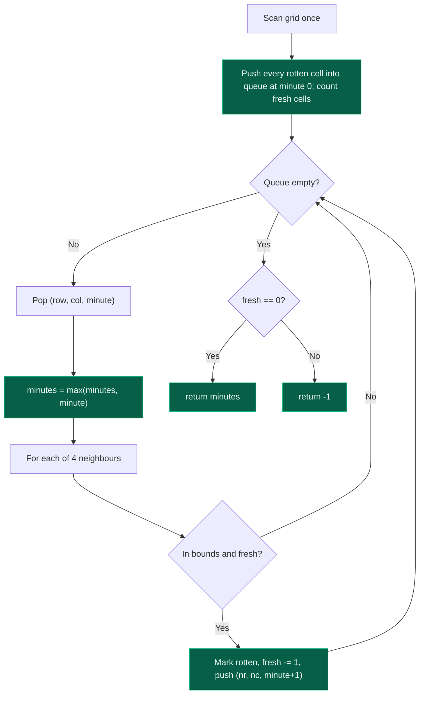

# 04. 994. Rotten Oranges

| Difficulty | Pattern | Source | Time | Space |
|:---:|:---:|:---:|:---:|:---:|
| **Medium** | Multi-Source BFS | [994. Rotting Oranges](https://leetcode.com/problems/rotting-oranges/) | `O(n*m)` | `O(n*m)` |

## 1. Problem Statement

You are given an `n x m` grid where each cell can have one of three values:

- `0` representing an empty cell,
- `1` representing a fresh orange, or
- `2` representing a rotten orange.

Every minute, any fresh orange that is **4-directionally adjacent** to a rotten orange becomes rotten.

Return the minimum number of minutes that must elapse until no cell has a fresh orange. If this is impossible, return `-1`.

### Examples

```text
Input:  grid = [[2,1,1],[1,1,0],[0,1,1]]
Output: 4
```

```text
Input:  grid = [[2,1,1],[0,1,1],[1,0,1]]
Output: -1
Explanation: The orange in the bottom left corner (row 2, column 0) is never
rotten, because rotting only happens 4-directionally.
```

```text
Input:  grid = [[0,2]]
Output: 0
Explanation: Since there are already no fresh oranges at minute 0, the answer is
just 0.
```

### Constraints

- `n == grid.length`
- `m == grid[i].length`
- `1 <= n, m <= 10`
- `grid[i][j]` is `0`, `1`, or `2`

## 2. Core Theory

This is a **multi-source BFS** problem, and that is the single idea the whole solution rests on.

**Why not single-source BFS?** A normal BFS starts from *one* node and expands outward, and "distance" means "steps from that one source." But here there can be several rotten oranges scattered across the grid at minute 0, and they all start rotting their neighbours **simultaneously**. If you ran BFS from just one rotten orange, you would compute how long it takes rot to spread *from that orange alone* — which is not the same as the true answer once you have to also account for the other rotten oranges that are independently spreading rot in parallel. Running BFS one source at a time and combining results with a max/min afterwards is also wrong and wasteful: it does not model the fact that a fresh orange next to *two* different rotten oranges rots at the minute of whichever one reaches it first, not after both have been processed in sequence.

The fix is simple and powerful: seed the BFS queue with **every** rotten orange at once, all tagged as "minute 0." Then run one BFS. Because every rotten orange enters the queue at the same starting level, the BFS naturally expands level by level — and each level corresponds to exactly one minute passing, regardless of how many separate rotten oranges are contributing to that level.

```text
Multi-source seeding:
  queue = [(r, c, 0) for every cell where grid[r][c] == 2]

Instead of:  BFS from orange A, then separately BFS from orange B  (WRONG)
Do:          BFS from {A, B, C, ...} all at once, level = minute   (RIGHT)
```

**Grid spread, minute by minute** (`2` = rotten, `1` = fresh, `.` = empty):

```text
Minute 0        Minute 1        Minute 2        Minute 3        Minute 4
2 1 1           2 2 1           2 2 2           2 2 2           2 2 2
1 1 .    -->    2 1 .    -->    2 2 .    -->    2 2 .    -->    2 2 .
. 1 1           . 1 1           . 2 1           . 2 2           . 2 2

Two seeds this   Each rotten     Rot keeps       Last fresh      No fresh
minute: (0,0)    cell from       spreading one    cell (2,2)     oranges
already 2;       minute 0        ring outward     rots           remain ->
rot reaches      infects its                      this minute    answer = 4
(0,1) and (1,0)  fresh nbrs
```

Every cell that starts in the queue is at "distance" (minute) `0`. Every cell discovered while processing that first batch is at minute `1`, and so on — exactly the level-order property of BFS, here reused to mean elapsed time instead of hop count.

**Detecting "impossible."** Count all fresh (`1`) oranges before starting BFS. Every time BFS turns a fresh orange rotten, decrement that counter. If the counter is not `0` once the queue is empty, some fresh orange was never reached (for example, sealed off by empty cells or the grid boundary) — return `-1`. If the counter starts at `0` (no fresh oranges at all), the answer is immediately `0` minutes, since nothing ever needed to rot.



**Why a `fresh` counter, not a second grid scan.** Re-scanning the whole grid at the end to check for leftover `1`s also works, but it is redundant `O(n*m)` extra work when a single integer maintained during the BFS already tells you the same thing for free.

**Recognizing the pattern.** Any time a problem describes several "infection points" spreading outward at the same rate simultaneously — rotting fruit, fire spreading through a forest, multiple walls expanding towards each other — the right model is multi-source BFS: seed all sources at level 0 and let one BFS pass compute the simultaneous spread. This differs from Number of Islands / Number of Provinces (Files 01–03 of this topic), where BFS/DFS was used to *discover and count* separate components; here it is used to *measure elapsed time* across a shared, simultaneous expansion.

## 3. Edge Cases

| Case | Input | Expected | Why it matters |
|:---|:---|:---:|:---|
| No fresh oranges | `[[2,0],[0,2]]` | `0` | `fresh` counter starts at `0`; BFS still runs but nothing changes — must not return a stray nonzero minute |
| No rotten oranges, fresh exist | `[[1,1],[0,1]]` | `-1` | Queue starts empty, BFS never runs, `fresh` counter stays above `0` |
| Grid all rotten | `[[2,2],[2,2]]` | `0` | Every source is already rotten; there is nothing to spread to |
| Isolated fresh orange | `[[2,0,1]]` | `-1` | The `0` blocks 4-directional adjacency, so the fresh orange at index 2 is unreachable |
| Single rotten, single fresh, adjacent | `[[2,1]]` | `1` | Smallest case that actually exercises one BFS level |

## 4. Optimal Solution: Multi-Source BFS

### Intuition

Treat every rotten orange as a BFS source at time `0`. BFS explores the grid in expanding "rings" — each ring is exactly the set of fresh oranges that turn rotten in the same minute. The last ring processed tells you the total time elapsed. A running `fresh` counter tracks whether any orange never got reached.

### Approach

1. Scan the grid once. Push `(row, col, 0)` for every rotten cell into a queue, and count every fresh cell into `fresh`.
2. If `fresh == 0`, the outer BFS loop still runs but performs no work, and the answer naturally comes out `0`.
3. While the queue is non-empty, pop `(row, col, minute)`, update `minutes = max(minutes, minute)`, and for each of the 4 directions check bounds and `grid[nr][nc] == 1`.
4. If a fresh neighbour is found, mark it rotten (`grid[nr][nc] = 2`) immediately (not when popped) to avoid the same cell being pushed twice, decrement `fresh`, and push `(nr, nc, minute + 1)`.
5. After the queue drains, return `minutes` if `fresh == 0`, else `-1`.

### Dry Run

```text
grid =
2 1 1
1 1 0
0 1 1

fresh = 6, queue = [(0,0,0)]

Pop (0,0,0): minutes = 0
  down  (1,0) fresh -> rot, fresh=5, push (1,0,1)
  right (0,1) fresh -> rot, fresh=4, push (0,1,1)

Pop (1,0,1): minutes = 1
  right (1,1) fresh -> rot, fresh=3, push (1,1,2)

Pop (0,1,1): minutes = 1
  right (0,2) fresh -> rot, fresh=2, push (0,2,2)
  (down (1,1) already rotten by the time this runs, in-flight — grid check prevents double work)

Pop (1,1,2): minutes = 2
  down (2,1) fresh -> rot, fresh=1, push (2,1,3)

Pop (0,2,2): minutes = 2
  no unrotted fresh neighbours

Pop (2,1,3): minutes = 3
  right (2,2) fresh -> rot, fresh=0, push (2,2,4)

Pop (2,2,4): minutes = 4
  no unrotted fresh neighbours

Queue empty. fresh == 0 -> return minutes = 4
```

### Code

```python
# Define the class solution
from collections import deque
from typing import List


class Solution:

    # Define the method
    def orangesRotting(self, grid: List[List[int]]) -> int:

        # Compute the dimensions of grid
        n = len(grid)
        m = len(grid[0])

        # Define fresh count and assign it to 0
        fresh = 0

        # Define the queue
        queue = deque()

        # Scan the grid: collect all rotten oranges, count all fresh oranges
        for i in range(n):

            # Iterate on the columns
            for j in range(m):

                # Count the fresh oranges
                if grid[i][j] == 1:
                    fresh += 1

                # Seed the queue with every rotten orange at minute 0
                # (row, col, minute)
                elif grid[i][j] == 2:
                    queue.append((i, j, 0))

        # Define the 4 directions
        directions = [(1, 0), (-1, 0), (0, 1), (0, -1)]

        # Define the minutes elapsed
        minutes = 0

        # BFS from all rotten oranges in parallel
        while queue:

            # Extract the left most node
            x, y, minute = queue.popleft()

            # Update the minutes
            minutes = max(minutes, minute)

            # Now rot the x, y neighbours
            for dx, dy in directions:

                # Compute the new grid cell coordinates
                nx = x + dx
                ny = y + dy

                # Edge case handling: coordinate must stay inside the grid
                # and the neighbour must currently be fresh
                if 0 <= nx < n and 0 <= ny < m and grid[nx][ny] == 1:

                    # Make that cell rotten
                    grid[nx][ny] = 2

                    # Decrement the fresh count
                    fresh -= 1

                    # Push it to the queue for the next minute
                    queue.append((nx, ny, minute + 1))

        # Return minutes only if every fresh orange was reached
        return minutes if fresh == 0 else -1
```

### Complexity

| Measure | Complexity | Why |
|:---|:---:|:---|
| **Time** | `O(n*m)` | Every cell is enqueued and processed at most once; each processed cell does 4 constant-time neighbour checks |
| **Space** | `O(n*m)` | The BFS queue holds at most all rotten/soon-to-be-rotten cells; no extra visited matrix needed since the grid itself encodes state |

## 5. Common Mistakes

| Mistake | Why it breaks | Fix |
|:---|:---|:---|
| Marking fresh oranges rotten when they are *popped*, not when they are *discovered/pushed* | The same fresh cell can be discovered by two different rotten neighbours before either is popped, so it gets pushed (and `fresh` decremented) twice, corrupting the count | Flip `grid[nr][nc] = 2` and decrement `fresh` at discovery time, right before pushing |
| Returning `minutes + 1` or otherwise adjusting the final answer | `minutes` already equals the level of the *last* orange rotted, since it is updated as `max(minutes, minute)` on every pop — no further increment is needed | Return `minutes` exactly as tracked; verify against the dry run rather than guessing an offset |
| Forgetting to check `fresh == 0` at the end | If some fresh orange is unreachable, BFS drains normally and `minutes` still holds a "final" value from the last reachable ring — silently returning the wrong (too-small) answer instead of `-1` | Always gate the return on the fresh counter, not just on the queue being empty |
| Seeding a BFS per rotten orange and combining results afterwards | Does not correctly model that a single fresh cell rots at the *earliest* minute any neighbour reaches it, and duplicates work across sources | Seed one single queue with all rotten oranges at minute 0, run one BFS pass |
| Not initializing `fresh = 0` correctly when the grid has no fresh oranges at all | Some implementations special-case "no fresh oranges" incorrectly and return `-1` or skip BFS entirely | Let the general algorithm handle it naturally: BFS runs (doing nothing), `fresh` stays `0`, answer is `minutes = 0` |

## 6. Interview Follow-ups

**Q: What if oranges could rot diagonally too, not just 4-directionally?**

A: Extend the direction array to all 8 offsets: `(-1,-1),(-1,0),(-1,1),(0,-1),(0,1),(1,-1),(1,0),(1,1)`. Nothing else changes — the multi-source seeding, the level-by-level minute tracking, and the `fresh` counter all work identically; only neighbour generation changes.

**Q: Can you solve this without a queue, using DFS instead?**

A: Not cleanly. DFS naturally tracks "can this cell be reached," not "in how many minutes." You could simulate it with a `time[][]` array and repeatedly relax it (similar to Bellman-Ford), but that loses BFS's guarantee that the first time a cell is visited is already its minimum time, and costs more work overall. BFS is the natural fit whenever the question is a *shortest number of steps/minutes*.

**Q: How would you extend this to report which orange rotted last?**

A: Track the `(row, col)` of the cell popped with the maximum `minute` value, updating it alongside `minutes` — no extra pass needed.

**Q: What if instead of a grid, oranges were nodes in an arbitrary graph (not a grid) with some initially rotten?**

A: The same multi-source BFS pattern applies directly: seed the queue with all initially-rotten nodes at minute 0, then BFS over the adjacency list instead of over 4-directional grid neighbours. The grid is just one specific adjacency structure.

**Q: Could you solve it with Dijkstra instead of plain BFS?**

A: You could, but it would be strictly worse here: Dijkstra is needed when edges have varying weights, but every "rot spreads by one minute" edge has weight exactly 1. Plain BFS already computes shortest paths optimally on unweighted graphs in `O(V+E)`, whereas Dijkstra would add an unnecessary `O(log V)` priority-queue factor for no benefit.

## 7. Interview Explanation

> This is a multi-source BFS problem, not a single-source one, because multiple rotten oranges spread infection simultaneously. I first scan the grid once: every rotten orange goes into the BFS queue tagged with minute 0, and I count all fresh oranges into a `fresh` counter. Then I run one BFS where each level of the traversal corresponds to exactly one minute elapsing — a fresh orange gets marked rotten and pushed with `minute+1` the moment any rotten neighbour discovers it, and I decrement `fresh` at that same moment to avoid double-counting. I track the maximum minute seen across all pops. At the end, if `fresh` is back to zero, every orange rotted and I return that maximum minute; otherwise some orange was unreachable and I return -1. This is `O(n*m)` time and space, since every cell is processed at most once.

## 8. Verify

```python
# Import deque for the BFS queue and List for type hints
from collections import deque
from typing import List


# Define the function
def oranges_rotting(grid: List[List[int]]) -> int:
    # Compute the dimensions of grid
    n = len(grid)
    m = len(grid[0])
    # Define fresh count and assign it to 0
    fresh = 0
    # Define the queue
    queue = deque()

    # Scan the grid: collect all rotten oranges, count all fresh oranges
    for i in range(n):
        # Iterate on the columns
        for j in range(m):
            # Count the fresh oranges
            if grid[i][j] == 1:
                fresh += 1
            # Seed the queue with every rotten orange at minute 0
            elif grid[i][j] == 2:
                queue.append((i, j, 0))

    # Define the 4 directions
    directions = [(1, 0), (-1, 0), (0, 1), (0, -1)]
    # Define the minutes elapsed
    minutes = 0

    # BFS from all rotten oranges in parallel
    while queue:
        # Extract the left most node
        x, y, minute = queue.popleft()
        # Update the minutes
        minutes = max(minutes, minute)
        # Now rot the x, y neighbours
        for dx, dy in directions:
            # Compute the new grid cell coordinates
            nx, ny = x + dx, y + dy
            # Edge case handling: coordinate must stay inside the grid
            # and the neighbour must currently be fresh
            if 0 <= nx < n and 0 <= ny < m and grid[nx][ny] == 1:
                # Make that cell rotten
                grid[nx][ny] = 2
                # Decrement the fresh count
                fresh -= 1
                # Push it to the queue for the next minute
                queue.append((nx, ny, minute + 1))

    # Return minutes only if every fresh orange was reached
    return minutes if fresh == 0 else -1


# LeetCode examples
assert oranges_rotting([[2, 1, 1], [1, 1, 0], [0, 1, 1]]) == 4
assert oranges_rotting([[2, 1, 1], [0, 1, 1], [1, 0, 1]]) == -1
assert oranges_rotting([[0, 2]]) == 0

# No fresh oranges at all -> 0 minutes
assert oranges_rotting([[2, 0], [0, 2]]) == 0

# No rotten oranges, fresh exist -> impossible
assert oranges_rotting([[1, 1], [0, 1]]) == -1

# Grid all rotten -> 0 minutes, nothing to spread
assert oranges_rotting([[2, 2], [2, 2]]) == 0

# Isolated fresh orange blocked by an empty cell -> impossible
assert oranges_rotting([[2, 0, 1]]) == -1

# Single rotten, single adjacent fresh -> 1 minute
assert oranges_rotting([[2, 1]]) == 1

print("All tests passed")
```
