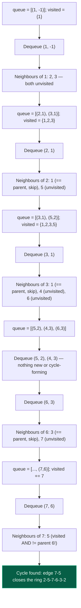

# 05. Detect Cycle in an Undirected Graph using BFS

| Difficulty | Pattern | Source | Time | Space |
|:---:|:---:|:---:|:---:|:---:|
| **Medium** | BFS + Parent Tracking | [Detect cycle in an undirected graph](https://www.geeksforgeeks.org/problems/detect-cycle-in-an-undirected-graph/1) | `O(V + 2E)` | `O(V)` |

## 1. Problem Statement

Given an undirected graph with `V` vertices and `E` edges, represented as an adjacency list, determine whether the graph contains a **cycle**.

**Note:** The graph can have multiple components.

### Examples

```text
Input:  V = 4, edges = [[0,1],[0,2],[1,2],[2,3]]
Output: true
Explanation: 1 -> 2 -> 0 -> 1 is a cycle.
```

```text
Input:  V = 4, edges = [[0,1],[1,2],[2,3]]
Output: false
Explanation: The graph is a straight line (a tree) — no cycle.
```

### Constraints

- `1 <= V, E <= 10^5`
- `0 <= edges[i][0], edges[i][1] < V`

## 2. Core Theory

BFS can detect a cycle in an undirected graph, but it needs one extra piece of information beyond the usual "visited" array: for every node in the queue, you must also remember **which node you arrived from** — its parent in the BFS tree.

**Why plain visited-tracking BFS is not enough.** In an undirected graph, every edge is bidirectional: if there is an edge `u — v`, then from `u` you see `v` as a neighbour, and from `v` you see `u` as a neighbour, for the *same single edge*. If BFS only tracked "have I seen this node before," then the very edge you just walked *along* would immediately look like a repeat visit the moment you check the neighbours of the node on the other end — every single edge would incorrectly look like a cycle.

**The fix: track `(node, parent)` pairs.** Instead of enqueuing bare nodes, enqueue pairs `(node, parent)`, where `parent` is the node you just came from. When you dequeue `(node, parent)` and scan `node`'s neighbours:

- If a neighbour is **unvisited**, mark it visited and enqueue `(neighbour, node)` — `node` becomes its parent.
- If a neighbour **is already visited**, check whether it equals `parent`. If it **does** equal `parent`, this is simply the same edge you arrived on, seen from the other side — not a cycle, skip it. If it does **not** equal `parent`, you have found a second, independent path back to an already-discovered node — a genuine cycle exists.

**Why the parent check is exactly correct.** Walking from `u` to `v` and then looking back at `u` from `v` is not "returning to `u`" in any meaningful graph sense — it's re-reading the same physical edge backwards. The parent check filters out exactly this one harmless case. Any *other* visited neighbour reached is proof that the graph has two distinct routes converging on the same node — which is the structural definition of a cycle.

```text
Adjacency list:
1 -> {2, 3}
2 -> {1, 5}
3 -> {1, 4, 6}
4 -> {3}
5 -> {2, 7}
6 -> {3, 7}
7 -> {5, 6}

Graph shape:
   2 --- 5
  /       \
 1         7
  \       /
   3 --- 6
   |
   4
```

BFS from node `1` (no parent, use a sentinel like `-1`):



```text
The closing edge, marked distinctly:

    2 ═══ 5
   /       \\
  1         7    <- 7's neighbour 5 is already visited
   \\       /        and is NOT 7's parent (parent is 6)
    3 ═══ 6         => genuine second path back to 5 => CYCLE

Edges walked first (BFS tree):  1-2, 1-3, 2-5, 3-4, 3-6, 6-7
Edge that closes the cycle:     7-5   (double '=' marks it above)
```

**Handling multiple components.** The graph need not be connected. Loop over every vertex `0..V-1`; whenever a vertex is still unvisited, it belongs to a component BFS has not explored yet, so start a fresh BFS from it (with parent `-1`). This guarantees every component is checked independently, and a cycle hidden in any single component is enough to return `true` overall.

**Recognizing the pattern.** Whenever a traversal must distinguish "the edge I just came from" from "a different edge that happens to point at an already-seen node," carry a parent (or "came-from") value alongside the state you're already tracking. The same trick reappears in the DFS version of this exact problem (File 06), and more generally anywhere an undirected structure is walked and edges must not be double-counted as revisits.

## 3. Edge Cases

| Case | Input | Expected | Why it matters |
|:---|:---|:---:|:---|
| No edges | `V = 3, edges = []` | `false` | Every vertex starts its own trivial single-node BFS; no neighbours are ever visited, so no cycle check ever fires |
| A tree | `V = 5, edges = [[0,1],[0,2],[1,3],[1,4]]` | `false` | Must not false-positive on parent edges — this is exactly what the parent check exists to prevent |
| Self-loop | `V = 2, edges = [[0,0],[0,1]]` | `true` | A neighbour equal to the node itself is visited and not equal to `parent` (unless the sentinel parent happens to coincide) — must be treated as an immediate cycle |
| Disconnected graph, cycle in one component | `V = 6, edges = [[0,1],[1,2],[2,0],[3,4]]` | `true` | The outer loop must continue checking *every* unvisited vertex — a cycle in any one component makes the whole answer `true` |
| Single vertex, no edges | `V = 1, edges = []` | `false` | Smallest possible input; BFS visits the one node and immediately exhausts its (empty) neighbour list |

## 4. Optimal Solution: BFS with Parent Tracking

### Intuition

Run BFS as usual, but store `(node, parent)` in the queue instead of just `node`. Every time a neighbour is already visited and is not the parent you just came from, that neighbour is reachable by two different paths — which is precisely what a cycle is.

### Approach

1. Build the adjacency list from the edge list.
2. Maintain a `visited` array of size `V`, initialized to `False`.
3. For every vertex `0..V-1` that is still unvisited, start a BFS from it (this correctly handles disconnected components):
   - Push `(start, -1)` into the queue and mark `start` visited.
   - While the queue is non-empty, pop `(node, parent)`.
   - For each `neighbour` of `node`:
     - If `neighbour` is unvisited, mark it visited and push `(neighbour, node)`.
     - Else if `neighbour != parent`, a cycle is found — return `True` immediately.
4. If the outer loop finishes without ever finding a cycle, return `False`.

### Dry Run

```text
V = 4, edges = [[0,1],[0,2],[1,2],[2,3]]
adj: 0 -> {1,2}, 1 -> {0,2}, 2 -> {0,1,3}, 3 -> {2}

Start BFS at 0: visited = {0}, queue = [(0,-1)]

Pop (0,-1):
  neighbour 1: unvisited -> visited={0,1}, push (1,0)
  neighbour 2: unvisited -> visited={0,1,2}, push (2,0)

Pop (1,0):
  neighbour 0: visited AND 0 == parent(0) -> skip (same edge, backwards)
  neighbour 2: visited AND 2 != parent(0) -> CYCLE FOUND, return True
```

### Code

```python
# Define the class solution
from collections import deque


class Solution:

    # Define the method
    def isCycle(self, V: int, edges: list) -> bool:

        # Build the adjacency list from the edge list
        adj = [[] for _ in range(V)]
        for u, v in edges:
            adj[u].append(v)
            adj[v].append(u)

        # Track visited vertices
        visited = [False] * V

        # BFS helper: returns True if a cycle is found starting from src
        def bfs(src):

            # Mark the source visited and push (node, parent)
            visited[src] = True
            queue = deque([(src, -1)])

            # Standard BFS loop
            while queue:

                # Extract the current node and the node we came from
                node, parent = queue.popleft()

                # Check every neighbour of the current node
                for neighbour in adj[node]:

                    # Unvisited neighbour: discover it, remember node as its parent
                    if not visited[neighbour]:
                        visited[neighbour] = True
                        queue.append((neighbour, node))

                    # Visited neighbour that is NOT where we came from: cycle
                    elif neighbour != parent:
                        return True

            # No cycle found reachable from this source
            return False

        # Handle disconnected graphs: check every unvisited vertex
        for start in range(V):
            if not visited[start]:
                if bfs(start):
                    return True

        # No component contained a cycle
        return False
```

### Complexity

| Measure | Complexity | Why |
|:---|:---:|:---|
| **Time** | `O(V + 2E)` | Every vertex is enqueued once; every edge is examined from both of its endpoints across the whole traversal |
| **Space** | `O(V)` | The `visited` array, the adjacency list construction, and the BFS queue are all bounded by `O(V + E)`, dominated here by `O(V)` alongside the input |

## 5. Common Mistakes

| Mistake | Why it breaks | Fix |
|:---|:---|:---|
| Forgetting the parent check entirely, just checking `if visited[neighbour]` | Every edge is bidirectional, so the neighbour you just came from always appears visited — every single edge looks like a cycle, and the function returns `True` on any graph with at least one edge | Always compare the visited neighbour against `parent`, not just its visited status |
| Comparing node identity instead of tracking edges/parents (e.g., using a `set` of visited nodes with no memory of *how* each was reached) | Without a parent reference, there is no way to distinguish "this is the edge I arrived on" from "this is a different edge closing a loop" | Store `(node, parent)` pairs in the queue, not bare nodes |
| Only starting BFS from vertex `0` | Misses cycles that exist only in a different, disconnected component | Loop over all `V` vertices and start a fresh BFS from every still-unvisited one |
| Using a single shared `parent` variable outside the queue instead of storing it per queue entry | Different branches of the BFS frontier have different parents; a single outer variable gets overwritten and produces wrong comparisons | Store `parent` alongside each `node` inside the queue tuple itself |
| Marking a node visited only when it is popped, not when it is pushed | The same node can be pushed multiple times by different neighbours before any pop happens, wasting work and risking incorrect parent bookkeeping | Mark visited at the moment of discovery (push time), exactly as in standard BFS |

## 6. Interview Follow-ups

**Q: How would this change for a directed graph?**

A: The parent trick stops working, because in a directed graph an edge `u -> v` does *not* imply `v -> u`, so a "back edge" to your parent is not automatically harmless — and worse, a visited-but-not-ancestor node might just be a valid shared descendant (a DAG), not a cycle at all. Directed cycle detection instead needs to track the current recursion/DFS path (a "grey" or "on-stack" set) via colouring (white/grey/black) or an explicit recursion-stack array — visited alone is never enough. This is a genuinely different algorithm, covered separately (topic file 16, Detect Cycle in a Directed Graph).

**Q: Can you count the number of cycles instead of just detecting one?**

A: This is significantly harder — a graph can have exponentially many simple cycles in the worst case, so "count all cycles" usually means counting *independent* cycles instead, which equals `E - V + (number of connected components)` for a graph (this comes from the cyclomatic number / circuit rank in graph theory). Enumerating every simple cycle explicitly requires dedicated algorithms (e.g., Johnson's algorithm) and is out of scope for a standard interview follow-up — mention the formula and move on unless asked to go deeper.

**Q: Why does the DFS version of this problem look almost identical?**

A: Because the core insight — track `(node, parent)`, and flag any visited non-parent neighbour as a cycle — is about the graph structure, not the traversal order. DFS just replaces the explicit queue with the recursion stack (or an explicit stack). See File 06 for the direct side-by-side.

**Q: Does the self-loop case need special handling?**

A: A self-loop `(u, u)` means `u` appears in its own adjacency list. When BFS processes `u` with some parent `p != u`, it sees neighbour `u`, which is already visited and not equal to `p` — correctly flagged as a cycle without any extra code.

**Q: What's the actual cycle path, not just true/false?**

A: Track a `parent` map during BFS (as already built), and when the cycle-closing edge `(node, neighbour)` is found, walk `parent[node]` back to the root and `parent[neighbour]` back to the root; the path from `node` up, plus `neighbour`, plus the path from `neighbour`'s side back down to the lowest common ancestor, reconstructs the cycle. This is a bit more bookkeeping but reuses exactly the parent pointers already being tracked.

## 7. Interview Explanation

> I run BFS from every unvisited vertex, so disconnected components are all covered. The key trick is that the queue stores `(node, parent)` pairs, not just nodes — because in an undirected graph every edge is bidirectional, so if I only checked "is this neighbour already visited," the edge I just walked would always look like a cycle when viewed from the other end. So instead, when I look at a neighbour: if it's unvisited, I mark it and continue BFS from it with the current node as its parent. If it's already visited, I check whether it's equal to my own parent — if it is, that's just the same edge seen backwards, not a cycle. If it's visited and *not* my parent, that means there are two different paths converging on the same node, which is exactly what a cycle is, so I return true immediately. This runs in O(V + E) time and O(V) space.

## 8. Verify

```python
# Import deque for an efficient BFS queue
from collections import deque


def is_cycle(V, edges):
    # Build the adjacency list from the edge list
    adj = [[] for _ in range(V)]
    for u, v in edges:
        adj[u].append(v)
        adj[v].append(u)

    # Track visited vertices
    visited = [False] * V

    # BFS helper: returns True if a cycle is found starting from src
    def bfs(src):
        # Mark the source visited and push (node, parent)
        visited[src] = True
        queue = deque([(src, -1)])
        # Standard BFS loop
        while queue:
            # Extract the current node and the node we came from
            node, parent = queue.popleft()
            # Check every neighbour of the current node
            for neighbour in adj[node]:
                # Unvisited neighbour: discover it, remember node as its parent
                if not visited[neighbour]:
                    visited[neighbour] = True
                    queue.append((neighbour, node))
                # Visited neighbour that is NOT where we came from: cycle
                elif neighbour != parent:
                    return True
        # No cycle found reachable from this source
        return False

    # Handle disconnected graphs: check every unvisited vertex
    for start in range(V):
        if not visited[start]:
            if bfs(start):
                return True
    # No component contained a cycle
    return False


# GfG-style examples
assert is_cycle(4, [[0, 1], [0, 2], [1, 2], [2, 3]]) is True
assert is_cycle(4, [[0, 1], [1, 2], [2, 3]]) is False

# No edges at all
assert is_cycle(3, []) is False

# A tree: must not false-positive on parent edges
assert is_cycle(5, [[0, 1], [0, 2], [1, 3], [1, 4]]) is False

# Self-loop counts as an immediate cycle
assert is_cycle(2, [[0, 0], [0, 1]]) is True

# Disconnected graph, cycle in only one component
assert is_cycle(6, [[0, 1], [1, 2], [2, 0], [3, 4]]) is True

# Single vertex, no edges
assert is_cycle(1, []) is False

print("All tests passed")
```
