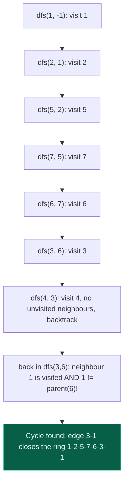

# 06. Detect Cycle in an Undirected Graph using DFS

| Difficulty | Pattern | Source | Time | Space |
|:---:|:---:|:---:|:---:|:---:|
| **Medium** | DFS + Parent Tracking | [Detect cycle in an undirected graph](https://www.geeksforgeeks.org/problems/detect-cycle-in-an-undirected-graph/1) | `O(V + 2E)` | `O(V)` |

## 1. Problem Statement

Given an undirected graph with `V` vertices and `E` edges, represented as a 2D vector `edges[][]`, where each entry `edges[i] = [u, v]` denotes an edge between vertices `u` and `v`, determine whether the graph contains a **cycle** or not.

**Note:** The graph can have multiple components.

### Examples

```text
Input:  V = 4, E = 4, edges[][] = [[0, 1], [0, 2], [1, 2], [2, 3]]
Output: true
Explanation: 1 -> 2 -> 0 -> 1 is a cycle.
```

```text
Input:  V = 4, E = 3, edges[][] = [[0, 1], [1, 2], [2, 3]]
Output: false
Explanation: No cycle in the graph.
```

### Constraints

- `1 <= V, E <= 10^5`
- `0 <= edges[i][0], edges[i][1] < V`

## 2. Core Theory

This is the exact same idea as the BFS version of this problem (File 05), with the traversal mechanism swapped: recursion (or an explicit stack) replaces the queue, but the underlying insight — track `(node, parent)`, not just `node` — is identical.

**Why plain visited-tracking DFS is not enough.** Every edge in an undirected graph is bidirectional: an edge `u — v` means `u` sees `v` as a neighbour and `v` sees `u` as a neighbour, for the same single edge. If DFS recurses from `u` into `v`, then checks `v`'s neighbours, `u` will already be marked visited — and a naive check would misreport every single edge as a cycle, since walking back along the edge you just used always looks like "found an already-visited node."

**The fix: recurse with a parent argument.** Define `dfs(node, parent)`. Mark `node` visited, then for every `neighbour` of `node`:

- If `neighbour` is unvisited, recurse into `dfs(neighbour, node)` — `node` becomes `neighbour`'s parent — and propagate `True` upward immediately if that recursive call finds a cycle.
- If `neighbour` **is** visited: check whether it equals `parent`. If it does, this is just the same edge traversed backwards — not a cycle, keep scanning other neighbours. If it does **not** equal `parent`, a second, independent path has reached an already-discovered node — a cycle exists, return `True`.

**Why the parent check is exactly correct.** Arriving at `v` from `u` and then, while exploring `v`'s neighbours, seeing `u` again is not a real "return" to `u` — it is the same physical edge, read in the opposite direction. The parent check is precisely the filter that discards this one harmless case. Any *other* already-visited neighbour reached during the DFS is proof of two genuinely different routes converging on the same node, which is what a cycle means.

```text
Adjacency list:
1 -> {2, 3}
2 -> {1, 5}
3 -> {1, 4, 6}
4 -> {3}
5 -> {2, 7}
6 -> {3, 7}
7 -> {5, 6}

Graph shape:
   2 --- 5
  /       \
 1         7
  \       /
   3 --- 6
   |
   4
```

DFS from node `1`, called as `dfs(1, -1)`, exploring neighbours in the order they appear in the adjacency list (`2` before `3`):



```text
The closing edge, marked distinctly:

    2 --- 5
   /       \
  1         7      DFS path so far: 1 -> 2 -> 5 -> 7 -> 6 -> 3
  ‖         |
   3 ═══ ═ 6        3's neighbour 1 is already visited
   |                and is NOT 3's parent (parent is 6)
   4                => genuine second path back to 1 => CYCLE

Recursion tree edges: 1-2, 2-5, 5-7, 7-6, 6-3, 3-4
Edge that closes the cycle: 3-1   (double '‖' marks it above)
```

**Contrast with the BFS version.** The two algorithms differ only in *when* neighbours are explored: BFS processes all neighbours of the current frontier level by level using an explicit queue, while DFS commits fully to one neighbour's entire subtree (via recursion or an explicit stack) before backtracking to try the next. The cycle-detection *logic* — pass along a parent, flag any visited non-parent neighbour — is identical in both, which is why the two files read almost like templates of each other with the data structure swapped.

**Handling multiple components.** Loop over every vertex `0..V-1`; whenever a vertex is still unvisited, call `dfs(vertex, -1)` on it to explore that entire component fresh. A cycle found in any component is enough to return `True` for the whole graph.

**Recognizing the pattern.** Any time a traversal must tell apart "the edge I just arrived on" from "a different edge pointing at an already-seen node," carry a parent (or "came-from") reference through the recursion or queue. This is the same trick used in File 05's BFS version, and it generalizes to any undirected-structure walk where edges must not be double-counted as revisits.

## 3. Edge Cases

| Case | Input | Expected | Why it matters |
|:---|:---|:---:|:---|
| No edges | `V = 3, edges = []` | `false` | Each vertex's DFS call finds no neighbours at all; the cycle check never fires |
| A tree | `V = 5, edges = [[0,1],[0,2],[1,3],[1,4]]` | `false` | Must not false-positive on parent edges — exactly what the parent check exists to prevent |
| Self-loop | `V = 2, edges = [[0,0],[0,1]]` | `true` | A neighbour equal to the node itself is visited and not equal to `parent` — must be flagged as an immediate cycle |
| Disconnected graph, cycle in one component | `V = 6, edges = [[0,1],[1,2],[2,0],[3,4]]` | `true` | The outer loop must still call `dfs` on every unvisited vertex; a cycle anywhere makes the answer `true` |
| Single vertex, no edges | `V = 1, edges = []` | `false` | Smallest possible input; `dfs(0, -1)` finds no neighbours and returns `False` immediately |

## 4. Optimal Solution: DFS with Parent Tracking

### Intuition

Recurse through the graph while carrying the parent node as an argument. Whenever an already-visited neighbour is found that is not the parent you just recursed from, two distinct paths have reached the same node — a cycle.

### Approach

1. Build the adjacency list from the edge list.
2. Maintain a `visited` array of size `V`, initialized to `False`.
3. For every vertex `0..V-1` still unvisited, call `dfs(vertex, -1)` (handles disconnected components).
4. Inside `dfs(node, parent)`:
   - Mark `node` visited.
   - For each `neighbour` of `node`:
     - If `neighbour` is unvisited, recurse: `if dfs(neighbour, node): return True`.
     - Else if `neighbour != parent`, a cycle is found — `return True`.
   - If the loop completes with no cycle found, `return False`.
5. If no call to `dfs` ever returns `True`, the graph has no cycle.

### Dry Run

```text
V = 4, edges = [[0,1],[0,2],[1,2],[2,3]]
adj: 0 -> {1,2}, 1 -> {0,2}, 2 -> {0,1,3}, 3 -> {2}

dfs(0, -1): visited = {0}
  neighbour 1: unvisited -> dfs(1, 0)
    dfs(1, 0): visited = {0,1}
      neighbour 0: visited AND 0 == parent(0) -> skip (same edge, backwards)
      neighbour 2: unvisited -> dfs(2, 1)
        dfs(2, 1): visited = {0,1,2}
          neighbour 0: visited AND 0 != parent(1) -> CYCLE FOUND, return True
        dfs(2,1) returns True
      dfs(1,0) propagates True upward
  dfs(0,-1) propagates True upward -> overall result: True
```

### Code

```python
# Define the class solution
class Solution:

    # DFS function to detect cycle starting from `node`, remembering `parent`
    def dfs(self, node, adj, visited, parent):

        # Mark the current node visited
        visited[node] = True

        # Traverse all adjacent vertices of the current node
        for neighbour in adj[node]:

            # If the adjacent vertex is not visited, recurse into it
            if not visited[neighbour]:
                if self.dfs(neighbour, adj, visited, node):
                    # If a cycle is found deeper in the recursion, propagate True
                    return True

            # If the adjacent vertex is visited AND is not the parent,
            # a cycle exists
            elif neighbour != parent:
                return True

        # No cycle found starting from this node
        return False

    # Define the method
    def isCycle(self, V: int, edges: list) -> bool:

        # Build the adjacency list from the edge list
        adj = [[] for _ in range(V)]
        for u, v in edges:
            adj[u].append(v)
            adj[v].append(u)

        # Track visited vertices
        visited = [False] * V

        # Check each vertex (handles disconnected graphs)
        for start in range(V):

            # If vertex is not visited, start DFS from it
            if not visited[start]:
                if self.dfs(start, adj, visited, -1):
                    return True

        # No cycle detected in any component
        return False
```

### Complexity

| Measure | Complexity | Why |
|:---|:---:|:---|
| **Time** | `O(V + 2E)` | Every vertex is visited once; every edge is examined from both of its endpoints across the whole traversal |
| **Space** | `O(V)` | The `visited` array and adjacency list are `O(V + E)`; the recursion stack adds up to `O(V)` in the worst case of a single long chain |

## 5. Common Mistakes

| Mistake | Why it breaks | Fix |
|:---|:---|:---|
| Forgetting the parent check entirely, just checking `if visited[neighbour]` | Every edge is bidirectional, so the neighbour you just recursed from always appears visited — every single edge looks like a cycle, and the function returns `True` on any graph with at least one edge | Always compare the visited neighbour against `parent` before declaring a cycle |
| Using node identity instead of edge/parent tracking (e.g., a plain `visited` set with no memory of the calling node) | Without a parent reference, there is no way to distinguish "the edge I just arrived on" from "a different edge closing a loop" | Pass `parent` explicitly into every recursive `dfs` call |
| Only starting DFS from vertex `0` | Misses a cycle that exists only in a different, disconnected component | Loop over all `V` vertices and call `dfs` from every still-unvisited one |
| Not propagating the recursive `True` result upward (`self.dfs(neighbour, adj, visited, node)` called but its return value ignored) | A cycle detected several levels deep in the recursion never reaches the top-level caller, silently returning `False` for a graph that does have a cycle | Always `return True` immediately when the recursive call itself returns `True` |
| Passing `node` as the parent for *every* neighbour but not per-call (e.g., reusing a mutable default argument across calls) | Different branches of the recursion tree have different parents; sharing state across calls corrupts the comparison | Pass `parent` as a plain function argument, fresh on each call, exactly as in standard recursive DFS |

## 6. Interview Follow-ups

**Q: How would this change for a directed graph?**

A: The parent trick no longer works, because in a directed graph an edge `u -> v` does not imply an edge `v -> u`, so a "back edge" to your parent isn't automatically harmless — and a visited node that isn't an ancestor might simply be a valid shared descendant in a DAG, not part of a cycle at all. Directed cycle detection instead requires tracking the current recursion path (an "on-stack"/grey set) via colouring (white/grey/black) or an explicit recursion-stack boolean array. This is a genuinely different algorithm, covered separately (topic file 16, Detect Cycle in a Directed Graph).

**Q: Can you count the number of cycles instead of just detecting one?**

A: Counting *all* simple cycles can be exponential in the worst case, so in practice "count cycles" means counting *independent* cycles, given by the formula `E - V + (number of connected components)` — the graph's circuit rank. Enumerating every simple cycle explicitly needs a dedicated algorithm (e.g., Johnson's algorithm) and is well beyond a standard follow-up; state the formula and offer to go deeper only if asked.

**Q: Why is the BFS version of this problem almost identical in structure?**

A: Because the correctness argument — track `(node, parent)`, flag any visited non-parent neighbour as a cycle — depends only on the graph being undirected, not on traversal order. BFS replaces the recursion stack with an explicit queue and stores `(node, parent)` pairs there instead of passing `parent` as a function argument; everything else is the same. See File 05 for the direct side-by-side.

**Q: Could recursion depth be a problem here?**

A: Yes — for a graph shaped like a long chain (or a "path" component) with up to `10^5` vertices, naive recursion can hit Python's default recursion limit or overflow the call stack in other languages. The fix is either raising the recursion limit deliberately, or converting the DFS to an explicit iterative stack that manually tracks `(node, parent)` pairs the same way the BFS version tracks them in its queue.

**Q: What's the actual cycle path, not just true/false?**

A: Track a `parent` array as the DFS already implicitly does via its call arguments (store it explicitly this time, e.g., `parent_of[node] = caller`), and once the cycle-closing edge `(node, neighbour)` is detected, walk `parent_of` from both endpoints back toward the root to reconstruct the loop, same as described for the BFS version.

## 7. Interview Explanation

> I recurse through the graph with a helper `dfs(node, parent)`, and I run it from every unvisited vertex so disconnected components are all covered. The key idea is passing along the parent — because in an undirected graph every edge is bidirectional, so if I only checked "is this neighbour already visited," the edge I just recursed in on would always look like a cycle when I look back from the other side. So for each neighbour: if it's unvisited, I recurse into it with the current node as its parent, and propagate `True` up immediately if that call finds a cycle. If the neighbour is already visited, I check whether it equals my own parent — if so, that's the same edge seen backwards, not a cycle. If it's visited and not my parent, that's a second path converging on an already-seen node, which is a cycle, so I return true right away. This is O(V + E) time and O(V) space, dominated by the visited array and the recursion stack.

## 8. Verify

```python
def is_cycle(V, edges):
    adj = [[] for _ in range(V)]
    for u, v in edges:
        adj[u].append(v)
        adj[v].append(u)

    visited = [False] * V

    def dfs(node, parent):
        visited[node] = True
        for neighbour in adj[node]:
            if not visited[neighbour]:
                if dfs(neighbour, node):
                    return True
            elif neighbour != parent:
                return True
        return False

    for start in range(V):
        if not visited[start]:
            if dfs(start, -1):
                return True
    return False


# GfG-style examples
assert is_cycle(4, [[0, 1], [0, 2], [1, 2], [2, 3]]) is True
assert is_cycle(4, [[0, 1], [1, 2], [2, 3]]) is False

# No edges at all
assert is_cycle(3, []) is False

# A tree: must not false-positive on parent edges
assert is_cycle(5, [[0, 1], [0, 2], [1, 3], [1, 4]]) is False

# Self-loop counts as an immediate cycle
assert is_cycle(2, [[0, 0], [0, 1]]) is True

# Disconnected graph, cycle in only one component
assert is_cycle(6, [[0, 1], [1, 2], [2, 0], [3, 4]]) is True

# Single vertex, no edges
assert is_cycle(1, []) is False

print("All tests passed")
```
