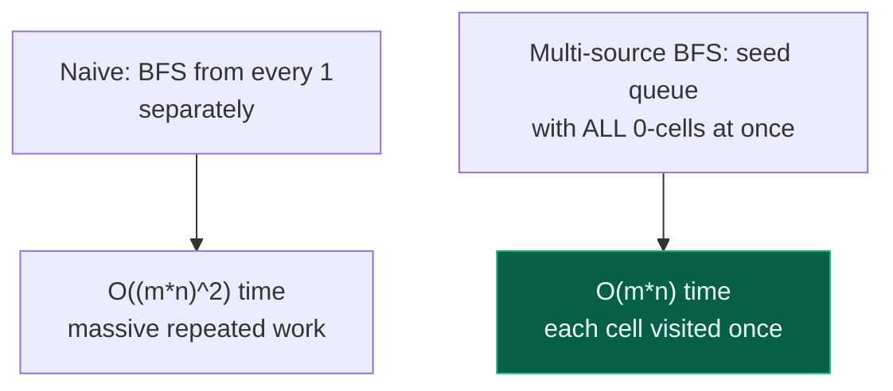

# 07. 542. 01 Matrix

| Difficulty | Pattern | Source | Time | Space |
|:---:|:---:|:---:|:---:|:---:|
| **Medium** | Multi-Source BFS | [542. 01 Matrix](https://leetcode.com/problems/01-matrix/) | `O(m*n)` | `O(m*n)` |

## 1. Problem Statement

Given an `m x n` binary matrix `mat`, return *the distance of the nearest* `0` *for each cell*.

The distance between two adjacent cells is `1`.

(The GFG variant of this exact problem, "Distance of nearest cell having 1," asks the mirror question — the distance of the nearest `1` for every `0` cell, given that at least one `1` exists. The algorithm is byte-for-byte identical; only which value counts as a "source" flips. This note solves LeetCode 542 and calls out the GFG framing wherever it differs.)

### Examples

```text
Input:  mat = [[0,0,0],[0,1,0],[0,0,0]]
Output: [[0,0,0],[0,1,0],[0,0,0]]

Input:  mat = [[0,0,0],[0,1,0],[1,1,1]]
Output: [[0,0,0],[0,1,0],[1,2,1]]
```

### Constraints

- `m == mat.length`
- `n == mat[i].length`
- `1 <= m, n <= 10^4`
- `1 <= m * n <= 10^4`
- `mat[i][j]` is either `0` or `1`
- There is at least one `0` in `mat`

## 2. Core Theory

This is the same connected-region family as Number of Islands and Rotting Oranges, but the question asked is different: instead of "how many components" or "how long until everything is infected," it asks for a **distance value at every single cell**. That distance requirement is exactly what BFS is built for — BFS explores a graph in strictly increasing order of distance from its starting point(s), so if you seed a BFS at the right cells, the order cells get dequeued *is* their distance, for free.

**The naive idea and why it is too slow.** The direct reading of the problem is "for every cell, find the closest `0`." Done literally, that means running a BFS (or scanning the whole grid) starting **from each cell individually** to find its nearest `0`. With `m*n` cells and each search potentially touching `m*n` other cells, that is `O((m*n)^2)` — for the constraint's `10^4` cells that is `10^8`, borderline, and for a squarer grid it degrades further. It also does a huge amount of duplicated work: the BFS from cell `A` and the BFS from its neighbour `B` re-explore almost the same territory.

**The multi-source trick.** Flip the direction of the search. Instead of asking "which `0` is closest to me?" from every `1`, start BFS simultaneously from **every `0` at once** (all pushed into the queue at the start, all at distance `0`), and let the BFS expand outward together, level by level. A cell gets its distance the first time *any* expanding wave reaches it — and because all sources start at the same "time," the first wave to arrive is automatically the nearest one. This computes **all** distances in a single `O(m*n)` traversal, because every cell is enqueued and dequeued exactly once.



**Why "first visit = shortest distance" holds.** BFS processes the queue in FIFO order, so it fully finishes all cells at distance `k` before touching any cell at distance `k+1` (standard BFS level property). With multiple sources pushed at distance `0` together, the queue still expands strictly level by level across *all* sources simultaneously — so the level at which a cell is first reached is the minimum number of steps from **any** source to that cell. This is the identical reasoning used in Rotting Oranges (all initially-rotten oranges are multi-source seeds, and "minutes elapsed" is the BFS level) — 01 Matrix is that same template, generalized to report the level for every cell instead of just the maximum level reached.

**Algorithm outline:**

```text
1. Initialize dist[i][j] = 0 and enqueue (i, j) for every cell where mat[i][j] == 0.
   Initialize dist[i][j] = -1 (unvisited) for every cell where mat[i][j] == 1.
2. While queue is not empty:
     pop (r, c)
     for each of the 4 neighbours (nr, nc):
       if in bounds and dist[nr][nc] == -1 (not yet reached):
         dist[nr][nc] = dist[r][c] + 1
         push (nr, nc)
3. Return dist.
```

**Ring-by-ring expansion**, using `mat = [[0,0,0],[0,1,0],[1,1,1]]` (row/col indices `0..2`):

```text
Start (sources = all 0-cells, distance 0):     After ring 1:                 After ring 2 (final):
0 0 0                                          0 0 0                         0 0 0
0 . 0        . = unknown (was 1)               0 . 0                        0 1 0
. . .        every 0 enqueued at dist 0        1 1 1        (1,1) reached    1 2 1
                                                             from 4 sides,
                                                             dist = 1 + 1 = 2
```

`(1,1)` is surrounded on all four sides by `1`s in the input, so it is reached last, from any of its four `1`-neighbours which were themselves set to distance `1` in the previous ring — giving `dist[1][1] = 2`.

## 3. Edge Cases

| Case | Input | Expected | Why it matters |
|:---|:---|:---:|:---|
| All cells already `0` | `[[0,0],[0,0]]` | all zeros | Every cell is a source; queue starts full, nothing is ever updated past `0` |
| Single cell | `[[0]]` | `[[0]]` | Smallest valid input; BFS loop body never runs |
| Target only in one corner | `[[0,1],[1,1]]` | `[[0,1],[1,2]]` | Stresses expansion across the full diagonal of the grid |
| Single row | `[[0,1,1,0]]` | `[[0,1,1,0]]` | Confirms neighbour generation doesn't assume more than 1 row |
| Dense `1`s, sparse `0`s | `[[1,1,1],[1,0,1],[1,1,1]]` | ring of `1`s around center `0` | Confirms uniform ring expansion in all 4 directions |

## 4. Optimal Approach — Multi-Source BFS

### Intuition

Seed the BFS frontier with every `0` simultaneously (they all sit at distance `0` from themselves) and expand outward. Because BFS visits nodes in non-decreasing distance order, the moment an unvisited `1`-cell is first reached, that is provably its shortest distance to *some* `0` — there is no need to compare against other sources, since a farther source could only have reached this cell later, and BFS levels are monotonic.

### Approach

1. Compute `rows = len(mat)`, `cols = len(mat[0])`.
2. Build a `dist` grid of the same shape, initialized to `-1` (meaning "unvisited").
3. Scan every cell; wherever `mat[i][j] == 0`, set `dist[i][j] = 0` and push `(i, j)` into the BFS queue. This seeds all sources before any expansion begins.
4. Standard multi-source BFS: pop `(r, c)`, look at all 4 neighbours; if a neighbour is in bounds and still `-1` (unreached), set its distance to `dist[r][c] + 1` and push it.
5. Once the queue is empty every reachable cell has its final (and correct) shortest distance. Return `dist`.

### Dry Run

```text
mat =
0 0 0
0 1 0
1 1 1

Step 1 - seed queue with all 0-cells, distance 0:
dist =
0 0 0
0 -1 0
-1 -1 -1
queue = [(0,0),(0,1),(0,2),(1,0),(1,2)]

Step 2 - BFS pops each source, checks neighbours:
pop (0,0): neighbours (1,0) dist=0 already set -> skip; (0,1) already set -> skip
pop (0,1): neighbours (1,1) is -1 -> dist[1][1] = dist[0][1]+1 = 1, push (1,1)
pop (0,2): neighbours (1,2) already set -> skip
pop (1,0): neighbours (2,0) is -1 -> dist[2][0] = dist[1][0]+1 = 1, push (2,0)
pop (1,2): neighbours (2,2) is -1 -> dist[2][2] = dist[1][2]+1 = 1, push (2,2)

dist so far =
0 0 0
0 1 0
1 -1 1

Step 3 - process the newly pushed cells:
pop (1,1): neighbours (2,1) is -1 -> dist[2][1] = dist[1][1]+1 = 2, push (2,1)
pop (2,0): neighbours already set, skip
pop (2,2): neighbours already set, skip
pop (2,1): no unvisited neighbours

Final dist =
0 0 0
0 1 0
1 2 1
```

### Code

```python
# Import the required lib's
from collections import deque

# Define the class solution
class Solution:

    # Define the method
    def updateMatrix(self, mat: List[List[int]]) -> List[List[int]]:

        # Compute the size of the matrix
        m = len(mat)
        n = len(mat[0])

        # Define the queue
        queue = deque()

        # Create the distance array, -1 means "not yet reached"
        distance = [[-1] * n for _ in range(m)]

        # Seed the queue with every 0-cell at distance 0
        for i in range(m):
            for j in range(n):
                if mat[i][j] == 0:
                    distance[i][j] = 0
                    queue.append((i, j))

        # Define the 4 directions: down, up, right, left
        directions = [(1, 0), (-1, 0), (0, 1), (0, -1)]

        # Multi-source BFS: every source expands together, level by level
        while queue:

            # Pop the leftmost (earliest-enqueued) node
            x, y = queue.popleft()

            # Explore all 4 neighbours
            for dx, dy in directions:

                # Compute the neighbour coordinate
                nx = x + dx
                ny = y + dy

                # In bounds and not yet reached by any closer source
                if 0 <= nx < m and 0 <= ny < n and distance[nx][ny] == -1:

                    # First time reached = shortest distance, by BFS ordering
                    distance[nx][ny] = distance[x][y] + 1

                    # Push into the queue to expand from it later
                    queue.append((nx, ny))

        # Return the completed distance grid
        return distance
```

**GFG variant** ("Distance of nearest cell having 1") is identical except the seed condition flips to `grid[i][j] == 1`, and the problem guarantees at least one `1` exists:

```python
# Import the required lib's
from collections import deque

# Define the class solution
class Solution:

    # Function to find distance of nearest cell having 1
    def nearest(self, grid):

        # Compute the dimensions
        rows = len(grid)
        cols = len(grid[0])

        # Result matrix to store distances, -1 = unvisited
        dist = [[-1 for _ in range(cols)] for _ in range(rows)]

        # Queue for BFS (row, col)
        q = deque()

        # Step 1: push all cells with value 1 into the queue
        for i in range(rows):
            for j in range(cols):
                if grid[i][j] == 1:

                    # Distance of 1 from itself is 0
                    dist[i][j] = 0

                    # Multi-source BFS
                    q.append((i, j))

        # Directions: up, down, left, right
        directions = [(-1, 0), (1, 0), (0, -1), (0, 1)]

        # Step 2: BFS traversal
        while q:
            r, c = q.popleft()

            # Explore all 4 neighbors
            for dr, dc in directions:
                nr, nc = r + dr, c + dc

                # Check boundary and if not visited
                if 0 <= nr < rows and 0 <= nc < cols and dist[nr][nc] == -1:
                    dist[nr][nc] = dist[r][c] + 1
                    q.append((nr, nc))

        # Finally return the distance
        return dist
```

### Complexity

| Measure | Complexity | Why |
|:---|:---:|:---|
| **Time** | `O(m*n)` | Every cell is enqueued and dequeued exactly once; each dequeue does 4 constant-time neighbour checks |
| **Space** | `O(m*n)` | The `dist` output grid plus the BFS queue, which can briefly hold up to `O(m*n)` cells |

## 5. Common Mistakes

| Mistake | Why it breaks | Fix |
|:---|:---|:---|
| Initializing non-source cells to `0` instead of `-1`/unvisited | `0` looks identical to "already at distance 0," so the BFS `if unreached` check never fires and no distance ever gets updated | Use a sentinel like `-1` (or `None`, or `float('inf')`) that cannot be confused with a real distance |
| Running a fresh single-source BFS from every `1`-cell | Correct answer, but `O((m*n)^2)` — recomputes overlapping work across every "from-cell" BFS | Seed one shared queue with **all** sources at once and run a single multi-source BFS |
| Marking a cell visited only when popped, not when pushed | The same cell can be pushed multiple times by different neighbours before being processed, doing redundant work and occasionally recording a non-minimal distance if processed out of order | Set `distance[nr][ny]` and mark it visited at the moment it is *discovered* (pushed), not when it is later dequeued |
| Checking `mat[nx][ny]` bounds after indexing | Indexing an out-of-range coordinate raises `IndexError` (or silently wraps with negative Python indices) | Always check `0 <= nx < m and 0 <= ny < n` before indexing the grid or distance array |
| Assuming the grid might have zero `0`-cells | Constraints guarantee at least one `0` (or one `1`, in the GFG framing), but code written for a general grid should not silently loop forever or crash if that guarantee is dropped | Trust the constraint here, but note it explicitly if reusing this template elsewhere without that guarantee |

## 6. Interview Follow-ups

**Q: Why is multi-source BFS better than running BFS from every cell individually?**

A: Single-source-per-cell BFS is `O((m*n)^2)` because each of the `m*n` cells triggers its own `O(m*n)` search. Multi-source BFS instead pushes every source into one shared queue up front; the combined BFS still visits each cell exactly once overall, giving `O(m*n)`. The two are not simply "same work, done together" — the multi-source version genuinely never repeats the exploration of a cell the way independent per-cell searches do.

**Q: How does this compare to Rotting Oranges?**

A: Identical template. Rotting Oranges seeds the queue with all initially-rotten cells (rather than all `0`-cells) and asks for the maximum BFS level reached (rather than the level of every cell) — "minutes until no fresh orange remains" is `max(dist)` in this same distance grid, with `-1` returned if any cell is unreachable (a fresh orange with no path to any rotten one).

**Q: Could you solve this with DP instead of BFS?**

A: Yes — a well-known alternative does two passes over the grid: top-left to bottom-right taking `min(distance from up, distance from left) + 1`, then bottom-right to top-left taking `min(distance from down, distance from right) + 1`, combining both passes with `min`. It also reaches `O(m*n)` time and avoids a queue, but is easy to get subtly wrong (must initialize non-source cells to a large sentinel like `m+n` first) and is harder to explain cleanly than BFS in an interview.

**Q: What if diagonal neighbours also counted toward distance?**

A: Extend `directions` to include the 4 diagonal offsets (`(-1,-1),(-1,1),(1,-1),(1,1)`) — the rest of the algorithm, including the level-by-level correctness argument, is unaffected, since BFS's shortest-path property holds for any fixed, symmetric neighbour relation.

**Q: Can you avoid the extra `dist` array and update `mat` in place?**

A: Only if overwriting `1`s with growing integers is acceptable output-wise (LeetCode expects exactly the distance grid back, so in practice you return a new array either way) — but you could reuse `mat` itself as the `dist` array by treating existing `0`s as already-correct and rewriting `1`-cells in place, saving the separate allocation while keeping the same `O(m*n)` queue cost.

## 7. Interview Explanation

> I treat every `0`-cell as already being at distance `0` and push all of them into one BFS queue at the start — that is the "multi-source" part. I initialize every `1`-cell's distance to a sentinel (`-1`, meaning unreached) and then run a standard 4-directional BFS: every time I pop a cell, I look at its neighbours, and any neighbour still marked unreached gets `current distance + 1` and is pushed onward. Because BFS explores in strictly increasing distance order and all sources start together, the first time any cell is reached is guaranteed to be its true shortest distance to the nearest `0` — I never need to compare against other sources. Every cell is pushed and popped exactly once, so this is `O(m*n)` time and `O(m*n)` space for the queue and the answer grid, instead of the `O((m*n)^2)` you'd get running an independent BFS from every cell.

## 8. Verify

```python
from collections import deque
from typing import List


def update_matrix(mat: List[List[int]]) -> List[List[int]]:
    # Compute the size of the matrix
    m = len(mat)
    n = len(mat[0])
    # Define the queue
    queue = deque()
    # Create the distance array, -1 means "not yet reached"
    distance = [[-1] * n for _ in range(m)]

    # Seed the queue with every 0-cell at distance 0
    for i in range(m):
        for j in range(n):
            if mat[i][j] == 0:
                distance[i][j] = 0
                queue.append((i, j))

    # Define the 4 directions: down, up, right, left
    directions = [(1, 0), (-1, 0), (0, 1), (0, -1)]

    # Multi-source BFS: every source expands together, level by level
    while queue:
        # Pop the leftmost (earliest-enqueued) node
        x, y = queue.popleft()
        # Explore all 4 neighbours
        for dx, dy in directions:
            # Compute the neighbour coordinate
            nx, ny = x + dx, y + dy
            # In bounds and not yet reached by any closer source
            if 0 <= nx < m and 0 <= ny < n and distance[nx][ny] == -1:
                # First time reached = shortest distance, by BFS ordering
                distance[nx][ny] = distance[x][y] + 1
                # Push into the queue to expand from it later
                queue.append((nx, ny))

    # Return the completed distance grid
    return distance


# LeetCode examples
assert update_matrix([[0, 0, 0], [0, 1, 0], [0, 0, 0]]) == [[0, 0, 0], [0, 1, 0], [0, 0, 0]]
assert update_matrix([[0, 0, 0], [0, 1, 0], [1, 1, 1]]) == [[0, 0, 0], [0, 1, 0], [1, 2, 1]]

# All cells already 0
assert update_matrix([[0, 0], [0, 0]]) == [[0, 0], [0, 0]]

# Single cell
assert update_matrix([[0]]) == [[0]]

# Target only in one corner
assert update_matrix([[0, 1], [1, 1]]) == [[0, 1], [1, 2]]

# Single row
assert update_matrix([[0, 1, 1, 0]]) == [[0, 1, 1, 0]]

# Dense 1s, sparse 0
assert update_matrix([[1, 1, 1], [1, 0, 1], [1, 1, 1]]) == [[2, 1, 2], [1, 0, 1], [2, 1, 2]]

print("All tests passed")
```
