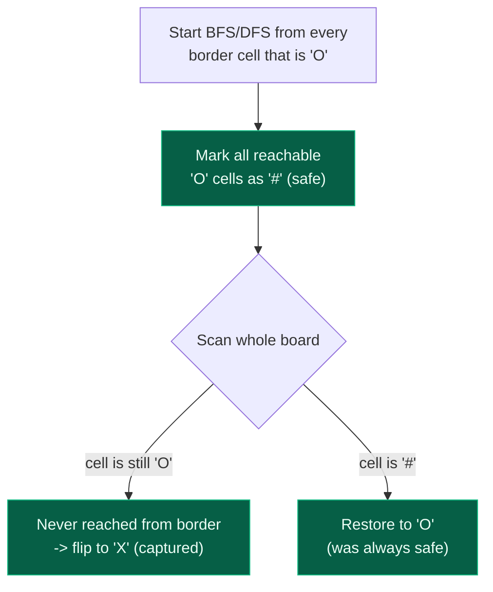

# 08. 130. Surrounded Regions

| Difficulty | Pattern | Source | Time | Space |
|:---:|:---:|:---:|:---:|:---:|
| **Medium** | Border-Seeded BFS/DFS | [130. Surrounded Regions](https://leetcode.com/problems/surrounded-regions/) | `O(m*n)` | `O(m*n)` |

## 1. Problem Statement

Given an `m x n` matrix `board` containing letters `'X'` and `'O'`, capture all regions that are **4-directionally surrounded** by `'X'`.

A region is captured by flipping all `'O'`s into `'X'`s in that surrounded region. A region is **not** surrounded if it has at least one `'O'` cell connected (directly or through a chain of adjacent `'O'`s) to a cell on the border of the board.

### Examples

```text
Input:  board = [["X","X","X","X"],
                  ["X","O","O","X"],
                  ["X","X","O","X"],
                  ["X","O","X","X"]]
Output: [["X","X","X","X"],
         ["X","X","X","X"],
         ["X","X","X","X"],
         ["X","O","X","X"]]

Input:  board = [["X"]]
Output: [["X"]]
```

### Constraints

- `m == board.length`
- `n == board[i].length`
- `1 <= m, n <= 200`
- `board[i][j]` is `'X'` or `'O'`

## 2. Core Theory

The naive framing of this problem is hard to compute directly: "flip every `'O'` region that is fully surrounded by `'X'`." To know whether a region is surrounded, you'd need to check that *none* of its cells touch the border — but the border could be reached through a long, winding chain of `'O'`s far from any single cell you're inspecting. Scanning outward from an arbitrary interior `'O'` to ask "can this reach the border?" means potentially re-exploring the same region from many different starting points.

**The reversed insight.** Flip the question around. Instead of asking "which `'O'`s are surrounded," ask "which `'O'`s are **safe** — i.e., reachable from the border?" That question is easy to answer directly: run BFS/DFS starting from every `'O'` that already sits *on* the border, and mark every cell reachable from those seeds (temporarily, with a third marker like `'#'`) as safe. Anything left as plain `'O'` after that sweep was never reachable from the border by any path, which is exactly the definition of "surrounded" — so it gets flipped to `'X'`. Finally, restore every `'#'` back to `'O'`, since those were the genuinely safe cells all along.



**Why border-outward beats interior-first.** Starting from the border turns "is this connected to the outside?" from a global question (requires knowing the whole region's shape before deciding) into a local, one-pass label-propagation: run the flood fill once from every border `'O'`, and by the time it finishes, every reachable cell is already correctly labeled — no cell needs to be revisited or re-questioned. This is the same idea used elsewhere in graph problems where "is X connected to a special set of nodes" is answered by seeding BFS/DFS from that special set (the border) rather than testing membership from each individual node — structurally the same shift as multi-source BFS seeding from every source cell at once (see 01 Matrix, 994. Rotten Oranges) rather than searching outward from each cell individually.

**Why only border cells are safe seeds.** Any `'O'` cell that is *not* on the border and *not* connected to a border cell has no path to the outside of the board — by definition, every path out of the interior must eventually cross a border cell. So "reachable from a border `'O'`" and "not surrounded" are exactly the same set.

**Three-symbol trick.** Using a third marker (`'#'`) instead of just `'O'`/`'X'` is what makes the algorithm a clean single pass: it lets you tell apart, at scan time, "was `'O'`, proven safe" (`'#'`) from "was `'O'`, never proven safe" (still plain `'O'`) without needing a separate visited array.

**Before -> border BFS -> final flip**, using the example above:

```text
Before:                    After border BFS (safe marked #):    Final (flip O->X, # ->O):
X X X X                    X X X X                               X X X X
X O O X                    X O O X   (interior O's untouched,    X X X X   (interior O's flip to X)
X X O X                    X X O X    not reachable from border) X X X X
X O X X                    X # X X   ((3,1) touches border row)  X O X X   (# restores to O)
```

Here `(3,1)` sits on the bottom border, so border BFS marks it `'#'` immediately; it has no `'O'` neighbours, so nothing else gets marked safe. Every other `'O'` — `(1,1)`, `(1,2)`, `(2,2)` — is interior and disconnected from any border cell, so all three are captured (flipped to `'X'`).

## 3. Edge Cases

| Case | Input | Expected | Why it matters |
|:---|:---|:---:|:---|
| No `'O'` cells at all | `[["X","X"],["X","X"]]` | unchanged | Border BFS has nothing to seed; main scan finds nothing to flip |
| All `'O'` cells on the border | `[["O","O"],["O","O"]]` (both rows are border rows) | unchanged | Every `'O'` is a border cell, so every cell gets marked safe and nothing is captured |
| Single row | `[["O","O","O"]]` | unchanged | Every cell in a 1-row board is a border cell by definition — nothing can ever be surrounded |
| Single column | `[["O"],["X"],["O"]]` | unchanged | Same reasoning — a 1-column board has no interior cells |
| Grid entirely `'O'` including border | `[["O","O","O"],["O","O","O"],["O","O","O"]]` | unchanged | Border BFS floods the entire board since every interior `'O'` connects back to a border `'O'` |

## 4. Optimal Approach — Border-Seeded DFS/BFS with a Safe Marker

### Intuition

Treat every border `'O'` as a source and flood-fill outward (DFS or BFS, either works — the graph is unweighted and only reachability matters, not shortest distance), marking every cell reached with a sentinel like `'#'`. After the flood-fill finishes, a single linear scan over the whole board can decide every cell's fate: `'O'` remaining means unreachable from the border (capture it), `'#'` means it was reachable (restore it), `'X'` was never a candidate and stays as-is.

### Approach

1. Guard the trivial case: if the board has fewer than 3 rows or 3 columns, no cell can ever be interior, so nothing is ever surrounded — return immediately (optional micro-optimization; the general algorithm handles it correctly anyway since every cell would be a border seed).
2. For every cell on the border (row `0`, row `m-1`, column `0`, column `n-1`) that is `'O'`, run DFS/BFS, flipping every reachable `'O'` to `'#'` as it is visited.
3. Scan the entire board once: any remaining `'O'` (never reached from the border) becomes `'X'`; any `'#'` (proven safe) becomes `'O'` again.

### Dry Run

```text
board =
X X X X
X O O X
X X O X
X O X X

Step 1: scan border cells (row 0, row 3, col 0, col 3)
row 0: X X X X -> no 'O'
row 3: X O X X -> (3,1) is 'O' -> DFS from (3,1)
col 0: X X X X (already covered by row scans at corners) -> no new 'O'
col 3: X X X X -> no 'O'

DFS from (3,1):
  mark (3,1) = '#'
  neighbours: (2,1)='X' skip, (3,0)='X' skip, (3,2)='X' skip
  no further expansion

Board after border DFS:
X X X X
X O O X
X X O X
X # X X

Step 2: scan every cell
(1,1)='O' -> never reached from border -> flip to 'X'
(1,2)='O' -> never reached from border -> flip to 'X'
(2,2)='O' -> never reached from border -> flip to 'X'
(3,1)='#' -> restore to 'O'

Final board:
X X X X
X X X X
X X X X
X O X X
```

### Code

```python
# Define the class solution
class Solution:

    # Define the method (modifies board in place, returns None per LeetCode signature)
    def solve(self, board: List[List[str]]) -> None:

        # Grid dimensions
        rows = len(board)
        cols = len(board[0])

        # DFS marks every 'O' reachable from a border cell as safe ('#')
        def dfs(r, c):
            # Out of bounds, or not an unclaimed 'O': stop
            if r < 0 or r >= rows or c < 0 or c >= cols or board[r][c] != "O":
                return

            # Mark this cell as safe (reachable from the border)
            board[r][c] = "#"

            # Explore all four directions
            dfs(r + 1, c)
            dfs(r - 1, c)
            dfs(r, c + 1)
            dfs(r, c - 1)

        # Seed DFS from every 'O' on the top and bottom border rows
        for c in range(cols):
            if board[0][c] == "O":
                dfs(0, c)
            if board[rows - 1][c] == "O":
                dfs(rows - 1, c)

        # Seed DFS from every 'O' on the left and right border columns
        for r in range(rows):
            if board[r][0] == "O":
                dfs(r, 0)
            if board[r][cols - 1] == "O":
                dfs(r, cols - 1)

        # Final scan: capture unreached 'O's, restore safe '#'s
        for r in range(rows):
            for c in range(cols):
                if board[r][c] == "O":
                    # Never reached from the border -> fully surrounded
                    board[r][c] = "X"
                elif board[r][c] == "#":
                    # Was proven safe -> restore original value
                    board[r][c] = "O"
```

**BFS variant** (avoids recursion depth limits on very large all-`'O'` boards):

```python
# Import the required lib's
from collections import deque

# Define the class solution
class Solution:

    # Define the method
    def solve(self, board: List[List[str]]) -> None:

        rows = len(board)
        cols = len(board[0])

        def bfs(sr, sc):
            queue = deque([(sr, sc)])
            board[sr][sc] = "#"
            while queue:
                r, c = queue.popleft()
                for dr, dc in [(1, 0), (-1, 0), (0, 1), (0, -1)]:
                    nr, nc = r + dr, c + dc
                    if 0 <= nr < rows and 0 <= nc < cols and board[nr][nc] == "O":
                        board[nr][nc] = "#"
                        queue.append((nr, nc))

        # Seed from every border 'O'
        for c in range(cols):
            if board[0][c] == "O":
                bfs(0, c)
            if board[rows - 1][c] == "O":
                bfs(rows - 1, c)
        for r in range(rows):
            if board[r][0] == "O":
                bfs(r, 0)
            if board[r][cols - 1] == "O":
                bfs(r, cols - 1)

        # Final scan
        for r in range(rows):
            for c in range(cols):
                if board[r][c] == "O":
                    board[r][c] = "X"
                elif board[r][c] == "#":
                    board[r][c] = "O"
```

### Complexity

| Measure | Complexity | Why |
|:---|:---:|:---|
| **Time** | `O(m*n)` | Border seeding is `O(m+n)`; the DFS/BFS visits each cell at most once overall (a cell flipped to `'#'` can never trigger another traversal); the final scan is `O(m*n)` |
| **Space** | `O(m*n)` | No extra visited matrix is needed (marking is done in place), but the DFS recursion stack (or BFS queue) can hold up to `O(m*n)` cells if the whole board is one connected `'O'` region |

## 5. Common Mistakes

| Mistake | Why it breaks | Fix |
|:---|:---|:---|
| Only scanning the four border rows/columns as ranges but forgetting the corner cells are covered twice (or, in a buggy version, not at all) | Off-by-one range errors can silently skip a corner `'O'`, leaving a border cell unmarked and wrongly captured later | Loop columns for the top/bottom rows and rows for the left/right columns — corners get naturally covered twice, which is harmless (DFS on an already-`'#'` cell is a no-op) |
| Flipping cells to `'X'` *during* the border-seeding pass, before every border-connected region has been fully explored | Prematurely destroys `'O'`s that a still-in-progress border DFS from a different seed needed to pass through, breaking connectivity for that traversal | Do the capture/restore pass only in a **separate**, final scan, after all border-seeded DFS/BFS calls have completed |
| Using a plain `visited` boolean set instead of mutating the board with a third symbol | Works, but then the final pass needs both the visited set *and* the original board value to decide what to write, adding a second data structure for no benefit | Reuse the board itself with a sentinel (`'#'`) — one structure carries both "was O" and "is safe" |
| Treating `'O'` cells not on the border but adjacent to one as automatically safe without running the flood-fill fully | Safety must propagate transitively through a whole connected region, not just one hop from the border; stopping after one layer under-marks the region | Run full DFS/BFS from each border seed so safety propagates through the *entire* connected `'O'` component, however far it reaches inward |
| Forgetting the last row/column index is `rows - 1` / `cols - 1`, not `rows` / `cols` | Indexing `board[rows]` raises `IndexError` | Always use `rows - 1` and `cols - 1` for the bottom row and right column |

## 6. Interview Follow-ups

**Q: What if diagonal connections also counted as adjacency?**

A: Extend the neighbour offsets to all 8 directions in the DFS/BFS step (`(-1,-1),(-1,0),(-1,1),(0,-1),(0,1),(1,-1),(1,0),(1,1)`). The border-seeding logic and the final capture/restore scan are completely unaffected — only how "connected" is defined during the flood-fill changes.

**Q: Can you solve this without mutating the input board?**

A: Yes — allocate a separate `safe[m][n]` boolean matrix, run the same border-seeded BFS/DFS but set `safe[r][c] = True` instead of overwriting `board[r][c]`, guarding traversal with `board[r][c] == "O" and not safe[r][c]`. The final pass then writes a **new** output grid: `'X'` if `board[r][c] == 'X'`, `'O'` if `safe[r][c]`, else `'X'`. Time stays `O(m*n)`; space grows by the extra `O(m*n)` boolean matrix, but the caller's original board is untouched.

**Q: Why not try to detect "surrounded" directly by checking, for each `'O'` region, whether it touches the border?**

A: That is really the same algorithm in disguise — you would still need one full flood-fill per connected `'O'` region to know its full extent and check whether any cell in it lies on the border. Doing it "region-first" instead of "border-first" costs the same `O(m*n)` in the best implementation, but it's easy to implement wastefully (e.g., re-scanning already-visited regions to check border membership) or to introduce subtle bugs around when the border check happens relative to the flood-fill finishing. Seeding from the border directly sidesteps that ordering issue entirely.

**Q: How does this generalize to other problems?**

A: The "flip the search direction from the special set outward, rather than testing membership from arbitrary interior points" pattern reappears in Number of Enclaves (count land cells that can't reach the border) and Closed Islands (count land regions that don't touch the border) — both are near mechanical variations of this exact template, just changing what gets counted or returned in the final scan instead of what gets flipped.

**Q: What's the worst case for recursion depth in the DFS version?**

A: A board that is entirely `'O'` (border included) triggers one DFS call that marks all `m*n` cells safe via one connected recursive chain, so the call stack can reach `O(m*n)` deep. For very large boards this risks a stack overflow in recursive DFS; the iterative BFS variant (or an explicit stack-based DFS) avoids that risk entirely.

## 7. Interview Explanation

> Directly checking whether an `'O'` region is "surrounded" is awkward, because you'd need to know the whole region's shape before deciding — the border could be reached through a long chain far from any cell you're looking at. So I flip the question: instead of finding surrounded regions, I find **safe** regions — every `'O'` reachable from the border can never be surrounded, since any escape route from the interior must eventually cross a border cell. I run DFS (or BFS) starting from every `'O'` that's already on the border, and mark everything reachable with a third symbol, `'#'`, directly in the board — that's both the "visited" marker and a record that this cell is safe. After that flood-fill finishes, one final scan decides everything: any cell still `'O'` was never reached from the border, so it's fully surrounded and gets flipped to `'X'`; any `'#'` gets restored to `'O'`. Every cell is visited by the flood-fill at most once, and the border seeding and final scan are each linear in the board size, so this is `O(m*n)` time and `O(m*n)` worst-case space for the recursion stack or BFS queue.

## 8. Verify

```python
from typing import List


def solve(board: List[List[str]]) -> List[List[str]]:
    rows = len(board)
    cols = len(board[0])

    def dfs(r, c):
        if r < 0 or r >= rows or c < 0 or c >= cols or board[r][c] != "O":
            return
        board[r][c] = "#"
        dfs(r + 1, c)
        dfs(r - 1, c)
        dfs(r, c + 1)
        dfs(r, c - 1)

    for c in range(cols):
        if board[0][c] == "O":
            dfs(0, c)
        if board[rows - 1][c] == "O":
            dfs(rows - 1, c)
    for r in range(rows):
        if board[r][0] == "O":
            dfs(r, 0)
        if board[r][cols - 1] == "O":
            dfs(r, cols - 1)

    for r in range(rows):
        for c in range(cols):
            if board[r][c] == "O":
                board[r][c] = "X"
            elif board[r][c] == "#":
                board[r][c] = "O"

    return board


# LeetCode example
board1 = [
    list("XXXX"),
    list("XOOX"),
    list("XXOX"),
    list("XOXX"),
]
assert solve(board1) == [
    list("XXXX"),
    list("XXXX"),
    list("XXXX"),
    list("XOXX"),
]

# Single cell
assert solve([["X"]]) == [["X"]]

# No 'O' cells at all
assert solve([["X", "X"], ["X", "X"]]) == [["X", "X"], ["X", "X"]]

# All 'O' cells on the border (2x2, every cell is a border cell)
assert solve([["O", "O"], ["O", "O"]]) == [["O", "O"], ["O", "O"]]

# Single row: every cell is a border cell
assert solve([["O", "O", "O"]]) == [["O", "O", "O"]]

# Single column: every cell is a border cell
assert solve([["O"], ["X"], ["O"]]) == [["O"], ["X"], ["O"]]

# Grid entirely 'O' including border
board2 = [
    list("OOO"),
    list("OOO"),
    list("OOO"),
]
assert solve(board2) == [
    list("OOO"),
    list("OOO"),
    list("OOO"),
]

print("All tests passed")
```
