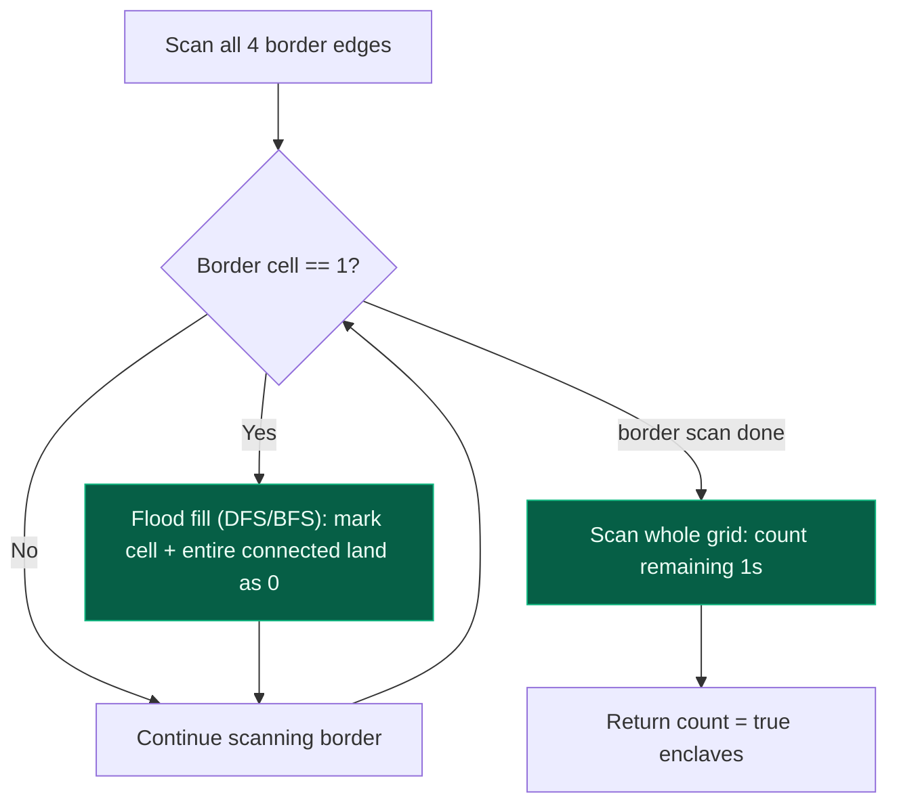
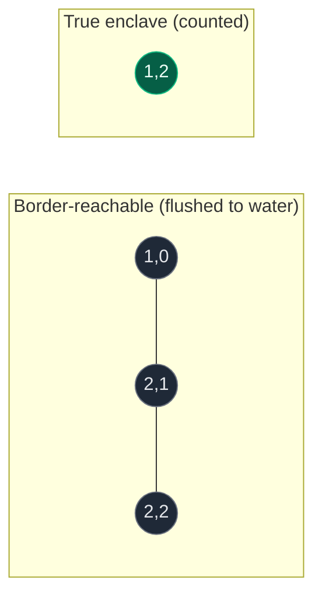

# 09. 1020. Number of Enclaves

| Difficulty | Pattern | Source | Time | Space |
|:---:|:---:|:---:|:---:|:---:|
| **Medium** | Border-Seeded Flood Fill | [1020. Number of Enclaves](https://leetcode.com/problems/number-of-enclaves/) | `O(m*n)` | `O(m*n)` |

## 1. Problem Statement

You are given an `m x n` binary matrix `grid`, where `0` represents a sea cell and `1` represents a land cell.

A **move** consists of walking from one land cell to another adjacent (4-directionally) land cell, or walking off the boundary of the grid.

Return *the number of land cells in* `grid` *for which we cannot walk off the boundary of the grid in any number of moves*.

### Examples

```text
Input: grid = [[0,0,0,0],[1,0,1,0],[0,1,1,0],[0,0,0,0]]
Output: 3
Explanation: There are three 1s that are enclosed by 0s, and one 1 that is
not enclosed because it is on the boundary.

Input: grid = [[0,1,1,0],[0,0,1,0],[0,0,1,0],[0,0,0,0]]
Output: 0
Explanation: All 1s are either on the boundary or can reach the boundary.
```

### Constraints

- `m == grid.length`
- `n == grid[i].length`
- `1 <= m, n <= 500`
- `grid[i][j]` is either `0` or `1`

## 2. Core Theory

This is the same family as **Surrounded Regions**: any problem phrased as "which cells are trapped / enclosed / cannot escape" is far easier solved by inverting the question. Instead of trying to prove a cell is enclosed (hard — you'd have to explore its entire component and confirm none of it touches the border), prove the opposite: which land cells **can** walk off the grid. Anything left over must be enclosed.

**The trick — flood-fill from the boundary, not from the interior.**

1. Scan the four edges of the grid (top row, bottom row, left column, right column).
2. For every land cell (`1`) found sitting directly on the boundary, that cell is trivially "escapable" — one move takes it off the grid. Start a flood fill (DFS or BFS) from it.
3. The flood fill marks every land cell **reachable** from that boundary cell (4-directionally) as escapable too, by the same argument used in Number of Islands: if you can walk from a boundary cell to some interior cell without leaving land, that interior cell can walk the same path in reverse and off the grid.
4. After all boundary-seeded flood fills finish, every remaining `1` in the grid is a **true enclave** — it has no path, however long, to the boundary. Count those.

```text
BEFORE (grid)              AFTER marking border-reachable land as water
0 0 0 0                    0 0 0 0
1 0 1 0        border      0 0 1 0      <- the (1,0) land cell touched the
0 1 1 0        seeded      0 1 1 0         border, so it + its whole
0 0 0 0        flood       0 0 0 0         component got flushed to 0

remaining 1s: (0,2)? no -> not touched  Wait: (1,2),(2,1),(2,2) are the
                                        enclave — none of them border-adjacent
answer = 3
```

**Why this beats trying to detect "enclosed" directly.** Enclosure is a global property — you cannot know a cell is trapped until you've explored its *entire* reachable region and verified none of it touches an edge. Reachability *from* the border, however, is a simple, well-understood flood fill you already know from Number of Islands — just seeded from a different starting set (all border land cells instead of "the next unvisited land cell"). This "flip the direction of the search" idea recurs constantly: Surrounded Regions, Number of Enclaves, and (in a different flavor) Rotting Oranges / 01 Matrix all get simpler once you seed the BFS/DFS from the boundary or from all sources at once, rather than searching outward from every candidate cell individually.





## 3. Edge Cases

| Case | Input | Expected | Why it matters |
|:---|:---|:---:|:---|
| All land touches the border | `[[1,1],[1,1]]` | `0` | Every cell is either on the border or connects to it; border flood fill consumes the whole grid |
| Grid with no land | `[[0,0],[0,0]]` | `0` | No border seeds exist, and the final count-scan finds nothing |
| Single isolated interior cell | `[[0,0,0],[0,1,0],[0,0,0]]` | `1` | The lone `1` is not on the border and has no path to it — a true enclave of size 1 |
| Single row/column grid | `[[1,0,1]]` | `0` | Every cell in a 1-row grid is automatically on the top **and** bottom border |
| Interior land blocked only diagonally from border | `[[0,1],[1,0]]` at corners | varies | Diagonal adjacency does NOT count — must be checked against 4-directional reachability, not "touches near the edge" |

## 4. Approach 1 (Optimal) — DFS from Every Border Land Cell

### Intuition

Treat every land cell sitting on row `0`, row `rows-1`, column `0`, or column `cols-1` as a free starting point that can already "walk off" the grid. DFS from each one, flipping every reachable land cell to water. What's left after all border seeds are exhausted is exactly the enclave count.

### Approach

1. Get `rows`, `cols`; define the standard 4-direction array.
2. Write a `dfs(r, c)` that returns immediately if out of bounds or the cell is water (`0`); otherwise flips the cell to `0` and recurses into all 4 neighbours.
3. Loop over every cell that lies on the border (`r == 0 or c == 0 or r == rows-1 or c == cols-1`) and is land; call `dfs(r, c)` on it.
4. After the border pass, scan the *entire* grid and count remaining `1`s — those are the enclaves.

### Dry Run

```text
grid =
0 0 0 0
1 0 1 0
0 1 1 0
0 0 0 0

Border scan finds land at (1,0) -> dfs(1,0)
  grid[1][0] = 0
  neighbours: (0,0)=0 stop, (2,0)=0 stop, (1,1)=0 stop
  (1,0)'s component was size 1, fully flushed

No other border cell is land (check all of row 0, row 3, col 0, col 3 -> only (1,0) was land)

Final scan for remaining 1s:
0 0 0 0
0 0 1 0
0 1 1 0
0 0 0 0
-> 3 ones remain: (1,2), (2,1), (2,2)

answer = 3
```

### Code

```python
# Import the required lib's
from typing import List

# Define the class solution
class Solution:

    # Define the method
    def numEnclaves(self, grid: List[List[int]]) -> int:

        # Get grid dimensions
        rows = len(grid)
        cols = len(grid[0])

        # 4-direction array (down, up, right, left)
        directions = [(1, 0), (-1, 0), (0, 1), (0, -1)]

        # DFS function to remove land connected to the boundary
        def dfs(r, c):
            # Base condition: out of bounds or water cell
            if r < 0 or c < 0 or r >= rows or c >= cols or grid[r][c] == 0:
                return

            # Mark the land cell as water (it can escape, so it is not an enclave)
            grid[r][c] = 0

            # Explore all 4 directions
            for dr, dc in directions:
                dfs(r + dr, c + dc)

        # Step 1: seed the flood fill from every boundary land cell
        for r in range(rows):
            for c in range(cols):
                # Only cells physically on the border qualify as free "escape" seeds
                if (r == 0 or c == 0 or r == rows - 1 or c == cols - 1) and grid[r][c] == 1:
                    dfs(r, c)

        # Step 2: whatever land remains could never reach the boundary
        enclave_count = 0
        for r in range(rows):
            for c in range(cols):
                if grid[r][c] == 1:
                    enclave_count += 1

        return enclave_count
```

### Complexity

| Measure | Complexity | Why |
|:---|:---:|:---|
| **Time** | `O(m*n)` | Every cell is visited by DFS at most once overall (once flipped to `0` it can never trigger another traversal); the final count scan is another `O(m*n)` pass |
| **Space** | `O(m*n)` | Worst case (all land, e.g. a full grid of `1`s connected to the border) the DFS recursion stack can hold up to `O(m*n)` frames |

## 5. Approach 2 — BFS from Every Border Land Cell

### Intuition

Functionally identical to Approach 1; swap the recursive DFS for an explicit queue to avoid recursion-depth limits on very large grids (up to `500 x 500 = 250000` cells, which can exceed Python's default recursion limit for a single connected component).

### Approach

1. Collect all boundary land cells into a queue up front, marking each `0` immediately as it's enqueued (so it is never re-added).
2. Standard multi-source BFS: pop a cell, expand its 4 neighbours, flip any land neighbour to water and enqueue it.
3. After the queue drains, scan the grid and count remaining `1`s.

### Code

```python
# Import the required lib's
from collections import deque
from typing import List

# Define the class solution
class Solution:

    # Define the method
    def numEnclaves(self, grid: List[List[int]]) -> int:

        # Get the dimensions of grid
        rows = len(grid)
        cols = len(grid[0])

        # Define the queue
        q = deque()

        # Step 1: add all boundary land cells to the queue
        for r in range(rows):
            for c in range(cols):
                # Check for the boundary cases
                if (r == 0 or c == 0 or r == rows - 1 or c == cols - 1) and grid[r][c] == 1:
                    # Push to the queue
                    q.append((r, c))
                    # Mark it as water immediately so it is never re-enqueued
                    grid[r][c] = 0

        # Define the directions
        directions = [(1, 0), (-1, 0), (0, 1), (0, -1)]

        # Step 2: BFS to remove all boundary-connected land
        while q:
            # Get the row and column
            r, c = q.popleft()

            # Iterate on the 4 directions
            for dr, dc in directions:
                # Get the new cell coordinates
                nr, nc = r + dr, c + dc

                # Check bounds and land
                if 0 <= nr < rows and 0 <= nc < cols and grid[nr][nc] == 1:
                    # Mark 0 into the grid
                    grid[nr][nc] = 0
                    # Push to the queue
                    q.append((nr, nc))

        # Step 3: count remaining enclaves
        count = 0
        for r in range(rows):
            for c in range(cols):
                if grid[r][c] == 1:
                    count += 1

        return count
```

### Complexity

| Measure | Complexity | Why |
|:---|:---:|:---|
| **Time** | `O(m*n)` | Each cell is enqueued and processed at most once |
| **Space** | `O(m*n)` | Worst case the queue holds up to `O(m*n)` cells (e.g. an all-land grid) |

## 6. Common Mistakes

| Mistake | Why it breaks | Fix |
|:---|:---|:---|
| Only checking the top row (`r == 0`) as the border | Misses land on the bottom row, left column, and right column — those cells can equally walk off the grid in one move | Check all four conditions together: `r == 0 or c == 0 or r == rows-1 or c == cols-1` |
| Running a fresh, independent DFS/BFS for every land cell to check "does it reach the border" | Re-explores overlapping regions repeatedly; degrades to far worse than `O(m*n)` on large grids | Seed the flood fill once, from the border inward, so each cell is visited at most once total |
| Forgetting to re-scan the whole grid after the border flood fill | The remaining count must be taken *after* all border-reachable land has been flushed, not estimated during the flood fill itself | Run the count as a separate, final `O(m*n)` pass over the mutated grid |
| Treating diagonal neighbours as connected | 1020 uses 4-directional adjacency only, same as Number of Islands | Restrict the direction array to `(1,0), (-1,0), (0,1), (0,-1)` |
| Mutating the grid without realizing the interviewer wants the input preserved | Approach 1/2 destroy the input grid, same trade-off as Number of Islands Approach 2 | If preservation is required, track flushed cells in a separate `visited` matrix instead of overwriting `grid` |

## 7. Interview Follow-ups

**Q: What if you needed the total *area* of enclaves instead of the number of enclave cells?**

A: Trivial extension — since every `1` counted in the final scan already represents a unit-area cell, "number of enclave cells" *is* the area. No structural change needed; this is really just asking whether you understood that the count itself is already an area sum.

**Q: How would you adapt this to return the actual enclosed regions, not just their count?**

A: During the final scan, instead of just incrementing a counter, run a fresh DFS/BFS from each remaining unvisited `1` to collect all cells of that specific enclave (same connected-component collection technique as Number of Distinct Islands), and append each region's cell list to a result list.

**Q: How is this different from Surrounded Regions (LeetCode 130)?**

A: Structurally identical algorithm (border-seeded flood fill marks land reachable from the edge). The difference is only in what happens to the two groups afterward: Surrounded Regions flips the *non*-reachable interior land to a different symbol (e.g. `'O'` to `'X'`) in place, while Number of Enclaves just counts them. Same core insight, different post-processing.

**Q: Could you solve this without mutating the input grid?**

A: Yes — use a separate `visited[m][n]` boolean matrix exactly as in Number of Islands Approach 1: mark cells visited there instead of flipping `grid` values, and check `grid[r][c] == 1 and not visited[r][c]` everywhere. Time stays `O(m*n)`; space grows by the extra `O(m*n)` visited matrix.

## 8. Interview Explanation

> This is the "escape the boundary" pattern. Instead of trying to prove that a land cell is trapped — which would require me to explore its entire connected region and confirm none of it touches an edge — I invert the search: I flood-fill outward from every piece of land that's *already* on the border, since those cells can trivially walk off the grid in one move, and anything reachable from them can too. I do this using DFS or BFS starting from all border land cells, flipping every visited land cell to water as I go, the same visited-via-mutation trick from Number of Islands. Once that flood fill finishes, whatever `1`s remain in the grid have no path — however long — back to the boundary, so they are exactly the enclaves; I count them in one final pass. Since every cell is touched by the flood fill and the final scan at most once each, this runs in `O(m*n)` time and `O(m*n)` worst-case space for the recursion stack or BFS queue.

## 9. Verify

```python
from typing import List


def num_enclaves(grid: List[List[int]]) -> int:
    rows = len(grid)
    cols = len(grid[0])
    directions = [(1, 0), (-1, 0), (0, 1), (0, -1)]

    def dfs(r, c):
        if r < 0 or c < 0 or r >= rows or c >= cols or grid[r][c] == 0:
            return
        grid[r][c] = 0
        for dr, dc in directions:
            dfs(r + dr, c + dc)

    for r in range(rows):
        for c in range(cols):
            if (r == 0 or c == 0 or r == rows - 1 or c == cols - 1) and grid[r][c] == 1:
                dfs(r, c)

    enclave_count = 0
    for r in range(rows):
        for c in range(cols):
            if grid[r][c] == 1:
                enclave_count += 1

    return enclave_count


# LeetCode examples
assert num_enclaves([[0, 0, 0, 0], [1, 0, 1, 0], [0, 1, 1, 0], [0, 0, 0, 0]]) == 3
assert num_enclaves([[0, 1, 1, 0], [0, 0, 1, 0], [0, 0, 1, 0], [0, 0, 0, 0]]) == 0

# All land touches the border
assert num_enclaves([[1, 1], [1, 1]]) == 0

# Grid with no land
assert num_enclaves([[0, 0], [0, 0]]) == 0

# Single isolated interior cell
assert num_enclaves([[0, 0, 0], [0, 1, 0], [0, 0, 0]]) == 1

# Single row grid: every cell is on the border
assert num_enclaves([[1, 0, 1]]) == 0

print("All tests passed")
```
