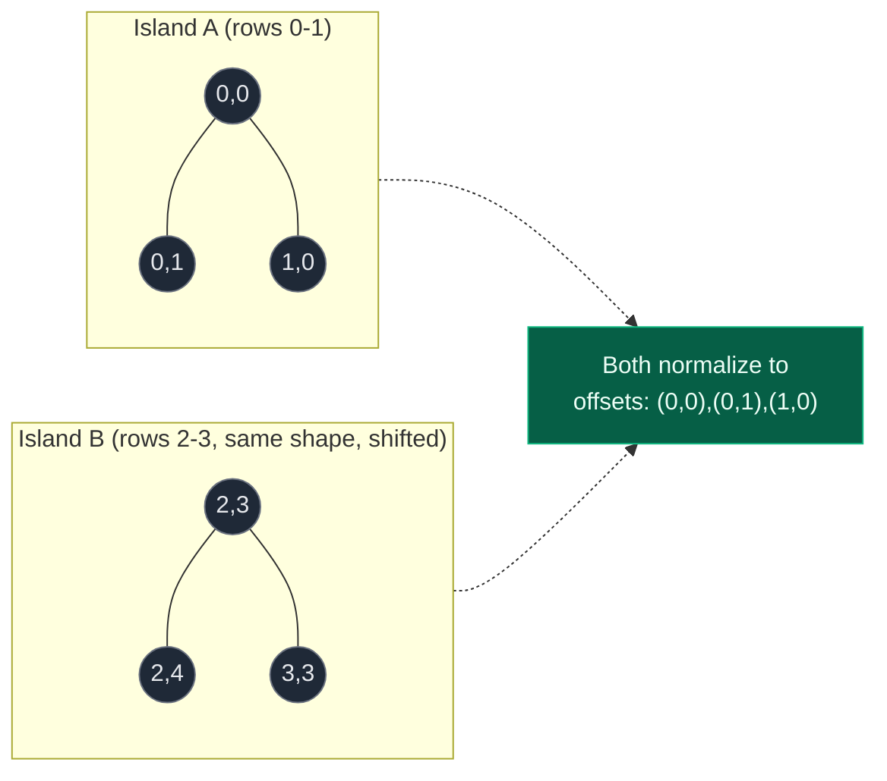
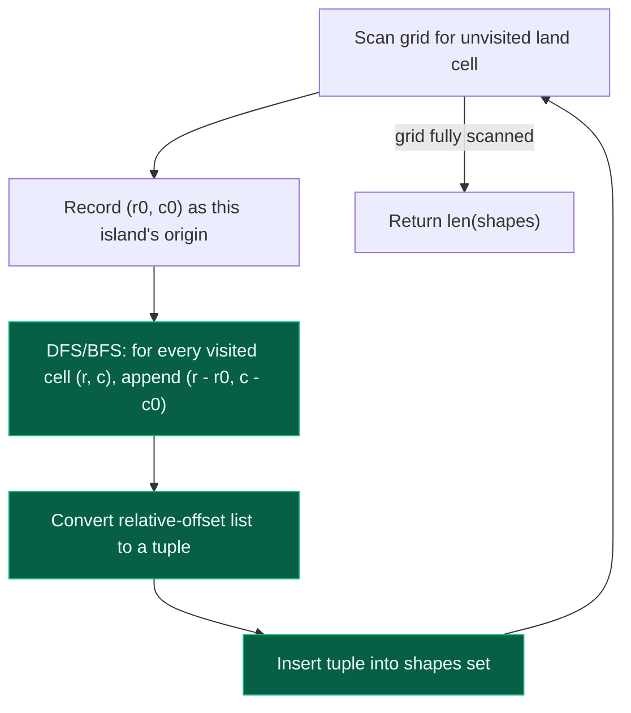

# 10. Number of Distinct Islands

| Difficulty | Pattern | Source | Time | Space |
|:---:|:---:|:---:|:---:|:---:|
| **Medium** | Connected Components + Shape Canonicalization | [Number of Distinct Islands](https://leetcode.com/problems/number-of-distinct-islands/) | `O(m*n)` | `O(m*n)` |

## 1. Problem Statement

You are given an `m x n` binary grid `grid` where:

- `1` represents land
- `0` represents water

An island is a group of `1`s connected **4-directionally** (up, down, left, right).

Two islands are considered **the same** if and only if one island can be **translated** (shifted) to equal the other — **rotation or reflection does NOT count**.

Return the number of **distinct** islands.

### Examples

```text
Input:
grid = [
  [1,1,0,0,0],
  [1,1,0,0,0],
  [0,0,0,1,1],
  [0,0,0,1,1]
]
Output: 1
Explanation: There are two islands — a 2x2 block top-left and a 2x2 block
bottom-right. Both have the same shape, just located at different places,
so distinct islands = 1.

Input:
grid = [
  [1,1,0,0,1],
  [0,1,0,1,1],
  [0,0,0,0,0],
  [1,0,0,0,0]
]
Output: 3
Explanation: There are 3 islands — an L-shape top-left, a differently-angled
L-shape top-right, and a single isolated cell bottom-left. All three have
different shapes, so distinct islands = 3.
```

### Constraints

- `m == grid.length`
- `n == grid[i].length`
- `1 <= m, n <= 50`
- `grid[i][j]` is either `0` or `1`

## 2. Core Theory

This problem builds directly on **Number of Islands**: the outer scan-and-DFS/BFS-per-component template is unchanged. What's new is that counting components is no longer enough — two islands must be compared **by shape**, and the count of unique shapes is the answer.

**Why absolute coordinates fail.** If you simply recorded the raw `(row, col)` cells visited during each island's DFS, two islands with the identical shape sitting at different places in the grid would produce completely different coordinate sets, and would incorrectly be treated as different shapes:

```text
Island A cells: (0,0), (0,1), (1,0)      Island B cells: (2,3), (2,4), (3,3)
Absolute coordinates never match, even though A and B are the same L-shape
translated 2 rows and 3 columns over.
```

**The fix — record relative coordinates.** For each island, remember the very first cell visited as that island's local origin `(r0, c0)`. As the DFS/BFS explores every other cell `(r, c)` of the same island, store the **offset** `(r - r0, c - c0)` instead of the raw coordinate. This offset is location-independent: shifting the whole island up/down/left/right in the grid does not change any of its relative offsets.

```text
Island A origin (0,0):  cells (0,0),(0,1),(1,0)  -> offsets (0,0),(0,1),(1,0)
Island B origin (2,3):  cells (2,3),(2,4),(3,3)  -> offsets (0,0),(0,1),(1,0)

Same offset set -> same shape -> counted once, not twice.
```

Collect the offsets for one island into a list, convert the list to a **tuple** (Python sets require hashable elements — lists are not hashable, tuples are), and insert that tuple into a `set`. The answer is simply the size of the set at the end, since a set automatically discards duplicate shape-signatures.

```python
shapes: set = set()
# ... for each island, after DFS/BFS collects `shape = [(0,0), (0,1), (1,0), ...]`
shapes.add(tuple(shape))
# answer = len(shapes)
```

**Alternative trick — path signature.** Instead of recording coordinates at all, record the *sequence of moves* the DFS takes: append a direction character (e.g. `'D'`, `'U'`, `'L'`, `'R'`) each time you step into a neighbour, and a distinct backtrack marker (e.g. `'B'`) each time the recursion returns from a cell. Two islands with the same shape, explored with a DFS that always tries directions in the same fixed order, always produce the identical path string — regardless of grid position, since the string encodes only relative movement, never absolute location. This avoids the coordinate/origin bookkeeping entirely, at the cost of needing the backtrack marker to disambiguate branching shapes (without it, an L-shape and a T-shape can accidentally produce the same string).





## 3. Edge Cases

| Case | Input | Expected | Why it matters |
|:---|:---|:---:|:---|
| Two islands, identical shape, different position | `[[1,1,0,0],[1,1,0,0],[0,0,1,1],[0,0,1,1]]` | `1` | Confirms relative-coordinate normalization collapses translated duplicates |
| Mirrored/rotated island | An L-shape vs. its 90-degree rotation or horizontal flip | Counted as **different** (unless the problem explicitly says rotations/reflections count as the same) | The relative-offset signature is translation-invariant only — it is NOT rotation- or reflection-invariant, so a rotated copy produces a different offset tuple and is (correctly, per this problem's rules) treated as distinct |
| Single-cell islands (multiple) | `[[1,0,1],[0,0,0],[1,0,0]]` | `1` (all three normalize to the same single-cell shape `((0,0),)`) | Every isolated `1` produces the identical trivial relative-offset tuple regardless of position |
| No land at all | `[[0,0],[0,0]]` | `0` | Outer scan never triggers a DFS; `shapes` set stays empty |
| Entire grid is one island | `[[1,1],[1,1]]` | `1` | One DFS/BFS call produces exactly one shape signature |

## 4. Approach 1 (Optimal) — DFS with Relative-Coordinate Signatures

### Intuition

Reuse the Number of Islands scan-and-consume template; the only addition is passing the island's origin `(r0, c0)` down through the recursion so every visited cell can record its offset into a shared `shape` list, which is then hashed into the `shapes` set.

### Approach

1. Allocate a `visited[m][n]` matrix (or mutate the grid, if the input need not be preserved).
2. Scan every cell; on an unvisited land cell `(r, c)`, treat `(r, c)` as the island's origin and start `shape = []`, then run `dfs(r, c, r0=r, c0=c, shape)`.
3. Inside `dfs`, mark the cell visited, append `(r - r0, c - c0)` to `shape`, and recurse into the 4 unvisited land neighbours.
4. After the DFS returns, convert `shape` to a `tuple` (making it hashable) and add it to the `shapes` set.
5. Return `len(shapes)`.

### Dry Run

```text
grid =
1 1 0 1
1 0 0 1
0 0 1 1

Scan finds (0,0) -> origin (0,0), shape = []
  dfs(0,0): visited, shape=[(0,0)]
    down (1,0)=1 -> dfs(1,0): shape=[(0,0),(1,0)]
    right (0,1)=1 -> dfs(0,1): shape=[(0,0),(1,0),(0,1)]
  tuple: ((0,0),(1,0),(0,1)) -> shapes = { that }

Scan continues, finds (0,3) -> origin (0,3), shape = []
  dfs(0,3): shape=[(0,0)]
    down (1,3)=1 -> dfs(1,3): shape=[(0,0),(1,0)]
      down (2,3)=1 -> dfs(2,3): shape=[(0,0),(1,0),(2,0)]
        left (2,2)=1 -> dfs(2,2): shape=[(0,0),(1,0),(2,0),(2,-1)]
  tuple: ((0,0),(1,0),(2,0),(2,-1)) -> shapes now has 2 distinct shapes

No other unvisited land remains -> answer = 2 distinct shapes for this
illustrative grid (a separate grid from the Example 2 above)
```

### Code

```python
# Import the required lib's
from typing import List, Tuple, Set


class Solution:
    def numDistinctIslands(self, grid: List[List[int]]) -> int:

        # Grid dimensions
        rows = len(grid)
        cols = len(grid[0])

        # Separate visited matrix; input grid stays untouched
        visited = [[False] * cols for _ in range(rows)]

        # Will contain all unique island shapes (as hashable tuples)
        shapes: Set[Tuple[Tuple[int, int], ...]] = set()

        # 4-direction array
        directions = [(1, 0), (-1, 0), (0, 1), (0, -1)]

        # DFS to explore one island, recording relative coordinates
        def dfs(r, c, r0, c0, shape):
            visited[r][c] = True

            # Record this cell's coordinate relative to the island's origin
            shape.append((r - r0, c - c0))

            # Explore neighbours
            for dr, dc in directions:
                nr, nc = r + dr, c + dc
                if 0 <= nr < rows and 0 <= nc < cols:
                    if grid[nr][nc] == 1 and not visited[nr][nc]:
                        dfs(nr, nc, r0, c0, shape)

        # Scan the grid for unvisited land, one island at a time
        for r in range(rows):
            for c in range(cols):
                if grid[r][c] == 1 and not visited[r][c]:
                    shape = []
                    dfs(r, c, r, c, shape)
                    # Convert list -> tuple so it can be hashed into the set
                    shapes.add(tuple(shape))

        return len(shapes)
```

### Complexity

| Measure | Complexity | Why |
|:---|:---:|:---|
| **Time** | `O(m*n)` | Every cell is visited exactly once across all DFS calls combined; recording an offset and appending to a list is `O(1)` amortized per cell |
| **Space** | `O(m*n)` | The `visited` matrix, the recursion stack, and the total size of all shape lists combined are each bounded by `O(m*n)` |

## 5. Approach 2 — BFS with Relative-Coordinate Signatures

### Intuition

Same normalization idea, using an explicit queue instead of recursion — useful when island size could otherwise blow the recursion limit on large grids.

### Approach

1. For each unvisited land cell `(sr, sc)`, treat it as the island's origin `(r0, c0) = (sr, sc)`.
2. BFS outward, and for every popped cell `(r, c)`, append `(r - r0, c - c0)` to that island's `shape` list before enqueuing its unvisited land neighbours.
3. Convert the finished `shape` list to a tuple and add it to `shapes`.

### Code

```python
# Import the required lib's
from typing import List, Tuple, Set
from collections import deque


class Solution:
    def numDistinctIslands(self, grid: List[List[int]]) -> int:

        rows = len(grid)
        cols = len(grid[0])

        visited = [[False] * cols for _ in range(rows)]
        shapes: Set[Tuple[Tuple[int, int], ...]] = set()
        directions = [(1, 0), (-1, 0), (0, 1), (0, -1)]

        # BFS to explore an island, returning its relative-coordinate shape
        def bfs(sr, sc):
            queue = deque([(sr, sc)])
            visited[sr][sc] = True

            shape = [(0, 0)]  # origin's own offset is always (0, 0)
            r0, c0 = sr, sc

            while queue:
                r, c = queue.popleft()

                for dr, dc in directions:
                    nr, nc = r + dr, c + dc

                    if 0 <= nr < rows and 0 <= nc < cols:
                        if grid[nr][nc] == 1 and not visited[nr][nc]:
                            visited[nr][nc] = True
                            queue.append((nr, nc))
                            # Record relative coordinate
                            shape.append((nr - r0, nc - c0))

            return tuple(shape)

        # Scan all cells
        for r in range(rows):
            for c in range(cols):
                if grid[r][c] == 1 and not visited[r][c]:
                    shape = bfs(r, c)
                    shapes.add(shape)

        return len(shapes)
```

### Complexity

| Measure | Complexity | Why |
|:---|:---:|:---|
| **Time** | `O(m*n)` | Each cell is enqueued and processed exactly once across all islands |
| **Space** | `O(m*n)` | `visited` matrix plus the BFS queue plus total shape storage are each bounded by `O(m*n)` |

## 6. Common Mistakes

| Mistake | Why it breaks | Fix |
|:---|:---|:---|
| Storing absolute `(r, c)` coordinates instead of relative offsets | Two islands with the exact same shape but different grid positions never match, so identical shapes get double-counted | Always subtract the island's own origin `(r0, c0)` before storing a coordinate |
| Trying to insert a `list` of coordinates directly into a `set` | Python lists are unhashable; raises `TypeError: unhashable type: 'list'` | Convert the coordinate list to a `tuple` (`tuple(shape)`) before adding to the set |
| Forgetting the backtrack marker in the path-signature variant | Without it, structurally different shapes (e.g. an L-shape vs. a T-shape) can produce identical direction strings, since both encode simple forward moves indistinguishably | Append a distinct character (e.g. `'B'`) each time the DFS returns/backtracks from a cell, so branch structure is captured in the string |
| Assuming rotated or mirrored islands count as the same shape | The problem defines "same" strictly as translatable-to-match; rotation/reflection is explicitly excluded | Only normalize by translation (relative offset from origin); do not attempt any rotation/reflection normalization unless the problem asks for it |
| Reusing one global `shape` list across multiple islands without resetting it | Coordinates from a previous island leak into the next island's signature, corrupting every shape after the first | Start a fresh empty `shape = []` for every new unvisited land cell found in the outer scan |

## 7. Interview Follow-ups

**Q: What if rotations and reflections should count as the same shape?**

A: A much harder variant. Normalize each island by generating all 8 possible orientations of its relative-coordinate set (4 rotations x 2 reflections), canonicalizing each orientation (e.g. sort the coordinate list, or shift so the minimum row/col is again `(0,0)`), and picking the lexicographically smallest one as the island's canonical signature. Two islands are the "same" if their canonical signatures match under this broader equivalence.

**Q: Why use a tuple of relative coordinates instead of the path-signature string — is one strictly better?**

A: They're equivalent in complexity; it's a style choice. The coordinate-tuple approach is easier to reason about and debug (you can print actual `(dr, dc)` pairs), while the path-signature string is slightly more memory-compact and avoids passing an origin down through the recursion — but it requires careful handling of the backtrack marker to stay correct on branching shapes.

**Q: How would you extend this to count distinct islands by size only, ignoring exact shape?**

A: Skip signature tracking entirely — just record each island's cell count during DFS/BFS into a `set` of integers (or a `Counter` if you also want the frequency of each size). This is a simpler variant of Max Area of Island.

**Q: Does mutating the grid in place (instead of using a visited matrix) still work here?**

A: Yes, with the same trade-off as Number of Islands: flipping visited land to `0` saves the `O(m*n)` visited matrix, but destroys the input. Since Number of Distinct Islands needs to record shape data regardless, either approach works — the mutation only replaces the *visited-tracking* mechanism, not the shape bookkeeping.

## 8. Interview Explanation

> This extends Number of Islands: instead of just counting connected components, I need to distinguish them by shape. The key realization is that comparing raw `(row, col)` coordinates fails, because the same shape placed at two different locations in the grid would never match. So for each island, I fix its very first visited cell as a local origin and record every other cell's position *relative* to that origin — `(row - row0, col - col0)` — during the DFS or BFS. This offset is translation-invariant: shifting the whole island around the grid doesn't change any of these relative values. I collect one island's offsets into a list, convert it to a tuple so it's hashable, and insert it into a set; duplicate shapes collapse automatically because their tuples are identical. The final answer is the size of that set. Since every cell is visited exactly once across all islands combined, this is `O(m*n)` time, with `O(m*n)` space for the visited tracking, the recursion/queue, and the stored shape signatures.

## 9. Verify

```python
from typing import List, Tuple, Set


def num_distinct_islands(grid: List[List[int]]) -> int:
    rows = len(grid)
    cols = len(grid[0])

    visited = [[False] * cols for _ in range(rows)]
    shapes: Set[Tuple[Tuple[int, int], ...]] = set()
    directions = [(1, 0), (-1, 0), (0, 1), (0, -1)]

    def dfs(r, c, r0, c0, shape):
        visited[r][c] = True
        shape.append((r - r0, c - c0))
        for dr, dc in directions:
            nr, nc = r + dr, c + dc
            if 0 <= nr < rows and 0 <= nc < cols:
                if grid[nr][nc] == 1 and not visited[nr][nc]:
                    dfs(nr, nc, r0, c0, shape)

    for r in range(rows):
        for c in range(cols):
            if grid[r][c] == 1 and not visited[r][c]:
                shape = []
                dfs(r, c, r, c, shape)
                shapes.add(tuple(shape))

    return len(shapes)


# LeetCode examples
grid1 = [
    [1, 1, 0, 0, 0],
    [1, 1, 0, 0, 0],
    [0, 0, 0, 1, 1],
    [0, 0, 0, 1, 1],
]
assert num_distinct_islands(grid1) == 1

grid2 = [
    [1, 1, 0, 0, 1],
    [0, 1, 0, 1, 1],
    [0, 0, 0, 0, 0],
    [1, 0, 0, 0, 0],
]
assert num_distinct_islands(grid2) == 3

# Multiple single-cell islands all normalize to the same trivial shape
grid3 = [
    [1, 0, 1],
    [0, 0, 0],
    [1, 0, 0],
]
assert num_distinct_islands(grid3) == 1

# No land at all
assert num_distinct_islands([[0, 0], [0, 0]]) == 0

# Entire grid is one island
assert num_distinct_islands([[1, 1], [1, 1]]) == 1

# Mirrored L-shapes count as different (translation-only equivalence)
grid4 = [
    [1, 1, 0, 0, 1],
    [1, 0, 0, 1, 1],
]
assert num_distinct_islands(grid4) == 2

print("All tests passed")
```
