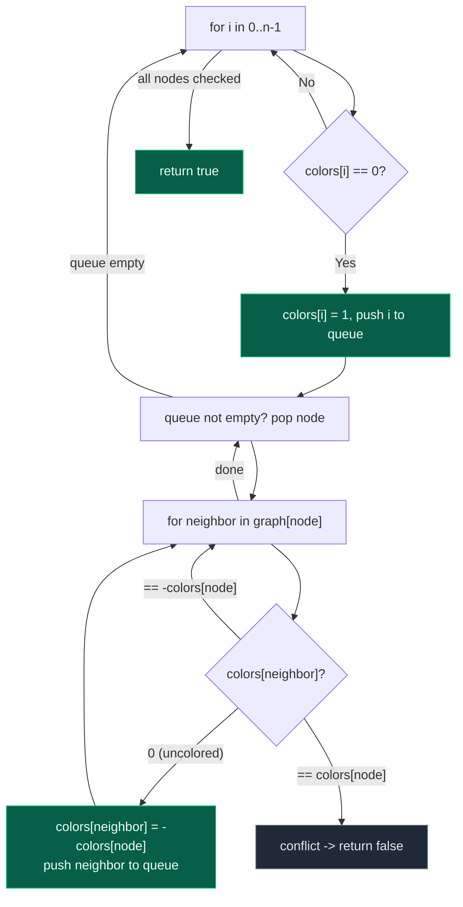
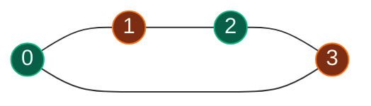
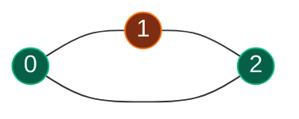

# 11. 785. Is Graph Bipartite (BFS)

| Difficulty | Pattern | Source | Time | Space |
|:---:|:---:|:---:|:---:|:---:|
| **Medium** | 2-Coloring via BFS | [785. Is Graph Bipartite?](https://leetcode.com/problems/is-graph-bipartite/) | `O(V+E)` | `O(V)` |

## 1. Problem Statement

There is an **undirected graph** with `n` nodes, where each node is numbered between `0` and `n - 1`. A 2D array `graph` is given, where `graph[u]` is an array of nodes that node `u` is adjacent to. More formally, for each `v` in `graph[u]`, there is an undirected edge between node `u` and node `v`. The graph has the following properties:

- There are no self-edges (`graph[u]` does not contain `u`).
- There are no parallel edges (`graph[u]` does not contain duplicate values).
- If `v` is in `graph[u]`, then `u` is in `graph[v]` (the graph is undirected).
- The graph may not be connected, meaning there may be two nodes `u` and `v` such that there is no path between them.

A graph is **bipartite** if the nodes can be partitioned into two independent sets `A` and `B` such that **every** edge in the graph connects a node in set `A` and a node in set `B`.

Return `true` if and only if it is **bipartite**.

### Examples

```text
Input: graph = [[1,2,3],[0,2],[0,1,3],[0,2]]
Output: false
Explanation: There is no way to partition the nodes into two independent sets
such that every edge connects a node in one and a node in the other.
(0-1-2-0 forms a triangle, an odd cycle.)

Input: graph = [[1,3],[0,2],[1,3],[0,2]]
Output: true
Explanation: We can partition the nodes into two sets: {0, 2} and {1, 3}.
```

### Constraints

- `graph.length == n`
- `1 <= n <= 100`
- `0 <= graph[u].length < n`
- `0 <= graph[u][i] <= n - 1`
- `graph[u]` does not contain `u`.
- All the values of `graph[u]` are unique.
- If `graph[u]` contains `v`, then `graph[v]` contains `u`.

## 2. Core Theory

**What "bipartite" means.** A graph is bipartite exactly when its vertices can be split into two independent groups — call them group `A` and group `B` — such that **every single edge** goes between the two groups, and never stays inside one. No edge is allowed to connect two nodes that are both in `A`, or both in `B`. Visually, if you drag all of `A`'s nodes to the left and all of `B`'s nodes to the right, every edge in the picture crosses from left to right — none of them curve back to connect two nodes on the same side.

**Why 2-coloring is the same question.** Assigning every node one of exactly two colors, such that no edge ever connects two same-colored nodes, is a direct restatement of the bipartite definition: "color 1" nodes are exactly group `A`, "color 2" nodes are exactly group `B`, and the "no edge connects two same-colored nodes" rule is exactly "no edge stays inside one group." So testing bipartiteness reduces to: **can this graph be properly 2-colored?**

**BFS coloring algorithm.** Maintain a `colors[]` array, with `0` meaning uncolored and `1` / `-1` as the two colors:

1. Loop over every node `0..n-1` (the graph may be disconnected, so every component needs its own starting seed). Whenever an uncolored node is found, start a fresh BFS from it, giving it color `1` (the specific choice of starting color is arbitrary and independent between components).
2. Push the seed node onto a queue after coloring it.
3. While the queue is non-empty, pop a node and look at each of its neighbours:
   - If the neighbour is **uncolored**, assign it the **opposite** color of the current node and push it onto the queue.
   - If the neighbour is **already colored**, check it: it must be the opposite color of the current node. If instead it has the **same** color as the current node, that is a direct conflict — the graph cannot be 2-colored, so return `false` immediately.
4. If the queue drains with no conflict, that whole component is successfully 2-colored; move to the next uncolored node in the outer loop.
5. If every component finishes without a conflict, the graph is bipartite — return `true`.

**Why the coloring test is equivalent to the bipartite definition.** If a valid 2-coloring exists, group `A` = all color-`1` nodes and group `B` = all color-`-1` nodes satisfy the bipartite condition by construction, since the coloring rule forbids any edge between two same-colored (same-group) nodes. Conversely, if the graph really is bipartite, coloring every node in `A` with `1` and every node in `B` with `-1` is a valid 2-coloring — BFS starting from any node will simply rediscover this same split (up to swapping which side gets which color), because the alternation forced by each edge exactly matches which side of the partition each neighbour must be on.



**A 2-colorable graph (bipartite):**



**An odd cycle (NOT 2-colorable):**



Walking the triangle `0-1-2-0`: color `0` as `1`, forces `1` to be `-1`, forces `2` to be `1` — but `2` is directly adjacent to `0`, which is also color `1`. The last edge closes the loop onto a same-colored pair, so no valid 2-coloring exists. This is why **any odd-length cycle** makes a graph non-bipartite: walking around an odd cycle, the forced alternation cannot line back up consistently with the starting node's color, whereas an even-length cycle always closes cleanly.

## 3. Edge Cases

| Case | Input | Expected | Why it matters |
|:---|:---|:---:|:---|
| Single node, no edges | `graph = [[]]` | `true` | Trivially 2-colorable; BFS still must seed and color node `0` even though its queue empties immediately |
| Disconnected graph, one component fails | `graph = [[1],[0],[3,4],[2,4],[2,3]]` | `false` | Nodes `2,3,4` form a triangle (odd cycle) while `0,1` are fine; the outer loop must still check every component, and a conflict in *any* component fails the whole graph |
| Self-loop | `graph[u]` contains `u` itself | never bipartite | An edge from a node to itself forces that node to be both colors simultaneously — an immediate, unavoidable conflict (not present in LeetCode 785's constraints, but a natural follow-up variant) |
| Empty graph | `graph = []` | `true` | The outer loop has nothing to iterate over; vacuously bipartite |

## 4. Approach 1 (Optimal) — BFS with a Color Array

### Intuition

Greedily 2-color the graph level by level: color the seed node, then push it onto a queue; every time a node is popped, force all of its uncolored neighbours to the opposite color and enqueue them, while double-checking any already-colored neighbour actually has the opposite color.

### Approach

1. Initialize `colors = [0] * n` (`0` = uncolored, `1` and `-1` for the two colors).
2. Iterate `i` from `0` to `n - 1` to reach every disconnected component. If `colors[i] == 0`, start a new BFS: set `colors[i] = 1` and push `i` onto a queue.
3. While the queue is non-empty, pop `node` and iterate over `graph[node]`:
   - If `colors[neighbor] == 0` (uncolored), assign it `-colors[node]` and push it onto the queue.
   - Otherwise, if `colors[neighbor] == colors[node]` (same color as current node), that's a conflict — return `false` immediately.
4. If every component's BFS drains cleanly, the graph is bipartite — return `true`.

### Dry Run

```text
graph = [[1,3],[0,2],[1,3],[0,2]]   (4-cycle: 0-1-2-3-0)
colors = [0,0,0,0]

i=0: colors[0]==0 -> colors[0]=1, queue=[0]

pop 0:
  neighbor 1: colors[1]==0 -> colors[1]=-1, queue=[1]
  neighbor 3: colors[3]==0 -> colors[3]=-1, queue=[1,3]

pop 1:
  neighbor 0: colors[0]==1, colors[1]==-1 -> opposite, fine, no action
  neighbor 2: colors[2]==0 -> colors[2]=1, queue=[3,2]

pop 3:
  neighbor 0: colors[0]==1, colors[3]==-1 -> opposite, fine
  neighbor 2: colors[2]==1, colors[3]==-1 -> opposite, fine

pop 2:
  neighbor 1: colors[1]==-1, colors[2]==1 -> opposite, fine
  neighbor 3: colors[3]==-1, colors[2]==1 -> opposite, fine

queue empty, no conflicts -> component done
i=1,2,3: already colored, skip

No conflicts anywhere -> return True (bipartite)
```

### Code

```python
# Import the required lib's
from collections import deque
from typing import List


class Solution:

    # Define the method
    def isBipartite(self, graph: List[List[int]]) -> bool:

        # Compute the length of the graph
        n = len(graph)

        # Define the color array; 0 = uncolored, 1 / -1 are the two colors
        colors = [0] * n

        # Iterate over all nodes to handle disconnected components
        for i in range(n):

            # Skip nodes already colored by an earlier component's BFS
            if colors[i] != 0:
                continue

            # Seed this component: color the start node and push it
            colors[i] = 1
            queue = deque([i])

            # Standard BFS, forcing the opposite color on every neighbor
            while queue:
                node = queue.popleft()

                for neighbor in graph[node]:

                    if colors[neighbor] == 0:
                        # Uncolored neighbor: force the opposite color and enqueue
                        colors[neighbor] = -colors[node]
                        queue.append(neighbor)

                    elif colors[neighbor] == colors[node]:
                        # Same color as current node: direct conflict
                        return False

        # Every component colored without conflict
        return True
```

### Complexity

| Measure | Complexity | Why |
|:---|:---:|:---|
| **Time** | `O(V+E)` | Every vertex is colored and enqueued once; every edge is inspected once from each endpoint that processes it |
| **Space** | `O(V)` | The `colors` array plus the BFS queue, both bounded by the number of vertices |

## 5. Common Mistakes

| Mistake | Why it breaks | Fix |
|:---|:---|:---|
| Only checking `colors[neighbor] == 0` and skipping the same-color check entirely | An already-visited neighbour with the *same* color as the current node is a real conflict that must fail the whole check, not something to silently ignore | Always compare an already-colored neighbour's color against the current node's color, and return `false` on a match |
| Forgetting the outer `for i in range(n)` loop and only BFS-ing from node `0` | Disconnected components other than node `0`'s component never get colored or checked, so a graph that fails only in a later component is wrongly reported as bipartite | Loop over every node and start a fresh BFS whenever an uncolored node is found |
| Marking a node's color only when it is popped from the queue, not when it is enqueued | The same node can be enqueued multiple times by different neighbours before being processed, wasting work and potentially colored inconsistently by two different callers first | Assign the color at the moment of discovery/enqueue, exactly as done for the seed node |
| Using `True`/`False` (or `0`/`1`) as the two colors instead of two symmetric values like `1`/`-1` | Makes "opposite color" awkward (`not color` or `1 - color` both work but are easy to get backwards and don't compose as cleanly with an "uncolored" sentinel) | Use `1` and `-1` as the two colors and `0` as the uncolored sentinel, so the opposite color is simply `-color` |
| Not checking every connected component separately | A conflict confined to one small component (e.g. a triangle tucked away in an otherwise-fine graph) gets missed if the traversal never reaches that component | Ensure the outer loop visits every node index, not just the ones reachable from node `0` |

## 6. Interview Follow-ups

**Q: How does this compare to the DFS version?**

A: Identical coloring logic — the only difference is the traversal mechanism. BFS uses an explicit queue and processes nodes level by level; DFS uses the call stack (implicit) and goes deep into one branch before backtracking. Both are `O(V+E)` time and `O(V)` space, and both correctly detect any odd cycle because the conflict check depends only on adjacent colors, never on visit order.

**Q: Can you solve this with Union-Find instead?**

A: Yes — for each node, union all of its neighbours together (since they must all end up in the *opposite* group from the node, they must all agree with each other), then check that no neighbour ends up in the same set as the node itself. If any node and one of its neighbours land in the same Union-Find component, the graph is not bipartite.

**Q: Why does an odd-length cycle always make a graph non-bipartite?**

A: Walking around a cycle of length `k`, colors must strictly alternate at every edge. After `k` steps you arrive back at the start node. If `k` is even, the alternation lines up and the forced color matches the start node's actual color. If `k` is odd, the last edge forces the start node to be the *same* color as itself — a direct contradiction, so no valid 2-coloring can exist.

**Q: What if the graph has a self-loop (a node adjacent to itself)?**

A: A self-loop is an automatic failure: the node would need to be the opposite color of itself, which is impossible. (LeetCode 785 explicitly rules self-loops out via its constraints, but it's a natural follow-up to test whether the conflict-detection logic — `colors[neighbor] == colors[node]` — already handles it correctly without special-casing: it does, since a self-loop makes `neighbor == node`, so the comparison trivially triggers a conflict the first time that node is processed.)

**Q: How would you also return one of the two partition sets if the graph is bipartite?**

A: Once colored successfully, collect all nodes with `colors[i] == 1` into set `A` and `colors[i] == -1` into set `B` — the `colors` array already encodes the partition; no extra work is needed beyond the existing coloring pass.

## 7. Interview Explanation

> A graph is bipartite exactly when its nodes can be split into two groups so that every edge crosses between the groups and none stays inside one — which is the same as asking whether the graph can be properly 2-colored, with each color representing one group. I run a BFS-based coloring: keep a `colors` array (0 = uncolored, 1 or -1 for the two colors), and for every node still uncolored, seed a new BFS giving it color 1 and push it onto a queue. While the queue isn't empty, I pop a node and look at its neighbours — an uncolored neighbour gets forced to the opposite color and gets enqueued, while an already-colored neighbour is checked: if it happens to match the current node's color instead of being the opposite, that's a direct conflict, and I return false immediately. Since the graph can be disconnected, I loop over every node index and start a fresh BFS for any component I haven't reached yet — each component is colored independently. If every component's BFS finishes without a conflict, the graph is bipartite. This is O(V+E) time since every vertex and edge is processed a constant number of times, and O(V) space for the colors array plus the BFS queue.

## 8. Verify

```python
from collections import deque
from typing import List


def is_bipartite(graph: List[List[int]]) -> bool:
    # Compute the length of the graph
    n = len(graph)

    # Define the color array; 0 = uncolored, 1 / -1 are the two colors
    colors = [0] * n

    # Iterate over all nodes to handle disconnected components
    for i in range(n):

        # Skip nodes already colored by an earlier component's BFS
        if colors[i] != 0:
            continue

        # Seed this component: color the start node and push it
        colors[i] = 1
        queue = deque([i])

        # Standard BFS, forcing the opposite color on every neighbor
        while queue:
            node = queue.popleft()
            for neighbor in graph[node]:
                if colors[neighbor] == 0:
                    # Uncolored neighbor: force the opposite color and enqueue
                    colors[neighbor] = -colors[node]
                    queue.append(neighbor)
                elif colors[neighbor] == colors[node]:
                    # Same color as current node: direct conflict
                    return False

    # Every component colored without conflict
    return True


# LeetCode examples
assert is_bipartite([[1, 2, 3], [0, 2], [0, 1, 3], [0, 2]]) is False
assert is_bipartite([[1, 3], [0, 2], [1, 3], [0, 2]]) is True

# Single node, no edges: trivially 2-colorable
assert is_bipartite([[]]) is True

# Disconnected graph, one component (triangle) fails: any conflicting component fails the whole graph
assert is_bipartite([[1], [0], [3, 4], [2, 4], [2, 3]]) is False

# Disconnected graph, both components bipartite
assert is_bipartite([[1], [0], [3], [2]]) is True

# Odd-length cycle (triangle) -> not bipartite
assert is_bipartite([[1, 2], [0, 2], [0, 1]]) is False

# Even-length cycle -> bipartite
assert is_bipartite([[1, 3], [0, 2], [1, 3], [0, 2]]) is True

# Empty graph: outer loop has nothing to iterate over, vacuously bipartite
assert is_bipartite([]) is True

print("All tests passed")
```
