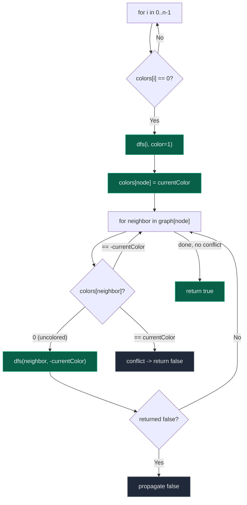

# 12. 785. Is Graph Bipartite (DFS)

| Difficulty | Pattern | Source | Time | Space |
|:---:|:---:|:---:|:---:|:---:|
| **Medium** | 2-Coloring via DFS | [785. Is Graph Bipartite?](https://leetcode.com/problems/is-graph-bipartite/) | `O(V+E)` | `O(V)` |

## 1. Problem Statement

There is an **undirected graph** with `n` nodes, where each node is numbered between `0` and `n - 1`. A 2D array `graph` is given, where `graph[u]` is an array of nodes that node `u` is adjacent to. More formally, for each `v` in `graph[u]`, there is an undirected edge between node `u` and node `v`. The graph has the following properties:

- There are no self-edges (`graph[u]` does not contain `u`).
- There are no parallel edges (`graph[u]` does not contain duplicate values).
- If `v` is in `graph[u]`, then `u` is in `graph[v]` (the graph is undirected).
- The graph may not be connected, meaning there may be two nodes `u` and `v` such that there is no path between them.

A graph is **bipartite** if the nodes can be partitioned into two independent sets `A` and `B` such that **every** edge in the graph connects a node in set `A` and a node in set `B`.

Return `true` if and only if it is **bipartite**.

### Examples

```text
Input: graph = [[1,2,3],[0,2],[0,1,3],[0,2]]
Output: false
Explanation: There is no way to partition the nodes into two independent sets
such that every edge connects a node in one and a node in the other.
(0-1-2-0 forms a triangle, an odd cycle.)

Input: graph = [[1,3],[0,2],[1,3],[0,2]]
Output: true
Explanation: We can partition the nodes into two sets: {0, 2} and {1, 3}.
```

### Constraints

- `graph.length == n`
- `1 <= n <= 100`
- `0 <= graph[u].length < n`
- `0 <= graph[u][i] <= n - 1`
- `graph[u]` does not contain `u`.
- All the values of `graph[u]` are unique.
- If `graph[u]` contains `v`, then `graph[v]` contains `u`.

## 2. Core Theory

A graph is bipartite exactly when it can be **2-colored**: every node gets one of two colors such that no edge connects two same-colored nodes. This is the identical idea used in the BFS version of this problem — only the *traversal mechanism* changes.

```text
BFS VERSION                              DFS VERSION (this note)
Color start node                         Color start node
Push to queue                            Recurse into neighbours directly
Pop node, look at neighbours             Current call frame IS the "current node"
Level-by-level expansion                 Depth-first expansion (goes deep first)
Same conflict rule                       Same conflict rule
```

**The coloring rule (shared by both):** maintain a `colors[]` array, `0` = uncolored, and `1` / `-1` as the two colors. To color a component:

1. Pick an uncolored node, assign it color `c` (say `1`).
2. Recurse into each neighbour:
   - If the neighbour is uncolored, recursively color it the **opposite** color (`-c`) — go deeper immediately (that's the DFS part).
   - If the neighbour is **already colored**, it must already be the opposite color. If it's the *same* color as the current node, that's a direct conflict — return `false` immediately (the whole search stops, not just this branch).
3. If every neighbour is consistent, this node (and its subtree) is fine — return `true` and let the caller continue.
4. Because the graph may be **disconnected**, loop over every node `0..n-1` and start a fresh DFS from any node that is still uncolored — the color chosen for a new component (`1` or `-1`) is arbitrary and independent of other components.



**Why recursion instead of a queue changes nothing about correctness.** The coloring decision for a node depends only on its own color and its neighbour's current color — it never depends on *which other uncolored nodes are still pending* or the *order* in which they get visited. BFS visits neighbours level by level; DFS dives down one branch to its end before backtracking. Either order discovers the same connected component and enforces the same alternation rule, so both must produce the same true/false verdict for a given graph.

**Sample trace on `graph = [{2},{1,3},{2,4},{3,5,7},{4,6},{2,5},{4,8}]`-style odd cycle** (using the whiteboard's numbering `1..8` with edges `1-2, 2-3, 3-4, 4-5, 4-7, 7-8, 2-6, 5-6`):

```text
graph:
1 -> {2}
2 -> {1, 3}
3 -> {2, 4}
4 -> {3, 5, 7}
5 -> {4, 6}
6 -> {2, 5}
7 -> {4, 8}
8 -> {7}

dfs(1, color=1)  -> colors[1]=1
  dfs(2, color=-1) -> colors[2]=-1
    dfs(3, color=1)  -> colors[3]=1
      dfs(4, color=-1) -> colors[4]=-1
        dfs(5, color=1)  -> colors[5]=1
          dfs(6, color=-1) -> colors[6]=-1
            neighbor 2 already colored -1 == currentColor(-1) for 6? check: 6's color=-1, neighbor 2's color=-1 -> conflict? 
            Actually neighbor 2 has color -1, node 6 has color -1 -> SAME color -> conflict -> return False
        propagate False up through 5, 4, 3, 2, 1
Result: NOT bipartite (the cycle 2-3-4-5-6-2 has odd length 5)
```

## 3. Edge Cases

| Case | Input | Expected | Why it matters |
|:---|:---|:---:|:---|
| Single node, no edges | `graph = [[]]` | `true` | Trivially 2-colorable; the outer loop still must call `dfs(0)` once |
| Disconnected graph | `graph = [[1],[0],[3],[2]]` | `true` | Each component is colored independently; the outer `for i in 0..n-1` loop must not stop after the first component |
| Odd-length cycle | `graph = [[1,2],[0,2],[0,1]]` (triangle) | `false` | An odd cycle can never be 2-colored — the last edge always closes onto a same-colored pair |
| Even-length cycle | `graph = [[1,3],[0,2],[1,3],[0,2]]` | `true` | Even cycles alternate colors perfectly and close consistently |

## 4. Approach 1 (Optimal) — DFS with a Color Array

### Intuition

Try to 2-color the graph greedily with DFS: color a node, then immediately recurse into its neighbours forcing the opposite color, backing out (returning `false`) the instant two adjacent nodes are found with the same color.

### Approach

1. Initialize `colors = [0] * n` (`0` = uncolored, use `1` and `-1` for the two colors).
2. Iterate `i` from `0` to `n - 1` to reach every disconnected component. If `colors[i] == 0`, start a DFS from `i` with an initial color (e.g. `1`).
3. Inside `dfs(node, color)`:
   - If `colors[node] != 0` (already colored), the node was already colored on this same search — return whether that stored color matches the expected `color`.
   - Otherwise set `colors[node] = color`.
   - For every neighbour, if uncolored, recurse with the opposite color; if that recursive call returns `False`, propagate `False` immediately.
   - If a neighbour is already colored, verifying it happens via the "already colored" branch above (call `dfs` on it too — it short-circuits into the check without recoloring).
4. If the main loop finishes without any `dfs` call returning `false`, the graph is bipartite — return `true`.

### Dry Run

```text
graph = [[1,3],[0,2],[1,3],[0,2]]   (4-cycle: 0-1-2-3-0)
colors = [0,0,0,0]

i=0: colors[0]==0 -> dfs(0, 1)
  colors[0] = 1
  neighbor 1: colors[1]==0 -> dfs(1, -1)
    colors[1] = -1
    neighbor 0: colors[0]==1 != 0 -> check colors[0]==-1? No wait, expected color passed is 1 (opposite of -1) -> colors[0]==1 matches -> True, no conflict
    neighbor 2: colors[2]==0 -> dfs(2, 1)
      colors[2] = 1
      neighbor 1: colors[1]==-1 != 0 -> expected -1, matches -> True
      neighbor 3: colors[3]==0 -> dfs(3, -1)
        colors[3] = -1
        neighbor 0: colors[0]==1 != 0 -> expected 1, matches -> True
        neighbor 2: colors[2]==1 != 0 -> expected 1, matches -> True
        return True
      return True
    return True
  return True
i=1,2,3: already colored, skip

No conflicts anywhere -> return True (bipartite)
```

### Code

```python
# Define the class solution
class Solution:

    # Define a helper DFS function that tries to color the graph
    # node: current node we are visiting
    # color: the color we want to assign to this node (1 or -1)
    def dfs(self, node: int, color: int, colors: list, graph: list) -> bool:

        # If node already colored, check for conflict
        if colors[node] != 0:
            return colors[node] == color

        # If the node is not colored yet, assign the given color
        colors[node] = color

        # Iterate through all neighbors of the current node
        for neighbor in graph[node]:

            # Recursively call dfs on the neighbor with the opposite color (-color)
            if not self.dfs(neighbor, -color, colors, graph):

                # If any recursive call returns False, propagate the failure
                return False

        # If all neighbors are processed without conflict, this part is bipartite
        return True

    # Define the method
    def isBipartite(self, graph: list) -> bool:

        # Compute the length of the graph
        n = len(graph)

        # Define the color array
        colors = [0] * n

        # Iterate over all the components to handle the disconnected components
        for i in range(n):

            # If the node is not coloured yet then we start the new dfs from this node
            if colors[i] == 0:

                # Call the dfs with initial color 1; if it fails then the graph is not bipartite
                if not self.dfs(i, 1, colors, graph):

                    # Immediately return false if any component is not bipartite
                    return False

        # If all components are successfully colored, the graph is bipartite
        return True
```

### Complexity

| Measure | Complexity | Why |
|:---|:---:|:---|
| **Time** | `O(V+E)` | Every vertex is colored once; every edge is inspected once (from each endpoint that visits it) |
| **Space** | `O(V)` | The `colors` array plus recursion call stack depth proportional to the number of vertices |

## 5. Common Mistakes

| Mistake | Why it breaks | Fix |
|:---|:---|:---|
| Checking `colors[neighbor] == 0` and treating "not yet visited in this branch" as "safe" without verifying an already-colored neighbor | An already-colored neighbor with the *same* color as the current node is a real conflict and must fail the whole check | Always route through the "already colored" branch (`return colors[node] == color`) even for neighbors visited earlier |
| Forgetting the outer `for i in range(n)` loop and only calling `dfs(0, ...)` once | Disconnected components other than node 0's component never get colored or checked | Loop over every node and only start a new DFS when it is still uncolored |
| Using `True`/`False` as colors instead of two symmetric values like `1`/`-1` | Makes "opposite color" awkward to express (`not color` works, but is easy to get backwards when nodes are pre-colored on entry) | Use `1` and `-1` so the opposite color is simply `-color` |
| Not propagating a `False` return value up through every recursive call | A conflict found deep in the recursion gets silently swallowed, and the algorithm incorrectly reports `true` | Every call site must `return False` immediately when the recursive call it made returns `False` |

## 6. Interview Follow-ups

**Q: How does this compare to the BFS version?**

A: Identical coloring logic — the only difference is the traversal mechanism. BFS uses an explicit queue and processes nodes level by level; DFS uses the call stack (implicit) and goes deep into one branch before backtracking. Both are `O(V+E)` time and `O(V)` space, and both correctly detect any odd cycle because the conflict check depends only on adjacent colors, not visit order.

**Q: Why does an odd cycle make a graph non-bipartite, but an even cycle doesn't?**

A: Walking around a cycle of length `k`, colors must strictly alternate. After `k` steps you return to the start node — if `k` is even, the alternation lines up and the start node's forced color matches its actual color; if `k` is odd, the last edge forces the start node to be the same color as itself, a direct contradiction.

**Q: Can you solve this without recursion, to avoid stack overflow on large graphs?**

A: Yes — convert to an explicit stack-based DFS (push nodes onto a manual stack instead of using the call stack), or just use the BFS-with-queue version, which has no recursion depth concerns at all.

**Q: How would you also return one of the two partition sets if the graph is bipartite?**

A: Once colored successfully, collect all nodes with `colors[i] == 1` into set A and `colors[i] == -1` into set B — the `colors` array already encodes the partition; no extra work is needed beyond the existing coloring pass.

## 7. Interview Explanation

> A graph is bipartite exactly when it can be properly 2-colored, so I run a DFS-based coloring: for every node, alternate colors as I move to each neighbor. I keep a `colors` array (0 = uncolored, 1 or -1 for the two colors). Whenever I visit an uncolored neighbor, I recurse into it with the opposite color of the current node. Whenever I encounter an already-colored neighbor, I check it has the opposite color — if it matches the current node's color instead, that's a direct conflict and I return false immediately, propagating the failure all the way up the call stack. Since the graph may be disconnected, I loop over every node and start a fresh DFS whenever I find one still uncolored — each component can be colored independently. This is O(V+E) time since every vertex and edge is processed a constant number of times, and O(V) space for the colors array plus the recursion stack.

## 8. Verify

```python
class Solution:
    def dfs(self, node, color, colors, graph):
        if colors[node] != 0:
            return colors[node] == color
        colors[node] = color
        for neighbor in graph[node]:
            if not self.dfs(neighbor, -color, colors, graph):
                return False
        return True

    def isBipartite(self, graph):
        n = len(graph)
        colors = [0] * n
        for i in range(n):
            if colors[i] == 0:
                if not self.dfs(i, 1, colors, graph):
                    return False
        return True


sol = Solution()

# LeetCode examples
assert sol.isBipartite([[1, 2, 3], [0, 2], [0, 1, 3], [0, 2]]) == False
assert sol.isBipartite([[1, 3], [0, 2], [1, 3], [0, 2]]) == True

# Single node, no edges
assert sol.isBipartite([[]]) == True

# Disconnected graph, both components bipartite
assert sol.isBipartite([[1], [0], [3], [2]]) == True

# Odd-length cycle (triangle) -> not bipartite
assert sol.isBipartite([[1, 2], [0, 2], [0, 1]]) == False

# Even-length cycle -> bipartite
assert sol.isBipartite([[1, 3], [0, 2], [1, 3], [0, 2]]) == True

print("All tests passed")
```
