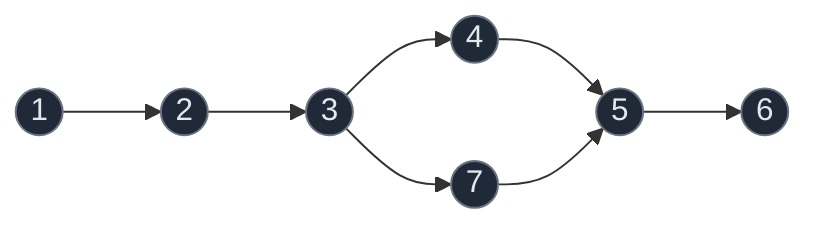
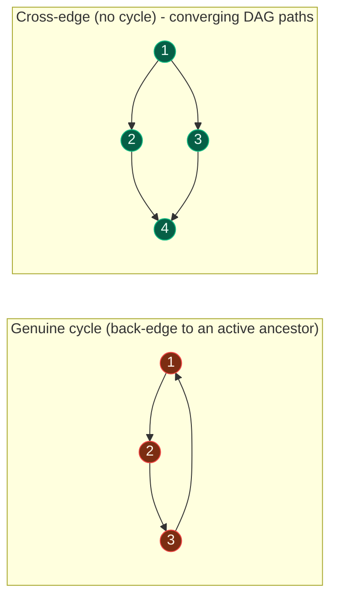

# 13. Detect Cycle in a Directed Graph using DFS

| Difficulty | Pattern | Source | Time | Space |
|:---:|:---:|:---:|:---:|:---:|
| **Medium** | DFS with recursion-stack tracking | [Directed Graph Cycle](https://www.geeksforgeeks.org/problems/detect-cycle-in-a-directed-graph/1) | `O(V+E)` | `O(V)` |

## 1. Problem Statement

Given a Directed Graph with `V` vertices (numbered from `0` to `V-1`) and `E` edges, check whether it contains any **cycle** or not. The graph is represented as a 2D vector `edges[][]`, where each entry `edges[i] = [u, v]` denotes an edge from vertex `u` to vertex `v`.

### Examples

```text
Input: V = 4, edges[][] = [[0, 1], [1, 2], [2, 0], [2, 3]]
Output: true
Explanation: The diagram clearly shows a cycle 0 -> 1 -> 2 -> 0

Input: V = 4, edges[][] = [[0, 1], [0, 2], [1, 2], [2, 3]]
Output: false
Explanation: No cycle in the graph
```

### Constraints

- `1 <= V <= 10^5`
- `0 <= E <= 10^5`
- `0 <= edges[i][0], edges[i][1] < V`

## 2. Core Theory

**This is fundamentally different from cycle detection in an UNDIRECTED graph — read this before writing any code.** In the undirected version, the trick was "visited and not the parent." That trick is **meaningless here**, because in a directed graph an edge only goes one way — there is no symmetric "parent" edge to exclude, and simply reaching an already-`visited` node does **not** mean a cycle exists. It might just mean two different paths happen to both lead to the same, already-finished node (a **cross edge**) — completely normal in a DAG (Directed Acyclic Graph), not a cycle at all.



```text
Path taken:            dfs(1) -> dfs(2) -> dfs(3) -> dfs(4) -> dfs(5) -> dfs(6)
Then backtrack to 3:   dfs(3) -> dfs(7) -> dfs(5)   <- 5 is already `visited`
```

Node `5` above is reached twice: once via `4`, once via `7`. The second visit to `5` is a **cross edge** — `5` was already fully explored (finished) and is *not* an ancestor of `7` in the current recursion path. This is fine and does NOT make the graph cyclic. If cycle detection only checked a single global `visited[]` array, it would **wrongly report a cycle here** — this is the single most important trap in this topic.

**The fix — track TWO states per node:**

- `visited[u]` — has `u` ever been visited, in *any* DFS call, ever? (never reset)
- `pathVisited[u]` (a.k.a. `recStack[u]`, the "recursion stack" / in-path marker) — is `u` currently an **ancestor of the current node**, i.e. still an active, unfinished call on the current DFS chain?

A genuine cycle exists only when DFS reaches a node `v` such that `pathVisited[v] == True` — that is a **back edge** to a live ancestor, closing a loop. Reaching a node with `visited[v] == True` but `pathVisited[v] == False` is a harmless cross edge to an already-finished, non-ancestor branch.



**Why you must REMOVE a node from `pathVisited` on backtrack (but never from `visited`).** `pathVisited` means "currently an ancestor of the node being explored right now." Once DFS finishes exploring all of `u`'s descendants and returns from `dfs(u)`, `u` is no longer on the active call chain — any future node that reaches `u` again is reaching a *finished* branch, not looping back to a live ancestor. So the algorithm must set `pathVisited[u] = False` immediately before returning, so that a later, unrelated path through `u` isn't mistaken for a cycle. `visited[u]`, in contrast, must **stay** `True` forever — it exists purely to avoid redoing the (expensive) DFS work on a node that has already been fully explored; whether `u` was ever visited never becomes false again.

```text
dfs(u):
    visited[u] = True
    pathVisited[u] = True        <- u joins the active chain
    for v in adj[u]:
        if not visited[v]:
            if dfs(v): return True
        elif pathVisited[v]:     <- v is a LIVE ancestor -> real cycle
            return True
        # else: visited[v] and not pathVisited[v] -> cross edge, ignore
    pathVisited[u] = False       <- u leaves the active chain (backtrack)
    return False
```

## 3. Edge Cases

| Case | Input | Expected | Why it matters |
|:---|:---|:---:|:---|
| Self-loop | `V=1, edges=[[0,0]]` | `true` | Smallest possible cycle — a node pointing to itself; `pathVisited[0]` is still `True` when its own edge is examined |
| No edges | `V=3, edges=[]` | `false` | No traversal ever finds a back edge; also verifies the algorithm handles isolated vertices without crashing |
| DAG with converging paths (cross edge) | `V=4, edges=[[0,1],[0,2],[1,3],[2,3]]` | `false` | Node `3` is reached from both `1` and `2` — a cross edge, not a cycle; must NOT false-positive |

## 4. Approach 1 (Optimal) — DFS with `visited` + `pathVisited` (Recursion Stack)

### Intuition

Run DFS from every unvisited node. While exploring, mark each node both globally visited and as part of the current path. A back edge to a node still marked "in the current path" proves a cycle; a hit on a node that's visited but no longer in the current path is a harmless cross edge.

### Approach

1. Allocate `visited = [False] * V` and `pathVisited = [False] * V`.
2. For every vertex `i` from `0` to `V-1`, if not yet `visited[i]`, run `dfs(i)`. This loop guarantees disconnected components are all checked.
3. Inside `dfs(u)`:
   - Set `visited[u] = True` and `pathVisited[u] = True`.
   - For each neighbour `v` in `adj[u]`:
     - If `v` is not visited, recurse; if that recursion returns `True`, propagate `True` immediately.
     - Else if `pathVisited[v]` is `True`, a back edge to a live ancestor was found — return `True`.
     - Else (`visited[v]` is `True` but `pathVisited[v]` is `False`) — this is a cross edge; ignore and continue the loop.
   - After the loop finishes with no cycle found through `u`, set `pathVisited[u] = False` (backtrack) and return `False`.
4. Return `True` overall if any `dfs` call found a cycle; otherwise `False`.

### Dry Run

```text
Graph:
1 -> {2}
2 -> {3}
3 -> {4, 7}
4 -> {5}
5 -> {6}
6 -> {}
7 -> {5}
8 -> {9}
9 -> {10}
10 -> {8}

dfs(1): visited[1]=T, pathVisited[1]=T
  dfs(2): visited[2]=T, pathVisited[2]=T
    dfs(3): visited[3]=T, pathVisited[3]=T
      dfs(4): visited[4]=T, pathVisited[4]=T
        dfs(5): visited[5]=T, pathVisited[5]=T
          dfs(6): visited[6]=T, pathVisited[6]=T
            no neighbors -> pathVisited[6]=F, return False
          no more neighbors -> pathVisited[5]=F, return False
        no more neighbors -> pathVisited[4]=F, return False
      dfs(7): visited[7]=T, pathVisited[7]=T
        neighbor 5: visited[5]=T, pathVisited[5]=F -> CROSS EDGE, ignore (not a cycle)
        no more neighbors -> pathVisited[7]=F, return False
      no more neighbors -> pathVisited[3]=F, return False
    no more neighbors -> pathVisited[2]=F, return False
  no more neighbors -> pathVisited[1]=F, return False
Component {1..7}: no cycle

dfs(8): visited[8]=T, pathVisited[8]=T
  dfs(9): visited[9]=T, pathVisited[9]=T
    dfs(10): visited[10]=T, pathVisited[10]=T
      neighbor 8: visited[8]=T, pathVisited[8]=T -> BACK EDGE to live ancestor -> CYCLE FOUND
      return True
    return True
  return True
return True

Overall result: cycle found (8 -> 9 -> 10 -> 8), even though {1..7} has a cross edge and is fine.
```

### Code

```python
# Import the required lib's
from typing import List


# Define the class solution
class Solution:

    # Define the method
    def isCyclic(self, V: int, adj: List[List[int]]) -> bool:

        # V = number of vertices
        # adj = adjacency list of directed graph

        # visited[i] == True -> node i has been visited at least once
        visited = [False] * V

        # pathVisited[i] == True -> node i is currently in recursion stack (active path) of DFS
        pathVisited = [False] * V

        # Define DFS helper to detect cycle starting from node 'u'
        def dfs(u: int) -> bool:

            # Mark current node visited and in recursion stack
            visited[u] = True
            pathVisited[u] = True

            # Explore all directed edges u -> v
            for v in adj[u]:

                # If v not visited, DFS on v
                if not visited[v]:

                    # If dfs finds a cycle, propagate True
                    if dfs(v):
                        return True

                # Else if v is already in recursion stack -> back edge -> cycle
                elif pathVisited[v]:
                    return True

                # Else: visited[v] is True but pathVisited[v] is False -> cross edge, safe, continue

            # Done exploring u; remove from recursion stack before backtracking
            pathVisited[u] = False

            # No cycle found starting at u
            return False

        # For each node, run DFS if not already visited (handles disconnected components)
        for i in range(V):

            # If not visited then call the dfs method
            if not visited[i]:

                # Calling the dfs
                if dfs(i):

                    # Return true
                    return True

        # No cycles found anywhere
        return False
```

### Complexity

| Measure | Complexity | Why |
|:---|:---:|:---|
| **Time** | `O(V+E)` | Each vertex is visited once (guarded by `visited[]`); each edge is examined exactly once from its source vertex |
| **Space** | `O(V)` | `visited` and `pathVisited` arrays cost `O(V)`; recursion stack depth is `O(V)` in the worst case (a single long chain) |

## 5. Common Mistakes

| Mistake | Why it breaks | Fix |
|:---|:---|:---|
| Using only one `visited[]` array and declaring a cycle whenever a visited node is reached | Mistakes a **cross edge** (a second path converging on an already-finished node) for a cycle — this is the #1 mistake on this topic and causes false positives on any DAG with converging/diamond-shaped paths | Track two states: `visited` (ever visited) and `pathVisited` (currently an active ancestor); only a hit on `pathVisited` is a real cycle |
| Forgetting to reset `pathVisited[u] = False` when backtracking out of `dfs(u)` | `u` stays marked as "on the active path" forever, so any later, unrelated path that reaches `u` again is wrongly flagged as looping back to a live ancestor | Always clear `pathVisited[u]` right before `dfs(u)` returns, regardless of which branch triggered the return |
| Reusing the undirected-graph trick of "visited and not equal to parent" | Directed edges have no symmetric "parent" edge to exclude; this check doesn't even make sense for a directed graph and will misclassify both cycles and cross edges | Use the `visited` + `pathVisited` two-state scheme designed specifically for directed graphs |
| Not looping over all `V` vertices in the outer loop | Nodes unreachable from vertex 0 (a separate component) never get checked for cycles | Always wrap the DFS call in `for i in range(V): if not visited[i]: dfs(i)` |

## 6. Interview Follow-ups

**Q: Can you detect a cycle without recursion/DFS, using BFS instead?**

A: Yes — use Kahn's algorithm (BFS-based topological sort): repeatedly remove nodes with in-degree 0. If, after processing, fewer than `V` nodes were ever removed, the remaining nodes must form a cycle (they never reached in-degree 0). This is exactly the technique used in the upcoming Topological Sort topic, and it naturally generalizes cycle detection into a full topological ordering when the graph is acyclic.

**Q: How would you find and print the actual cycle, not just report `true`/`false`?**

A: Maintain a `parent` (or path) array during DFS. When a back edge to a `pathVisited` node `v` is found from node `u`, walk the current path backward from `u` to `v` using the recorded parents — that sequence, plus the edge `u -> v`, is one concrete cycle.

**Q: What's the difference between this and detecting a cycle in an undirected graph?**

A: In an undirected graph, every edge is bidirectional, so simply reaching a `visited` neighbor other than your immediate parent proves a cycle — a single `visited` array is enough. In a directed graph, a `visited` node might have been reached via a completely different, already-finished path (a cross edge), which is not a cycle; only reaching a node still `pathVisited` (a live ancestor) counts.

**Q: Does the algorithm change for a graph with self-loops or multiple edges?**

A: No — a self-loop `u -> u` is caught naturally: when exploring `u`'s neighbours, `u` itself is still `pathVisited[u] == True` (it was just set at the top of `dfs(u)`), so the loop immediately reports a cycle. Multiple parallel edges to the same node don't change correctness, only add a few redundant checks.

## 7. Interview Explanation

> Directed graphs need more than a single visited array to detect cycles, because reaching an already-visited node might just be a cross edge from a different, already-finished path — not a loop. So I track two states per node: `visited`, which is true forever once a node has been explored, and `pathVisited` (or recursion-stack), which is true only while that node is an active ancestor on the current DFS call chain. When I visit a node, I mark both true; when I finish exploring all of its neighbours and am about to return, I reset `pathVisited` back to false, since that node is no longer part of the live path. During the neighbour scan, if I hit an unvisited node I recurse into it; if I hit a node that's visited but not `pathVisited`, that's a harmless cross edge and I move on; but if I hit a node that IS still `pathVisited`, that's a back edge to a live ancestor, meaning a genuine cycle, and I return true immediately, propagating it up the call stack. I loop over all vertices at the top level to also catch cycles in disconnected components. This runs in O(V+E) time and O(V) space for the two state arrays plus the recursion stack.

## 8. Verify

```python
class Solution:
    def isCyclic(self, V, adj):
        visited = [False] * V
        pathVisited = [False] * V

        def dfs(u):
            visited[u] = True
            pathVisited[u] = True
            for v in adj[u]:
                if not visited[v]:
                    if dfs(v):
                        return True
                elif pathVisited[v]:
                    return True
            pathVisited[u] = False
            return False

        for i in range(V):
            if not visited[i]:
                if dfs(i):
                    return True
        return False


def build_adj(V, edges):
    adj = [[] for _ in range(V)]
    for u, v in edges:
        adj[u].append(v)
    return adj


sol = Solution()

# LeetCode/GfG examples
adj1 = build_adj(4, [[0, 1], [1, 2], [2, 0], [2, 3]])
assert sol.isCyclic(4, adj1) == True

adj2 = build_adj(4, [[0, 1], [0, 2], [1, 2], [2, 3]])
assert sol.isCyclic(4, adj2) == False

# Self-loop: smallest possible cycle
adj3 = build_adj(1, [[0, 0]])
assert sol.isCyclic(1, adj3) == True

# No edges at all
adj4 = build_adj(3, [])
assert sol.isCyclic(3, adj4) == False

# DAG with converging paths (cross edge) -> must NOT false-positive
# 0 -> 1 -> 3
# 0 -> 2 -> 3   (3 reached twice, via a finished branch each time -> no cycle)
adj5 = build_adj(4, [[0, 1], [0, 2], [1, 3], [2, 3]])
assert sol.isCyclic(4, adj5) == False

# Disconnected: one acyclic component + one cyclic component
adj6 = build_adj(
    11,
    [
        [1, 2], [2, 3], [3, 4], [3, 7], [4, 5], [5, 6], [7, 5],
        [8, 9], [9, 10], [10, 8],
    ],
)
assert sol.isCyclic(11, adj6) == True

print("All tests passed")
```
