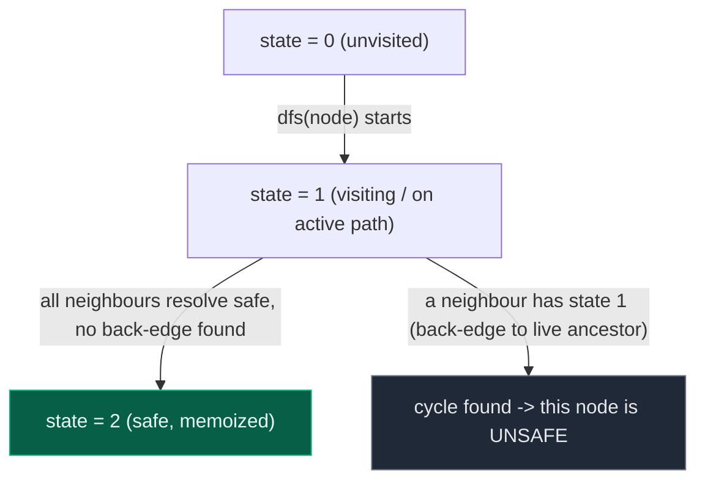
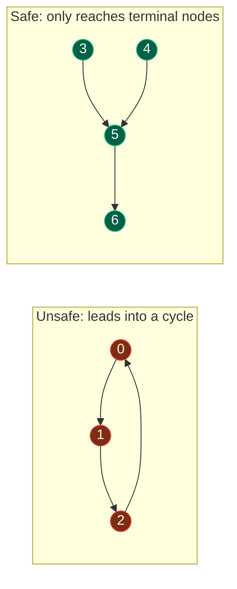

# 14. 802. Find Eventual Safe States

| Difficulty | Pattern | Source | Time | Space |
|:---:|:---:|:---:|:---:|:---:|
| **Medium** | DFS + memoized cycle detection (3-state coloring) | [802. Find Eventual Safe States](https://leetcode.com/problems/find-eventual-safe-states/) | `O(V+E)` | `O(V)` |

## 1. Problem Statement

There is a directed graph of `n` nodes with each node labeled from `0` to `n - 1`. The graph is represented by a **0-indexed** 2D integer array `graph`, where `graph[i]` is an integer array of nodes adjacent to node `i`, meaning there is an edge from node `i` to each node in `graph[i]`.

A node is a **terminal node** if there are no outgoing edges. A node is a **safe node** if every possible path starting from that node leads to a terminal node (or another safe node).

Return an array containing all the **safe nodes** of the graph. The answer should be sorted in **ascending** order.

### Examples

```text
Input: graph = [[1,2],[2,3],[5],[0],[5],[],[]]
Output: [2,4,5,6]
Explanation: The given graph is shown above.
Nodes 5 and 6 are terminal nodes as there are no outgoing edges from either of them.
Every path starting at nodes 2, 4, 5, and 6 all lead to either node 5 or 6.

Input: graph = [[1,2,3,4],[1,2],[3,4],[0,4],[]]
Output: [4]
Explanation:
Only node 4 is a terminal node, and every path starting at node 4 leads to node 4.
```

### Constraints

- `n == graph.length`
- `1 <= n <= 10^4`
- `0 <= graph[i].length <= n`
- `0 <= graph[i][j] <= n - 1`
- `graph[i]` is sorted in strictly increasing order.
- The graph may contain self-loops.
- The number of edges in the graph will be in the range `[1, 4 * 10^4]`.

## 2. Core Theory

This problem reuses the **exact same two-state DFS machinery** as [Detect Cycle in a Directed Graph using DFS](13.%20Detect%20Cycle%20in%20a%20Directed%20Graph%20using%20DFS.md) — read that note first if you haven't. The key insight: a node is **unsafe** if (and only if) it can reach a cycle; it is **safe** otherwise (every path from it eventually dead-ends at a terminal node, possibly through other safe nodes).

```text
Cycle detection (previous note)      Eventual Safe States (this note)
"Does a cycle exist anywhere?"       "Which nodes can reach a cycle?"
Boolean answer                       Per-node answer
visited + pathVisited (2 states)     visited + pathVisited, but now MEMOIZED per node (3 states)
```

**Extending two states into three.** Instead of separate `visited`/`pathVisited` booleans, use one `state[]` array per node with three possible values:

- `0` = **unvisited** — DFS hasn't reached this node yet.
- `1` = **visiting** (currently on the active path) — equivalent to `pathVisited = True`; the node is tentatively unsafe/suspected-cyclic while its descendants are still being explored.
- `2` = **safe** (fully resolved, and safe) — DFS finished exploring every reachable node from here without ever looping back to an active ancestor.

If DFS ever revisits a node whose `state == 1` (still "visiting"), that is a back edge to a live ancestor — a **cycle** — and every node on that cycle (and everything that can reach it) is **unsafe**. If a node's DFS finishes and *none* of its neighbours led back to a `state == 1` node, that node is marked `state = 2` (safe) and memoized forever.





**Why memoization matters here (and didn't strictly matter for boolean cycle detection).** Cycle detection can stop the instant *any* cycle is found — one `True` ends everything. But here every node needs its *own* safe/unsafe verdict, and many nodes share reachable descendants (e.g. two different nodes might both point into node `5`). Without memoizing `state[node] == 2` results, the DFS would re-explore the same safe subtree from scratch for every node that reaches it — on a graph shaped like a fan-in DAG this blows up to exponential time. Memoization guarantees each node's safety is computed exactly once.

```text
dfs(u):
    if state[u] != 0:                 # already resolved (or on active path)
        return state[u] == 2          # true only if previously marked SAFE
    state[u] = 1                      # mark "visiting" (tentatively unsafe)
    for v in graph[u]:
        if state[v] == 1 or not dfs(v):   # v is a live ancestor, OR v resolves unsafe
            return False               # -> u is unsafe
    state[u] = 2                      # every neighbour resolved safe -> u is safe
    return True
```

## 3. Edge Cases

| Case | Input | Expected | Why it matters |
|:---|:---|:---:|:---|
| Terminal node, no outgoing edges | `graph = [[],[0]]` | `[0,1]` | Trivially safe — the `for v in graph[u]` loop body never runs for node 0, so `dfs` falls straight through to `state[u] = 2`; node 1 is then safe too since it only points to the safe terminal node 0 |
| Node directly in a cycle | `graph = [[1],[0]]` | `[]` | Node `0` and `1` point back into each other; both must be marked unsafe (visiting a `state == 1` node) |
| Node that reaches a cycle after several hops | `graph = [[1],[2],[3],[1]]` | `[]` | Node `0` never directly touches the cycle `1->2->3->1`, but transitively `dfs(0)` propagates the "unsafe" result up through every ancestor of the cycle |

## 4. Approach 1 (Optimal) — DFS + Memoized 3-State Coloring

### Intuition

Treat safety as "does not reach a cycle." Run DFS from every node with the same `visited`/`pathVisited` idea used for cycle detection, but generalize the boolean into a 3-value `state[]` so each node's result (safe or unsafe) is cached and reused instantly by every other node that reaches it.

### Approach

1. Initialize `state = [0] * n` (`0` = unvisited, `1` = visiting/on current path, `2` = safe).
2. For each node `i` from `0` to `n-1`, call `dfs(i)`; collect `i` into the result if `dfs(i)` returns `True`.
3. Inside `dfs(u)`:
   - If `state[u] != 0`, the node is already resolved (or currently on the path) — return `state[u] == 2` immediately (memo hit / cycle short-circuit).
   - Otherwise mark `state[u] = 1` (entering, tentatively unsafe).
   - For every neighbour `v`: if `state[v] == 1` (a live ancestor — back edge, cycle) or `dfs(v)` returns `False` (that neighbour is itself unsafe), return `False` for `u` too.
   - If every neighbour resolves safely, set `state[u] = 2` and return `True`.
4. Sort and return the collected safe nodes (they're naturally discovered in increasing order if the outer loop runs `0..n-1` in order, but sort explicitly to be safe).

### Dry Run

```text
graph:
0 -> 1
1 -> 2
2 -> 3, 5
3 -> 4
4 -> 6
5 -> 6
6 -> 7
7 -> []
8 -> 1, 9
9 -> 10
10 -> 8
11 -> 9

state = [0]*12

dfs(0): state[0]=1
  dfs(1): state[1]=1
    dfs(2): state[2]=1
      dfs(3): state[3]=1
        dfs(4): state[4]=1
          dfs(6): state[6]=1
            dfs(7): state[7]=1
              no neighbours -> state[7]=2, return True
            all neighbours safe -> state[6]=2, return True
          all neighbours safe -> state[4]=2, return True
        all neighbours safe -> state[3]=2, return True
      dfs(5): state[5]=1
        neighbor 6: state[6]==2 (memo hit) -> safe, continue
        all neighbours safe -> state[5]=2, return True
      all neighbours (3, 5) safe -> state[2]=2, return True
    all neighbours safe -> state[1]=2, return True
  all neighbours safe -> state[0]=2, return True
Component {0..7}: ALL SAFE

dfs(8): state[8]=1
  neighbor 1: state[1]==2 (memo hit) -> safe, continue
  dfs(9): state[9]=1
    dfs(10): state[10]=1
      neighbor 8: state[8]==1 -> LIVE ANCESTOR -> back edge -> cycle -> dfs(10) returns False
    dfs(9) sees dfs(10)==False -> dfs(9) returns False (state[9] stays 1, i.e. unresolved/unsafe)
  dfs(8) sees dfs(9)==False -> dfs(8) returns False
Nodes 8, 9, 10: UNSAFE (they form/feed a cycle)

dfs(11): state[11]=1
  neighbor 9: state[9]==1 still (from the failed attempt above, never resolved safe)
    -> state[9] == 1 means "currently visiting" from 11's perspective too -> treated as unsafe:
       dfs(9) re-entered: state[9] != 0 -> return state[9]==2 -> False (it's 1, not 2)
  dfs(11) returns False
Node 11: UNSAFE (transitively reaches the cycle through 9)

Safe nodes overall: [0, 1, 2, 3, 4, 5, 6, 7]
```

### Code

```python
# Define the class solution
class Solution:

    # DFS helper function to check if a node is safe
    def dfs(self, u: int, graph: list, state: list) -> bool:
        """
        u     : current node
        graph : adjacency list
        state : 0 = unvisited, 1 = visiting, 2 = safe
        """

        # If node is already visited
        if state[u] != 0:

            # Return True only if node is already marked safe
            return state[u] == 2

        # Mark the node as visiting (part of current DFS path)
        state[u] = 1

        # Explore all outgoing edges from node u
        for v in graph[u]:

            # If neighbor is in current recursion stack (cycle)
            # OR neighbor leads to a cycle
            if state[v] == 1 or not self.dfs(v, graph, state):
                return False

        # If all neighbors are safe, mark this node as safe
        state[u] = 2
        return True

    # Main function to find eventual safe nodes
    def eventualSafeNodes(self, graph: list) -> list:

        # Number of nodes in the graph
        n = len(graph)

        # State array to track node status
        state = [0] * n

        # List to store safe nodes
        result = []

        # Run DFS for each node
        for i in range(n):

            # Calling the dfs
            if self.dfs(i, graph, state):
                result.append(i)

        # Finally return result
        return result
```

### Complexity

| Measure | Complexity | Why |
|:---|:---:|:---|
| **Time** | `O(V+E)` | Each node's `dfs` body runs at most once thanks to memoization via `state[]`; every edge is inspected once from its source |
| **Space** | `O(V)` | The `state` array plus recursion stack depth up to `O(V)` in the worst case (a single long chain) |

## 5. Common Mistakes

| Mistake | Why it breaks | Fix |
|:---|:---|:---|
| Not memoizing `state[u] = 2` for already-resolved safe nodes | Causes exponential blowup: any DAG where multiple nodes share a large safe subtree re-explores that subtree from scratch for every ancestor | Cache each node's final verdict in `state[]` and short-circuit with `if state[u] != 0: return state[u] == 2` at the top of `dfs` |
| Treating `state[u] == 1` ("visiting") the same as "unvisited" when checking neighbours | Fails to detect the back edge that proves a node is unsafe — the algorithm would recurse into a live ancestor instead of immediately returning `False` | Explicitly check `state[v] == 1` before recursing, and treat it as an immediate cycle/unsafe signal |
| Forgetting that "safe" requires checking ALL neighbours, not just the first one | A node with one safe neighbour and one neighbour that leads to a cycle is still unsafe overall — every path must be safe | Only set `state[u] = 2` after the `for` loop completes without any neighbour returning `False` |
| Confusing this with plain cycle detection and stopping at the first cycle found globally | This problem needs a per-node verdict for every node in the graph, not a single boolean | Run the DFS/memo check from every node (`for i in range(n)`) and collect individual results, reusing memoized states along the way |

## 6. Interview Follow-ups

**Q: How is this related to detecting a cycle in a directed graph?**

A: It's the same `visited`/`pathVisited` (here generalized to a 3-state `state[]`) machinery — a node is unsafe exactly when it can reach a cycle. Plain cycle detection asks "does any cycle exist?" (one boolean); this problem asks "which specific nodes can reach a cycle?" (a per-node verdict), solved by adding memoization so each node's answer is computed once and reused.

**Q: Can you solve this with BFS / topological sort instead of DFS?**

A: Yes — reverse all edges, then run Kahn's algorithm (BFS-based topological sort) treating "in-degree" on the reversed graph as "out-degree" on the original. Repeatedly remove nodes with out-degree 0 (terminal or now-safe nodes) and decrement the out-degree of nodes pointing to them; every node eventually removed is safe, and anything left over is part of or feeds into a cycle.

**Q: How would you return the actual paths from an unsafe node into the cycle it feeds, not just the safe/unsafe verdict?**

A: Track a `parent`/path array during DFS same as for plain cycle detection. When `dfs(u)` returns `False` because a neighbour `v` had `state[v] == 1`, that neighbour is the entry point into the cycle — walk back along recorded parents from `u` to reconstruct the specific path from `u` into the cycle.

**Q: What changes if the graph has self-loops?**

A: A self-loop `u -> u` is caught immediately: when exploring `u`'s own neighbour list and finding `u` again, `state[u]` is still `1` (just set at DFS entry), so the algorithm correctly reports `u` as unsafe without any special-casing.

## 7. Interview Explanation

> A node is safe if every path from it eventually reaches a terminal node, which is equivalent to saying it never reaches a cycle. This reuses the same two-state DFS idea from directed cycle detection — track whether a node is unvisited, currently on the active path, or fully resolved — but I generalize the boolean into a 3-value `state` array (0 = unvisited, 1 = visiting, 2 = safe) so I can memoize each node's individual verdict. When I enter a node I mark it 1 (visiting); if while exploring its neighbours I hit a node still marked 1, that's a back edge to a live ancestor, meaning a cycle, so this node is unsafe. If a neighbour has already been resolved as unsafe (its DFS returned false), this node is unsafe too, since one bad path is enough to disqualify it. Only if every neighbour comes back safe do I mark this node 2 and return true — and that memoized 2 lets any other node that later reaches this one skip re-exploring it entirely, which is what keeps this O(V+E) instead of exponential on graphs with heavily shared reachable subtrees. I run this from every node and collect the ones that resolve safe.

## 8. Verify

```python
# Define the class solution
class Solution:

    # DFS helper function to check if a node is safe
    def dfs(self, u, graph, state):

        # If node is already visited
        if state[u] != 0:

            # Return True only if node is already marked safe
            return state[u] == 2

        # Mark the node as visiting (part of current DFS path)
        state[u] = 1

        # Explore all outgoing edges from node u
        for v in graph[u]:

            # If neighbor is in current recursion stack (cycle)
            # OR neighbor leads to a cycle
            if state[v] == 1 or not self.dfs(v, graph, state):
                return False

        # If all neighbors are safe, mark this node as safe
        state[u] = 2
        return True

    # Main function to find eventual safe nodes
    def eventualSafeNodes(self, graph):

        # Number of nodes in the graph
        n = len(graph)

        # State array to track node status
        state = [0] * n

        # List to store safe nodes
        result = []

        # Run DFS for each node
        for i in range(n):

            # Calling the dfs
            if self.dfs(i, graph, state):
                result.append(i)

        # Finally return result
        return result


sol = Solution()

# LeetCode examples
assert sol.eventualSafeNodes([[1, 2], [2, 3], [5], [0], [5], [], []]) == [2, 4, 5, 6]
assert sol.eventualSafeNodes([[1, 2, 3, 4], [1, 2], [3, 4], [0, 4], []]) == [4]

# Terminal node with no outgoing edges -> trivially safe (and its only predecessor too)
assert sol.eventualSafeNodes([[], [0]]) == [0, 1]

# Node directly in a 2-cycle -> both unsafe
assert sol.eventualSafeNodes([[1], [0]]) == []

# Node that eventually reaches a cycle through several hops
# 0 -> 1 -> 2 -> 3 -> 1 (cycle among 1,2,3); node 0 transitively unsafe
assert sol.eventualSafeNodes([[1], [2], [3], [1]]) == []

# Fan-in DAG stressing memoization: many nodes share the same safe subtree
graph_fanin = [
    [1],       # 0 -> 1
    [2],       # 1 -> 2
    [3, 5],    # 2 -> 3, 5
    [4],       # 3 -> 4
    [6],       # 4 -> 6
    [6],       # 5 -> 6
    [7],       # 6 -> 7
    [],        # 7 terminal
    [1, 9],    # 8 -> 1, 9
    [10],      # 9 -> 10
    [8],       # 10 -> 8 (cycle 8-9-10)
    [9],       # 11 -> 9 (transitively unsafe)
]
assert sol.eventualSafeNodes(graph_fanin) == [0, 1, 2, 3, 4, 5, 6, 7]

# Self-loop -> unsafe
assert sol.eventualSafeNodes([[0]]) == []

print("All tests passed")
```
