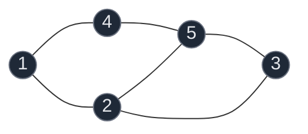
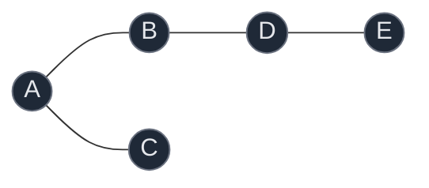
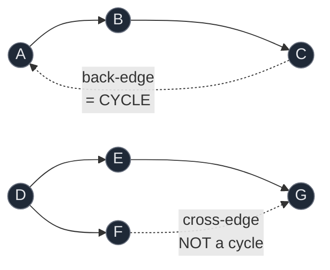
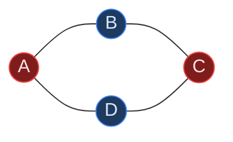

# 11. Graphs

A graph is a set of nodes connected by edges — the most general structure in this whole sheet. Arrays, linked lists, and trees are all graphs with extra restrictions (a tree is a connected, acyclic graph; a linked list is a tree where every node has one child).

This page covers vertices/edges/representations, the two traversal primitives BFS and DFS, and how nearly every problem in this tier is one of those two traversals wearing a different costume: counting components, flood-filling a grid, detecting a cycle, or 2-coloring a graph.

## Contents

1. [Vertices, Edges, Representations](#1-vertices-edges-representations)
2. [BFS vs DFS](#2-bfs-vs-dfs)
3. [The Visited Set Is Not Optional](#3-the-visited-set-is-not-optional)
4. [Connected Components](#4-connected-components)
5. [Grid Graphs](#5-grid-graphs)
6. [Multi-Source BFS](#6-multi-source-bfs)
7. [The Reversed-Thinking Trick](#7-the-reversed-thinking-trick)
8. [Cycle Detection — Undirected vs Directed](#8-cycle-detection--undirected-vs-directed)
9. [Bipartite Graphs](#9-bipartite-graphs)
10. [Common Traps](#10-common-traps)
11. [Pattern Recognition Cheat Sheet](#11-pattern-recognition-cheat-sheet)
12. [Problems](#12-problems)

## 1. Vertices, Edges, Representations



`V` = number of vertices (nodes), `E` = number of edges. Undirected edges (`A --- B`) go both ways; directed edges (`A --> B`) go one way only.

Two ways to store a graph:

| Representation | Structure | Space | Neighbor lookup |
|:---|:---|:---:|:---:|
| Adjacency matrix | `matrix[i][j] = 1` if edge exists | `O(V^2)` | `O(1)` |
| Adjacency list | `graph[i] = [neighbors]` | `O(V + E)` | `O(degree)` |

Adjacency lists win for sparse graphs (most real graphs, and every problem in this tier) because `O(V^2)` wastes space when most pairs of nodes are not connected.

## 2. BFS vs DFS

Both visit every reachable node exactly once. They differ only in *order*.



| | BFS | DFS |
|:---|:---|:---|
| Data structure | Queue (FIFO) | Stack (or recursion) |
| Visits | Level by level, nearest first | One branch fully, then backtrack |
| Order on graph above | A, B, C, D, E | A, B, D, E, C |
| Natural fit | Shortest path in unweighted graph | Exhausting all paths, cycle detection |

```python
from collections import deque

def bfs(graph, start):
    visited = {start}
    order = []
    queue = deque([start])
    while queue:
        node = queue.popleft()
        order.append(node)
        for neighbor in graph[node]:
            if neighbor not in visited:
                visited.add(neighbor)          # mark BEFORE enqueueing
                queue.append(neighbor)
    return order

def dfs(graph, start, visited=None, order=None):
    if visited is None:
        visited, order = set(), []
    visited.add(start)
    order.append(start)
    for neighbor in graph[start]:
        if neighbor not in visited:
            dfs(graph, neighbor, visited, order)
    return order
```

**Why BFS finds shortest paths and DFS does not:** BFS explores in strict distance order — everything at distance `d` is visited before anything at distance `d+1`. The first time BFS reaches a node is guaranteed to be via a shortest path. DFS commits to one path immediately and may reach a node the long way first.

## 3. The Visited Set Is Not Optional

Without it, a cyclic graph causes infinite re-visiting; even an acyclic graph gets exponentially re-explored.

```python
visited.add(neighbor)      # mark when ENQUEUED (BFS) to avoid duplicate enqueues
queue.append(neighbor)
```

**Common bug:** marking visited when a node is *dequeued* instead of when *enqueued*, in BFS. A node can be pushed onto the queue multiple times before its first dequeue, wasting work and — in problems that count something per visit — corrupting the answer.

## 4. Connected Components

A connected component is a maximal set of nodes all reachable from each other. Counting them is: run BFS/DFS from any unvisited node, mark everything reachable, increment a counter, repeat.

```text
for each node:
    if node not visited:
        bfs_or_dfs(node)     # marks the whole component
        count += 1
```

This single template answers "how many provinces/islands/groups" for any graph or grid.

## 5. Grid Graphs

A 2D grid is a graph where each cell is a node and its up-to-4 orthogonal neighbors are edges. Nearly every "matrix" problem in this tier is BFS/DFS on this implicit graph.

```python
directions = [(-1, 0), (1, 0), (0, -1), (0, 1)]   # up, down, left, right

def in_bounds(r, c, rows, cols):
    return 0 <= r < rows and 0 <= c < cols
```

**Marking visited in a grid:** either keep a separate `visited` set/matrix, or mutate the grid in place (e.g. `'1' -> '0'` once counted). In-place mutation is safe whenever you are *counting or painting*, not searching for a path to preserve — there is no need to restore it afterward, unlike backtracking.

## 6. Multi-Source BFS

Some problems have several starting points that all begin "at the same time" — seed the queue with all of them before the first BFS level runs.


**Why not run BFS from each source separately and take the minimum?** That works but costs `O(sources * V)`. Seeding all sources at once and running one BFS costs `O(V)` total — each level still expands by exactly one step of distance, because BFS explores in strict distance order regardless of how many sources it started from.

Used in: Rotten Oranges (rot spreads from every initially-rotten orange at once), 01 Matrix (distance to the nearest zero from every cell at once).

## 7. The Reversed-Thinking Trick

"Find regions that are surrounded/enclosed" is hard to check directly while scanning — you cannot know a region never touches the boundary until you have seen the whole region. The trick: **start from the boundary and mark what is reachable from it.** Everything not marked is, by definition, enclosed.

```text
1. BFS/DFS from every boundary cell that qualifies (e.g. every 'O' on the edge)
2. Mark everything reachable from those as "safe" / "not enclosed"
3. Everything unmarked is fully enclosed
```

Used in: Surrounded Regions (mark border-connected 'O's, flip the rest to 'X'), Number of Enclaves (mark border-connected land, count the rest).

## 8. Cycle Detection — Undirected vs Directed

These require genuinely different algorithms. Confusing them is the most common mistake in this tier.

### Undirected: track the parent

```python
def has_cycle_undirected(graph, start, visited):
    queue = deque([(start, -1)])          # (node, parent)
    visited.add(start)
    while queue:
        node, parent = queue.popleft()
        for neighbor in graph[node]:
            if neighbor not in visited:
                visited.add(neighbor)
                queue.append((neighbor, node))
            elif neighbor != parent:      # visited AND not where we came from
                return True                # genuine second path -> cycle
    return False
```

**Why the parent check matters:** in an undirected graph, the edge back to your immediate parent is the *same edge* traversed backwards, not a cycle. Only a visited neighbor that is *not* your parent proves a second, different path back to an already-seen node.

### Directed: track the recursion path, separately from visited-ever



```python
def has_cycle_directed(graph, node, visited, path_visited):
    visited.add(node)
    path_visited.add(node)                # on the ACTIVE recursion path
    for neighbor in graph[node]:
        if neighbor in path_visited:
            return True                    # back-edge to a live ancestor: cycle
        if neighbor not in visited:
            if has_cycle_directed(graph, neighbor, visited, path_visited):
                return True
    path_visited.remove(node)              # done exploring: no longer an ancestor
    return False
```

**Why one `visited` set is not enough here:** direction matters. Reaching an already-visited node that is *not* an ancestor of the current path (a **cross-edge**, in the diagram `F -> G`) is completely normal in a DAG — it just means two paths converge. Only reaching a node still on the *active* call stack (`C -> A`, a genuine back-edge) proves a cycle. `path_visited` must be removed on the way back up, or every finished branch looks like a permanent ancestor forever.

Used directly in: Detect Cycle in a Directed Graph, and its extension Find Eventual Safe States (a node is unsafe exactly when it can reach a cycle).

## 9. Bipartite Graphs

A graph is bipartite if its nodes can be split into two groups such that every edge connects the groups — never two nodes in the same group. Testing this is 2-coloring: color a node, then force every neighbor to the opposite color; a conflict (neighbor already the same color) means it is not bipartite.



```python
def is_bipartite(graph, n):
    color = {}
    for start in range(n):
        if start in color:
            continue
        color[start] = 0
        queue = deque([start])
        while queue:
            node = queue.popleft()
            for neighbor in graph[node]:
                if neighbor not in color:
                    color[neighbor] = 1 - color[node]     # opposite color
                    queue.append(neighbor)
                elif color[neighbor] == color[node]:
                    return False                            # same color: conflict
    return True
```

A graph containing any odd-length cycle can never be bipartite — going around an odd cycle forces a node to conflict with its own color.

## 10. Common Traps

| Trap | Broken | Correct |
|:---|:---|:---|
| Marking visited on dequeue, not enqueue | Same node enqueued multiple times | Mark visited the moment it is added to the queue |
| Undirected cycle check without parent | Every edge looks like a cycle | Skip the edge back to the immediate parent |
| Directed cycle check with one visited set | Cross-edges wrongly flagged as cycles | Track `path_visited` separately, remove on backtrack |
| Not bounding grid indices before recursing | Index error at grid edges | Check `0 <= r < rows and 0 <= c < cols` first |
| Single-source BFS repeated per source | `O(sources * V)`, needlessly slow | Seed all sources at once: `O(V)` total |
| Absolute coordinates for shape comparison | Identical shapes at different positions look different | Normalize to coordinates relative to the shape's start |
| Forgetting a same-value guard in flood fill | Infinite recursion when new value equals old | Check `new_color != old_color` first, or rely on the visited check |
| Not checking every connected component | Miss a cycle/imbalance in a later component | Loop over all nodes, skip only already-visited ones |

## 11. Pattern Recognition Cheat Sheet

| Signal in the problem | Pattern | Cost |
|:---|:---|:---:|
| "how many groups/provinces/components" | Count connected components | `O(V+E)` |
| "how many islands", grid of land/water | Connected components on a grid | `O(m*n)` |
| "paint/fill starting from a cell" | Single-source flood fill | `O(m*n)` |
| "multiple things spread simultaneously" | Multi-source BFS | `O(m*n)` |
| "distance to nearest X for every cell" | Multi-source BFS from all X's | `O(m*n)` |
| "surrounded by / enclosed by" | Reversed: mark from the boundary inward | `O(m*n)` |
| "does this graph have a cycle" + undirected | BFS/DFS with parent tracking | `O(V+E)` |
| "does this graph have a cycle" + directed | DFS with visited + path_visited | `O(V+E)` |
| "can this graph be 2-colored / split into two groups" | Bipartite check | `O(V+E)` |
| "every path from here eventually terminates" | Directed cycle detection + memoization | `O(V+E)` |
| "count DISTINCT shapes", not just count | Normalize to relative coordinates, use a set | `O(m*n)` |

## 12. Problems

### Introductions

| # | Note | What it covers |
|:---:|:---|:---|
| 1 | [Introduction to Graphs](01.%20Introductions/01.%20Introduction%20to%20Graphs.md) | Vertices, edges, directed/undirected, representations |
| 2 | [Connected Components in Graphs](01.%20Introductions/02.%20Connected%20Components%20in%20Graphs.md) | What a component is, why it matters |
| 3 | [Breadth First Search](01.%20Introductions/03.%20Breadth%20First%20Search.md) | Queue-based level-order traversal |
| 4 | [Depth First Search](01.%20Introductions/04.%20Depth%20First%20Search.md) | Stack/recursion-based traversal |

### BFS and DFS

| # | Problem | Difficulty | Key Idea |
|:---:|:---|:---:|:---|
| 1 | [547. Number of Provinces](02.%20BFS%20and%20DFS/01.%20547.%20Number%20of%20Provinces.md) | Medium | Count connected components on a matrix |
| 2 | [200. Number of Islands](02.%20BFS%20and%20DFS/02.%20200.%20Number%20of%20Islands.md) | Medium | Components on a grid instead of a matrix |
| 3 | [733. Flood Fill](02.%20BFS%20and%20DFS/03.%20733.%20Flood%20Fill.md) | Easy | Same grid traversal, painting instead of counting |
| 4 | [994. Rotten Oranges](02.%20BFS%20and%20DFS/04.%20994.%20Rotten%20Oranges.md) | Medium | Multi-source BFS, one level = one minute |
| 5 | [Detect Cycle — Undirected, BFS](02.%20BFS%20and%20DFS/05.%20Detect%20Cycle%20in%20an%20Undirected%20Graph%20using%20BFS.md) | Medium | Track (node, parent) pairs |
| 6 | [Detect Cycle — Undirected, DFS](02.%20BFS%20and%20DFS/06.%20Detect%20Cycle%20in%20an%20Undirected%20Graph%20using%20DFS.md) | Medium | Same idea, recursion instead of a queue |
| 7 | [542. 01 Matrix](02.%20BFS%20and%20DFS/07.%20542.%2001%20Matrix.md) | Medium | Multi-source BFS from every zero |
| 8 | [130. Surrounded Regions](02.%20BFS%20and%20DFS/08.%20130.%20Surrounded%20Regions.md) | Medium | Reversed thinking: mark from the border |
| 9 | [1020. Number of Enclaves](02.%20BFS%20and%20DFS/09.%201020.%20Number%20of%20Enclaves.md) | Medium | Same reversed-thinking trick, count instead of flip |
| 10 | [Number of Distinct Islands](02.%20BFS%20and%20DFS/10.%20Number%20of%20Distinct%20Islands.md) | Medium | Normalize shape to relative coordinates |
| 11 | [785. Is Graph Bipartite (BFS)](02.%20BFS%20and%20DFS/11.%20785.%20Is%20Graph%20Bipartite%20%28BFS%29.md) | Medium | 2-coloring via BFS |
| 12 | [785. Is Graph Bipartite (DFS)](02.%20BFS%20and%20DFS/12.%20785.%20Is%20Graph%20Bipartite%20%28DFS%29.md) | Medium | Same 2-coloring, recursive |
| 13 | [Detect Cycle in a Directed Graph](02.%20BFS%20and%20DFS/13.%20Detect%20Cycle%20in%20a%20Directed%20Graph%20using%20DFS.md) | Medium | visited + path_visited, back-edge vs cross-edge |
| 14 | [802. Find Eventual Safe States](02.%20BFS%20and%20DFS/14.%20802.%20Find%20Eventual%20Safe%20States.md) | Medium | Same machinery, memoized safe/unsafe per node |

## Where This Leads

| Skill built here | Used later in |
|:---|:---|
| BFS/DFS as the base traversal | Topological sort, shortest path (Dijkstra, Bellman-Ford) |
| Connected components | Union-Find, minimum spanning tree |
| Multi-source BFS | 0/1 BFS, layered shortest-path variants |
| visited + path_visited for directed cycles | Topological sort (Kahn's algorithm needs the same insight) |
| 2-coloring | Graph coloring, constraint satisfaction |
| Reversed-thinking from the boundary | Any "reachability from a fixed set" problem |
