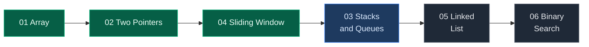

# DSA Notes

Structured notes for Data Structures & Algorithms, built from the TUF sheet.

Every problem note follows the same shape, so patterns stay comparable across topics:

> Problem statement → Core theory → Edge cases → Brute force → Better approach → Optimal approach → Dry run → Complexity → Common mistakes → Interview follow-ups → Runnable tests

Each approach carries commented Python and its own time/space analysis. Every note ends with a **Verify** block — the optimal solution plus asserts you can paste straight into a REPL.

## Topics

Counts are problems written, broken down by difficulty tier.

| # | Topic | Core Focus | Easy | Medium | Hard | Total | Status |
|:---:|:---|:---|:---:|:---:|:---:|:---:|:---:|
| 01 | [**Array**](01.%20Array/) | Prefix sums, Kadane, in-place rearrangement | 14 | 13 | 11 | **38** | Complete |
| 02 | [**Two Pointers**](02.%20Two%20pointers/) | Converging pointers, fast/slow, fix one + scan | 1 | 3 | 1 | **5** | Complete |
| 03 | Stacks and Queues | Monotonic stack, next greater element | – | – | – | – | Planned |
| 04 | [**Sliding Window**](04.%20Sliding%20window/) | Fixed/variable windows, at-most trick | 6 | 7 | 2 | **15** | Complete |
| 05 | Linked List | Reversal, cycle detection, merge | – | – | – | – | Planned |
| 06 | Binary Search | On answer space, rotated arrays | – | – | – | – | Planned |
| 07 | Recursion | Subsets, permutations, backtracking | – | – | – | – | Planned |
| 08 | Trees | Traversals, BST properties, LCA | – | – | – | – | Planned |
| 09 | Heaps | Top-K, merge K sorted, running median | – | – | – | – | Planned |
| 10 | Greedy | Interval scheduling, exchange argument | – | – | – | – | Planned |
| 11 | Graphs | BFS/DFS, topological sort, union-find | – | – | – | – | Planned |
| 12 | Dynamic Programming | 1D/2D states, knapsack, LIS | – | – | – | – | Planned |
| 13 | Maths and Geometry | Number theory, matrix rotation, GCD | – | – | – | – | Planned |
| 14 | Bit Manipulation | XOR tricks, masks, bit counting | – | – | – | – | Planned |
| 15 | Intervals | Merge, insert, overlap counting | – | – | – | – | Planned |
| 16 | Databases | Joins, window functions, aggregation | – | – | – | – | Planned |



## 01. Array

Foundation topic. Every later pattern — two pointers, sliding window, binary search — is first learned here.

**[Read the full Array guide →](01.%20Array/)** covers memory layout, operation costs, and every pattern with runnable code.

### Easy

| # | Problem | Difficulty | Key Idea | Time | Space |
|:---:|:---|:---:|:---|:---:|:---:|
| 1 | [Largest in Array](01.%20Array/01.%20Easy/01.%20Largest%20in%20Array.md) | Basic | Track the max seen so far in one scan | `O(n)` | `O(1)` |
| 2 | [Second Largest](01.%20Array/01.%20Easy/02.%20Second%20Largest.md) | Basic | Two trackers, demote before promote | `O(n)` | `O(1)` |
| 3 | [Array Search](01.%20Array/01.%20Easy/03.%20Array%20Search.md) | Basic | Linear scan, return index on match | `O(n)` | `O(1)` |
| 4 | [1752. Check if Array Is Sorted and Rotated](01.%20Array/01.%20Easy/04.%201752.%20Check%20if%20Array%20Is%20Sorted%20and%20Rotated.md) | Easy | Count the drops; at most one is allowed | `O(n)` | `O(1)` |
| 5 | [136. Single Number](01.%20Array/01.%20Easy/05.%20136.%20Single%20Number.md) | Easy | XOR cancels every pair, leaving the loner | `O(n)` | `O(1)` |
| 6 | [268. Missing Number](01.%20Array/01.%20Easy/06.%20268.%20Missing%20Number.md) | Easy | Expected sum minus actual sum, or XOR | `O(n)` | `O(1)` |
| 7 | [485. Max Consecutive Ones](01.%20Array/01.%20Easy/07.%20485.%20Max%20Consecutive%20Ones.md) | Easy | Running streak counter, reset on zero | `O(n)` | `O(1)` |
| 8 | [189. Rotate Array](01.%20Array/01.%20Easy/08.%20189.%20Rotate%20Array.md) | Medium | Reverse whole, then reverse both parts | `O(n)` | `O(1)` |
| 9 | [283. Move Zeroes](01.%20Array/01.%20Easy/09.%20283.%20Move%20Zeroes.md) | Easy | Slow pointer marks the next non-zero slot | `O(n)` | `O(1)` |
| 10 | [88. Merge Sorted Array](01.%20Array/01.%20Easy/10.%2088.%20Merge%20Sorted%20Array.md) | Easy | Fill from the back to avoid overwriting | `O(m+n)` | `O(1)` |
| 11 | [Longest Subarray with Sum K](01.%20Array/01.%20Easy/11.%20Longest%20Subarray%20with%20Sum%20K.md) | Medium | Prefix sum + first-seen index in a hashmap | `O(n)` | `O(n)` |
| 12 | [Largest subarray with 0 sum](01.%20Array/01.%20Easy/12.%20Largest%20subarray%20with%200%20sum.md) | Medium | Same prefix sum means zero in between | `O(n)` | `O(n)` |
| 13 | [Find Second Smallest and Second Largest](01.%20Array/01.%20Easy/13.%20Find%20Second%20Smallest%20and%20Second%20Largest%20Element%20in%20an%20Array.md) | Basic | Four trackers in a single pass | `O(n)` | `O(1)` |
| 14 | [First and Second Smallests](01.%20Array/01.%20Easy/14.%20First%20and%20Second%20Smallests.md) | Basic | Demote before promote | `O(n)` | `O(1)` |

### Medium

| # | Problem | Difficulty | Key Idea | Time | Space |
|:---:|:---|:---:|:---|:---:|:---:|
| 1 | [1. Two Sum](01.%20Array/02.%20Medium/01.%201.%20Two%20Sum.md) | Medium | Store complements; check before insert | `O(n)` | `O(n)` |
| 2 | [75. Sort Colors](01.%20Array/02.%20Medium/02.%2075.%20Sort%20Colors.md) | Medium | Dutch flag: three regions, one pass | `O(n)` | `O(1)` |
| 3 | [169. Majority Element](01.%20Array/02.%20Medium/03.%20169.%20Majority%20Element.md) | Easy | Pairwise cancellation leaves the majority | `O(n)` | `O(1)` |
| 4 | [53. Maximum Subarray](01.%20Array/02.%20Medium/04.%2053.%20Maximum%20Subarray.md) | Medium | Kadane: extend or restart at each element | `O(n)` | `O(1)` |
| 5 | [121. Best Time to Buy and Sell Stock](01.%20Array/02.%20Medium/05.%20121.%20Best%20Time%20to%20Buy%20and%20Sell%20Stock.md) | Easy | Track min price, best profit against it | `O(n)` | `O(1)` |
| 6 | [2149. Rearrange Array Elements by Sign](01.%20Array/02.%20Medium/06.%202149.%20Rearrange%20Array%20Elements%20by%20Sign.md) | Medium | Sign fixes the slot; cursors step by 2 | `O(n)` | `O(n)` |
| 7 | [31. Next Permutation](01.%20Array/02.%20Medium/07.%2031.%20Next%20Permutation.md) | Medium | Find pivot, swap successor, reverse suffix | `O(n)` | `O(1)` |
| 8 | [Array Leaders](01.%20Array/02.%20Medium/08.%20Array%20Leaders.md) | Easy | Running max scanning right to left | `O(n)` | `O(1)` |
| 9 | [128. Longest Consecutive Sequence](01.%20Array/02.%20Medium/09.%20128.%20Longest%20Consecutive%20Sequence.md) | Medium | Only walk runs from their head | `O(n)` | `O(n)` |
| 10 | [73. Set Matrix Zeroes](01.%20Array/02.%20Medium/10.%2073.%20Set%20Matrix%20Zeroes.md) | Medium | Row 0 and col 0 become the markers | `O(m*n)` | `O(1)` |
| 11 | [48. Rotate Image](01.%20Array/02.%20Medium/11.%2048.%20Rotate%20Image.md) | Medium | Two reflections compose to a rotation | `O(n^2)` | `O(1)` |
| 12 | [54. Spiral Matrix](01.%20Array/02.%20Medium/12.%2054.%20Spiral%20Matrix.md) | Medium | Shrink four boundaries layer by layer | `O(m*n)` | `O(1)` |
| 13 | [560. Subarray Sum Equals K](01.%20Array/02.%20Medium/13.%20560.%20Subarray%20Sum%20Equals%20K.md) | Medium | Count earlier prefix sums equal to sum - k | `O(n)` | `O(n)` |

### Hard

| # | Problem | Difficulty | Key Idea | Time | Space |
|:---:|:---|:---:|:---|:---:|:---:|
| 1 | [118. Pascal's Triangle](01.%20Array/03.%20Hard/01.%20118.%20Pascal%27s%20Triangle.md) | Easy | Each row is built from the row above | `O(n^2)` | `O(1)` |
| 2 | [229. Majority Element II](01.%20Array/03.%20Hard/02.%20229.%20Majority%20Element%20II.md) | Medium | Two candidates; verification is mandatory | `O(n)` | `O(1)` |
| 3 | [15. 3Sum](01.%20Array/03.%20Hard/03.%2015.%203Sum.md) | Medium | Fix one, scan the rest, skip duplicates | `O(n^2)` | `O(1)` |
| 4 | [18. 4Sum](01.%20Array/03.%20Hard/04.%2018.%204Sum.md) | Medium | kSum: each fixed element adds a loop | `O(n^3)` | `O(1)` |
| 5 | [Count Subarrays with given XOR](01.%20Array/03.%20Hard/05.%20Count%20Subarrays%20with%20given%20XOR.md) | Hard | Need prefix ^ k, since XOR is its own inverse | `O(n)` | `O(n)` |
| 6 | [56. Merge Intervals](01.%20Array/03.%20Hard/06.%2056.%20Merge%20Intervals.md) | Medium | Sort by start, extend the running block | `O(n log n)` | `O(n)` |
| 7 | [88. Merge Sorted Array](01.%20Array/03.%20Hard/07.%2088.%20Merge%20Sorted%20Array.md) | Easy | Never overwrite unread data | `O(m+n)` | `O(1)` |
| 8 | [Missing And Repeating](01.%20Array/03.%20Hard/08.%20Missing%20And%20Repeating.md) | Hard | Two equations recover both unknowns | `O(n)` | `O(1)` |
| 9 | [Count Inversions](01.%20Array/03.%20Hard/09.%20Count%20Inversions.md) | Hard | Count a whole left block per comparison | `O(n log n)` | `O(n)` |
| 10 | [493. Reverse Pairs](01.%20Array/03.%20Hard/10.%20493.%20Reverse%20Pairs.md) | Hard | Count in a separate pass before merging | `O(n log n)` | `O(n)` |
| 11 | [152. Maximum Product Subarray](01.%20Array/03.%20Hard/11.%20152.%20Maximum%20Product%20Subarray.md) | Medium | A negative swaps the running max and min | `O(n)` | `O(1)` |

## 02. Two Pointers

Two indices moving under a rule, replacing a nested loop. The hard part is proving the pointer you move can be discarded safely.

**[Read the full Two Pointers guide →](02.%20Two%20pointers/)** covers all four forms and the correctness argument for each.

| # | Tier | Problem | Difficulty | Key Idea | Time | Space |
|:---:|:---:|:---|:---:|:---|:---:|:---:|
| 1 | Basics | [125. Valid Palindrome](02.%20Two%20pointers/01.%20Basics/01.%20125.%20Valid%20Palindrome.md) | Easy | Skip non-alphanumerics, compare inward | `O(n)` | `O(1)` |
| 2 | Medium | [15. 3Sum](02.%20Two%20pointers/02.%20Medium/01.%2015.%203Sum.md) | Medium | Sort, fix one, two-pointer the rest | `O(n^2)` | `O(1)` |
| 3 | Medium | [167. Two Sum II](02.%20Two%20pointers/02.%20Medium/02.%20167.%20Two%20Sum%20II%20-%20Input%20Array%20Is%20Sorted.md) | Medium | Sortedness makes each move decidable | `O(n)` | `O(1)` |
| 4 | Medium | [11. Container With Most Water](02.%20Two%20pointers/02.%20Medium/03.%2011.%20Container%20With%20Most%20Water.md) | Medium | Always move the shorter line | `O(n)` | `O(1)` |
| 5 | Hard | [42. Trapping Rain Water](02.%20Two%20pointers/03.%20Hard/01.%2042.%20Trapping%20Rain%20Water.md) | Hard | Process the smaller side; its max bounds it | `O(n)` | `O(1)` |

## 04. Sliding Window

Two pointers bound a region that grows right and shrinks left. Turns `O(n^2)` subarray scans into one `O(n)` pass.

**[Read the full Sliding Window guide →](04.%20Sliding%20window/)** covers both window shapes, the universal skeleton, and the at-most trick.

| # | Tier | Problem | Difficulty | Key Idea | Time | Space |
|:---:|:---:|:---|:---:|:---|:---:|:---:|
| 1 | Intro | [Introduction to Sliding Window](04.%20Sliding%20window/01.%20Introduction/01.%20Introduction%20to%20Sliding%20Window.md) | – | The technique end to end | – | – |
| 2 | Basic | [1423. Maximum Points from Cards](04.%20Sliding%20window/02.%20Basic/01.%201423.%20Maximum%20Points%20You%20Can%20Obtain%20from%20Cards.md) | Medium | Taking both ends = leaving a middle window | `O(n)` | `O(1)` |
| 3 | Basic | [3. Longest Substring Without Repeating Characters](04.%20Sliding%20window/02.%20Basic/02.%203.%20Longest%20Substring%20Without%20Repeating%20Characters.md) | Medium | Jump `left` with a `max` guard | `O(n)` | `O(min(n,charset))` |
| 4 | Basic | [1004. Max Consecutive Ones III](04.%20Sliding%20window/02.%20Basic/03.%201004.%20Max%20Consecutive%20Ones%20III.md) | Medium | "Flip k zeroes" = "at most k zeroes" | `O(n)` | `O(1)` |
| 5 | Basic | [904. Fruit Into Baskets](04.%20Sliding%20window/02.%20Basic/04.%20904.%20Fruit%20Into%20Baskets.md) | Medium | Story for "at most 2 distinct" | `O(n)` | `O(1)` |
| 6 | Basic | [209. Minimum Size Subarray Sum](04.%20Sliding%20window/02.%20Basic/05.%20209.%20Minimum%20Size%20Subarray%20Sum.md) | Medium | Minimising: record inside the shrink | `O(n)` | `O(1)` |
| 7 | Basic | [713. Subarray Product Less Than K](04.%20Sliding%20window/02.%20Basic/06.%20713.%20Subarray%20Product%20Less%20Than%20K.md) | Medium | Valid window adds `right - left + 1` | `O(n)` | `O(1)` |
| 8 | At Most | [340. At Most K Distinct Characters](04.%20Sliding%20window/03.%20At%20Most/01.%20340.%20Longest%20Substring%20With%20At%20Most%20K%20Distinct%20Characters.md) | Medium | The parent count-map template | `O(n)` | `O(k)` |
| 9 | At Most | [159. At Most Two Distinct Characters](04.%20Sliding%20window/03.%20At%20Most/02.%20159.%20Longest%20Substring%20with%20At%20Most%20Two%20Distinct%20Characters.md) | Medium | The `k = 2` instance of 340 | `O(n)` | `O(1)` |
| 10 | Trick | [930. Binary Subarrays With Sum](04.%20Sliding%20window/04.%20At%20Most%20Trick/01.%20930.%20Binary%20Subarrays%20With%20Sum.md) | Medium | `exactly(k) = atMost(k) - atMost(k-1)` | `O(n)` | `O(1)` |
| 11 | Trick | [1248. Count Number of Nice Subarrays](04.%20Sliding%20window/04.%20At%20Most%20Trick/02.%201248.%20Count%20Number%20of%20Nice%20Subarrays.md) | Medium | Map odd to 1, even to 0, becomes 930 | `O(n)` | `O(1)` |
| 12 | Trick | [992. Subarrays with K Different Integers](04.%20Sliding%20window/04.%20At%20Most%20Trick/03.%20992.%20Subarrays%20with%20K%20Different%20Integers.md) | Hard | Same trick over the count-map template | `O(n)` | `O(k)` |
| 13 | Repeating | [1358. Substrings Containing All Three Characters](04.%20Sliding%20window/05.%20Repeating%20Characters/01.%201358.%20Number%20of%20Substrings%20Containing%20All%20Three%20Characters.md) | Medium | Add `min(last_a, last_b, last_c) + 1` | `O(n)` | `O(1)` |
| 14 | Repeating | [424. Longest Repeating Character Replacement](04.%20Sliding%20window/05.%20Repeating%20Characters/02.%20424.%20Longest%20Repeating%20Character%20Replacement.md) | Medium | Valid when `size - max_freq <= k` | `O(n)` | `O(1)` |
| 15 | Hard | [76. Minimum Window Substring](04.%20Sliding%20window/06.%20Hard/01.%2076.%20Minimum%20Window%20Substring.md) | Hard | `have == required` counter | `O(n+m)` | `O(charset)` |

## Repository Layout

```text
dsa-notes/
├── 01. Array/               ← 38 problems
├── 02. Two pointers/        ← 5 problems
└── 04. Sliding window/      ← 15 notes
    ├── README.md            ← full topic guide
    ├── 01. Introduction/
    ├── 02. Basic/
    ├── 03. At Most/
    ├── 04. At Most Trick/
    ├── 05. Repeating Characters/
    └── 06. Hard/
```

Folders and files are numbered so they sort in study order: topic → difficulty tier → problem.

## How to Use These Notes

| If you want to | Go to |
|:---|:---|
| Learn a topic from scratch | The topic `README.md` — it teaches the concepts end to end |
| Revise before an interview | A problem's **Interview Explanation** and **Interview Follow-ups** |
| Check you actually understand | The **Verify** block — paste it into a REPL and run it |
| Debug a wrong submission | The **Common Mistakes** table |
| Find the right pattern for a new problem | The topic guide's **Pattern Recognition Cheat Sheet** |

## Language

Solutions are written in **Python 3**, with line-by-line comments intended for revision rather than brevity.
