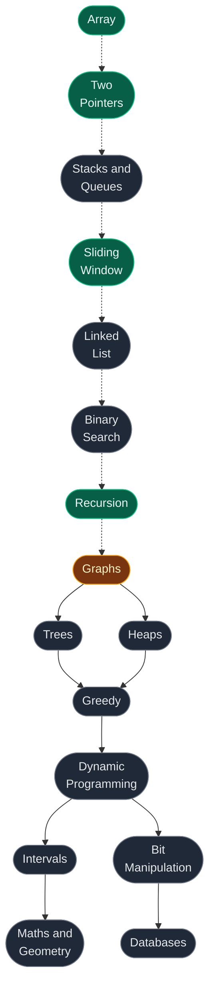

# DSA Notes

Structured notes for Data Structures & Algorithms.

Every problem note follows the same shape, so patterns stay comparable across topics:

Each approach carries commented Python and its own time/space analysis. Every note ends with a **Verify** block — the optimal solution plus asserts you can paste straight into a REPL.

## Topics

Counts are problems written, broken down by difficulty tier.

| # | Topic | Core Focus | Easy | Medium | Hard | Total | Status |
|:---:|:---|:---|:---:|:---:|:---:|:---:|:---:|
| 01 | [**Array**](01.%20Array/) | Prefix sums, Kadane, in-place rearrangement | 14 | 13 | 11 | **38** | Complete |
| 02 | [**Two Pointers**](02.%20Two%20pointers/) | Converging pointers, fast/slow, fix one + scan | 1 | 3 | 1 | **5** | Complete |
| 03 | Stacks and Queues | Monotonic stack, next greater element | – | – | – | – | Planned |
| 04 | [**Sliding Window**](04.%20Sliding%20window/) | Fixed/variable windows, at-most trick | 6 | 7 | 2 | **15** | Complete |
| 05 | Linked List | Reversal, cycle detection, merge | – | – | – | – | Planned |
| 06 | Binary Search | On answer space, rotated arrays | – | – | – | – | Planned |
| 07 | [**Recursion**](07.%20Recursion/) | Pick/not-pick, backtracking, constraints | 2 | 5 | 13 | **20** | Complete |
| 08 | Trees | Traversals, BST properties, LCA | – | – | – | – | Planned |
| 09 | Heaps | Top-K, merge K sorted, running median | – | – | – | – | Planned |
| 10 | Greedy | Interval scheduling, exchange argument | – | – | – | – | Planned |
| 11 | [**Graphs**](11.%20Graphs/) | BFS/DFS, cycle detection, bipartite | 4 | 14 | – | **18** | In progress |
| 12 | Dynamic Programming | 1D/2D states, knapsack, LIS | – | – | – | – | Planned |
| 13 | Maths and Geometry | Number theory, matrix rotation, GCD | – | – | – | – | Planned |
| 14 | Bit Manipulation | XOR tricks, masks, bit counting | – | – | – | – | Planned |
| 15 | Intervals | Merge, insert, overlap counting | – | – | – | – | Planned |
| 16 | Databases | Joins, window functions, aggregation | – | – | – | – | Planned |
| | **Total** | | **27** | **42** | **27** | **96** | |

## 01. Array

Foundation topic. Every later pattern — two pointers, sliding window, binary search — is first learned here.

**[Read the full Array guide →](01.%20Array/)** covers memory layout, operation costs, and every pattern with runnable code.

### Easy

| # | Problem | Difficulty | Key Idea | Source | Time | Space |
|:---:|:---|:---:|:---|:---:|:---:|:---:|
| 1 | [Largest in Array](01.%20Array/01.%20Easy/01.%20Largest%20in%20Array.md) | Basic | Track the maximum element seen so far in a single left-to-right scan | [Largest Element in Array](https://www.geeksforgeeks.org/problems/largest-element-in-array4009/1) | `O(n)` | `O(1)` |
| 2 | [Second Largest](01.%20Array/01.%20Easy/02.%20Second%20Largest.md) | Basic | Keep two trackers and always demote the old max before promoting a new one | [Second Largest](https://www.geeksforgeeks.org/problems/second-largest3735/1) | `O(n)` | `O(1)` |
| 3 | [Array Search](01.%20Array/01.%20Easy/03.%20Array%20Search.md) | Basic | Linear scan across the array, returning the index the moment a match is found | [Array Search](https://www.geeksforgeeks.org/problems/search-an-element-in-an-array-1587115621/1) | `O(n)` | `O(1)` |
| 4 | [1752. Check if Array Is Sorted and Rotated](01.%20Array/01.%20Easy/04.%201752.%20Check%20if%20Array%20Is%20Sorted%20and%20Rotated.md) | Easy | Count how many times the sequence drops; a valid rotation allows at most one drop | [1752. Check if Array Is Sorted and Rotated](https://leetcode.com/problems/check-if-array-is-sorted-and-rotated/) | `O(n)` | `O(1)` |
| 5 | [136. Single Number](01.%20Array/01.%20Easy/05.%20136.%20Single%20Number.md) | Easy | XOR every element together; duplicate pairs cancel out, leaving only the lone value | [136. Single Number](https://leetcode.com/problems/single-number/) | `O(n)` | `O(1)` |
| 6 | [268. Missing Number](01.%20Array/01.%20Easy/06.%20268.%20Missing%20Number.md) | Easy | Subtract the actual sum from the expected sum, or XOR every index and value together | [268. Missing Number](https://leetcode.com/problems/missing-number/) | `O(n)` | `O(1)` |
| 7 | [485. Max Consecutive Ones](01.%20Array/01.%20Easy/07.%20485.%20Max%20Consecutive%20Ones.md) | Easy | Maintain a running streak counter that resets to zero the moment a zero appears | [485. Max Consecutive Ones](https://leetcode.com/problems/max-consecutive-ones/) | `O(n)` | `O(1)` |
| 8 | [189. Rotate Array](01.%20Array/01.%20Easy/08.%20189.%20Rotate%20Array.md) | Medium | Reverse the whole array once, then reverse each of the two resulting parts | [189. Rotate Array](https://leetcode.com/problems/rotate-array/) | `O(n)` | `O(1)` |
| 9 | [283. Move Zeroes](01.%20Array/01.%20Easy/09.%20283.%20Move%20Zeroes.md) | Easy | A slow pointer marks the next slot a non-zero value should be swapped into | [283. Move Zeroes](https://leetcode.com/problems/move-zeroes/) | `O(n)` | `O(1)` |
| 10 | [88. Merge Sorted Array](01.%20Array/01.%20Easy/10.%2088.%20Merge%20Sorted%20Array.md) | Easy | Fill the merged array from the back so unread elements are never overwritten | [88. Merge Sorted Array](https://leetcode.com/problems/merge-sorted-array/) | `O(m+n)` | `O(1)` |
| 11 | [Longest Subarray with Sum K](01.%20Array/01.%20Easy/11.%20Longest%20Subarray%20with%20Sum%20K.md) | Medium | Prefix sums plus a hashmap of the first-seen index for each running sum | [Longest Sub-Array with Sum K](https://www.geeksforgeeks.org/problems/longest-sub-array-with-sum-k0809/1) | `O(n)` | `O(n)` |
| 12 | [Largest subarray with 0 sum](01.%20Array/01.%20Easy/12.%20Largest%20subarray%20with%200%20sum.md) | Medium | Two equal prefix sums mean everything between them sums to zero | [Largest subarray with 0 sum](https://www.geeksforgeeks.org/problems/largest-subarray-with-0-sum/1) | `O(n)` | `O(n)` |
| 13 | [Find Second Smallest and Second Largest](01.%20Array/01.%20Easy/13.%20Find%20Second%20Smallest%20and%20Second%20Largest%20Element%20in%20an%20Array.md) | Basic | Four running trackers updated together in a single pass over the array | [Second Largest](https://www.geeksforgeeks.org/problems/second-largest3735/1) | `O(n)` | `O(1)` |
| 14 | [First and Second Smallests](01.%20Array/01.%20Easy/14.%20First%20and%20Second%20Smallests.md) | Basic | Same demote-before-promote trick as second largest, mirrored for the minimum | [First and Second Smallests](https://www.geeksforgeeks.org/problems/smallest-and-second-smallest-element-in-an-array3226/1) | `O(n)` | `O(1)` |

### Medium

| # | Problem | Difficulty | Key Idea | Source | Time | Space |
|:---:|:---|:---:|:---|:---:|:---:|:---:|
| 1 | [1. Two Sum](01.%20Array/02.%20Medium/01.%201.%20Two%20Sum.md) | Medium | Store each visited value's complement in a hashmap and check it before inserting the next | [1. Two Sum](https://leetcode.com/problems/two-sum/) | `O(n)` | `O(n)` |
| 2 | [75. Sort Colors](01.%20Array/02.%20Medium/02.%2075.%20Sort%20Colors.md) | Medium | Dutch national flag partitioning maintains three regions with low, mid, and high pointers in one pass | [75. Sort Colors](https://leetcode.com/problems/sort-colors/) | `O(n)` | `O(1)` |
| 3 | [169. Majority Element](01.%20Array/02.%20Medium/03.%20169.%20Majority%20Element.md) | Easy | Boyer-Moore voting cancels mismatched pairs so the true majority element survives as the candidate | [169. Majority Element](https://leetcode.com/problems/majority-element/) | `O(n)` | `O(1)` |
| 4 | [53. Maximum Subarray](01.%20Array/02.%20Medium/04.%2053.%20Maximum%20Subarray.md) | Medium | Kadane's algorithm decides at each element whether to extend the running subarray or restart from here | [53. Maximum Subarray](https://leetcode.com/problems/maximum-subarray/) | `O(n)` | `O(1)` |
| 5 | [121. Best Time to Buy and Sell Stock](01.%20Array/02.%20Medium/05.%20121.%20Best%20Time%20to%20Buy%20and%20Sell%20Stock.md) | Easy | Track the minimum price seen so far and compare today's price against it for the best profit | [121. Best Time to Buy and Sell Stock](https://leetcode.com/problems/best-time-to-buy-and-sell-stock/) | `O(n)` | `O(1)` |
| 6 | [2149. Rearrange Array Elements by Sign](01.%20Array/02.%20Medium/06.%202149.%20Rearrange%20Array%20Elements%20by%20Sign.md) | Medium | The sign of each number decides its target slot, filled using two cursors stepping by two | [2149. Rearrange Array Elements by Sign](https://leetcode.com/problems/rearrange-array-elements-by-sign/) | `O(n)` | `O(n)` |
| 7 | [31. Next Permutation](01.%20Array/02.%20Medium/07.%2031.%20Next%20Permutation.md) | Medium | Find the pivot from the right, swap it with its next larger successor, then reverse the suffix | [31. Next Permutation](https://leetcode.com/problems/next-permutation/) | `O(n)` | `O(1)` |
| 8 | [Array Leaders](01.%20Array/02.%20Medium/08.%20Array%20Leaders.md) | Easy | Scan right to left while keeping a running maximum to identify every leader in one pass | [Array Leaders](https://www.geeksforgeeks.org/problems/leaders-in-an-array-1587115620/1) | `O(n)` | `O(1)` |
| 9 | [128. Longest Consecutive Sequence](01.%20Array/02.%20Medium/09.%20128.%20Longest%20Consecutive%20Sequence.md) | Medium | Only start walking a run from its head element so every sequence is counted just once | [128. Longest Consecutive Sequence](https://leetcode.com/problems/longest-consecutive-sequence/) | `O(n)` | `O(n)` |
| 10 | [73. Set Matrix Zeroes](01.%20Array/02.%20Medium/10.%2073.%20Set%20Matrix%20Zeroes.md) | Medium | Reuse row zero and column zero of the matrix itself as markers for which rows and columns to zero | [73. Set Matrix Zeroes](https://leetcode.com/problems/set-matrix-zeroes/) | `O(m*n)` | `O(1)` |
| 11 | [48. Rotate Image](01.%20Array/02.%20Medium/11.%2048.%20Rotate%20Image.md) | Medium | Composing a transpose with a horizontal reflection produces an in-place ninety degree rotation | [48. Rotate Image](https://leetcode.com/problems/rotate-image/) | `O(n^2)` | `O(1)` |
| 12 | [54. Spiral Matrix](01.%20Array/02.%20Medium/12.%2054.%20Spiral%20Matrix.md) | Medium | Maintain four shrinking boundaries and traverse layer by layer in a consistent spiral direction | [54. Spiral Matrix](https://leetcode.com/problems/spiral-matrix/) | `O(m*n)` | `O(1)` |
| 13 | [560. Subarray Sum Equals K](01.%20Array/02.%20Medium/13.%20560.%20Subarray%20Sum%20Equals%20K.md) | Medium | A hashmap of prefix sum frequencies lets you count earlier prefixes equal to the current sum minus k | [560. Subarray Sum Equals K](https://leetcode.com/problems/subarray-sum-equals-k/) | `O(n)` | `O(n)` |

### Hard

| # | Problem | Difficulty | Key Idea | Source | Time | Space |
|:---:|:---|:---:|:---|:---:|:---:|:---:|
| 1 | [118. Pascal's Triangle](01.%20Array/03.%20Hard/01.%20118.%20Pascal%27s%20Triangle.md) | Easy | Each row is built incrementally from the row above by summing adjacent pairs of values | [118. Pascal's Triangle](https://leetcode.com/problems/pascals-triangle/) | `O(n^2)` | `O(1)` |
| 2 | [229. Majority Element II](01.%20Array/03.%20Hard/02.%20229.%20Majority%20Element%20II.md) | Medium | Extended Boyer-Moore voting tracks two candidates at once, then a second pass verifies their counts | [229. Majority Element II](https://leetcode.com/problems/majority-element-ii/) | `O(n)` | `O(1)` |
| 3 | [15. 3Sum](01.%20Array/03.%20Hard/03.%2015.%203Sum.md) | Medium | Fix one element, then use two pointers on the sorted remainder while skipping duplicate values | [15. 3Sum](https://leetcode.com/problems/3sum/) | `O(n^2)` | `O(1)` |
| 4 | [18. 4Sum](01.%20Array/03.%20Hard/04.%2018.%204Sum.md) | Medium | Generalized kSum nests an extra loop for each fixed element before the final two-pointer scan | [18. 4Sum](https://leetcode.com/problems/4sum/) | `O(n^3)` | `O(1)` |
| 5 | [Count Subarrays with given XOR](01.%20Array/03.%20Hard/05.%20Count%20Subarrays%20with%20given%20XOR.md) | Hard | Since XOR is its own inverse, look up how often the running prefix XOR with k has occurred | [Count Subarrays with given XOR](https://www.geeksforgeeks.org/problems/count-subarray-with-given-xor/1) | `O(n)` | `O(n)` |
| 6 | [56. Merge Intervals](01.%20Array/03.%20Hard/06.%2056.%20Merge%20Intervals.md) | Medium | Sort intervals by start time, then extend or close the running merged block as you scan | [56. Merge Intervals](https://leetcode.com/problems/merge-intervals/) | `O(n log n)` | `O(n)` |
| 7 | [88. Merge Sorted Array](01.%20Array/03.%20Hard/07.%2088.%20Merge%20Sorted%20Array.md) | Easy | Fill the merged array from the back so unread elements are never overwritten during the merge | [88. Merge Sorted Array](https://leetcode.com/problems/merge-sorted-array/) | `O(m+n)` | `O(1)` |
| 8 | [Missing And Repeating](01.%20Array/03.%20Hard/08.%20Missing%20And%20Repeating.md) | Hard | Set up two equations from sum and squared sum differences to recover both unknown numbers | [Missing And Repeating](https://www.geeksforgeeks.org/problems/find-missing-and-repeating2512/1) | `O(n)` | `O(1)` |
| 9 | [Count Inversions](01.%20Array/03.%20Hard/09.%20Count%20Inversions.md) | Hard | During merge sort's merge step, a single comparison can count an entire remaining left block | [Count Inversions](https://www.geeksforgeeks.org/problems/inversion-of-array-1587115620/1) | `O(n log n)` | `O(n)` |
| 10 | [493. Reverse Pairs](01.%20Array/03.%20Hard/10.%20493.%20Reverse%20Pairs.md) | Hard | Count qualifying pairs in a dedicated pass over the sorted halves before performing the merge | [493. Reverse Pairs](https://leetcode.com/problems/reverse-pairs/) | `O(n log n)` | `O(n)` |
| 11 | [152. Maximum Product Subarray](01.%20Array/03.%20Hard/11.%20152.%20Maximum%20Product%20Subarray.md) | Medium | A negative number swaps the roles of the running maximum and minimum products at that point | [152. Maximum Product Subarray](https://leetcode.com/problems/maximum-product-subarray/) | `O(n)` | `O(1)` |

## 02. Two Pointers

Two indices moving under a rule, replacing a nested loop. The hard part is proving the pointer you move can be discarded safely.

**[Read the full Two Pointers guide →](02.%20Two%20pointers/)** covers all four forms and the correctness argument for each.

### Converging Pointers (start + end, walk inward)

| # | Problem | Difficulty | Key Idea | Source | Time | Space |
|:---:|:---|:---:|:---|:---:|:---:|:---:|
| 1 | [125. Valid Palindrome](02.%20Two%20pointers/01.%20Basics/01.%20125.%20Valid%20Palindrome.md) | Easy | Move both pointers inward, skipping non-alphanumeric characters, and compare cased-down letters as you go | [125. Valid Palindrome](https://leetcode.com/problems/valid-palindrome/) | `O(n)` | `O(1)` |
| 2 | [167. Two Sum II](02.%20Two%20pointers/02.%20Medium/02.%20167.%20Two%20Sum%20II%20-%20Input%20Array%20Is%20Sorted.md) | Medium | Because the array is sorted, comparing the pair sum to the target tells you exactly which pointer to move next | [167. Two Sum II - Input Array Is Sorted](https://leetcode.com/problems/two-sum-ii-input-array-is-sorted/) | `O(n)` | `O(1)` |
| 3 | [11. Container With Most Water](02.%20Two%20pointers/02.%20Medium/03.%2011.%20Container%20With%20Most%20Water.md) | Medium | Always advance the pointer at the shorter line, since keeping it can never yield a taller container | [11. Container With Most Water](https://leetcode.com/problems/container-with-most-water/) | `O(n)` | `O(1)` |
| 4 | [42. Trapping Rain Water](02.%20Two%20pointers/03.%20Hard/01.%2042.%20Trapping%20Rain%20Water.md) | Hard | Move the side with the smaller max height inward, since its own running max safely bounds the trapped water | [42. Trapping Rain Water](https://leetcode.com/problems/trapping-rain-water/) | `O(n)` | `O(1)` |

### Fix One + Scan (outer index, two-pointer the rest)

| # | Problem | Difficulty | Key Idea | Source | Time | Space |
|:---:|:---|:---:|:---|:---:|:---:|:---:|
| 1 | [15. 3Sum](02.%20Two%20pointers/02.%20Medium/01.%2015.%203Sum.md) | Medium | Sort the array, fix one element as the outer index, then use converging pointers to find the remaining pair | [15. 3Sum](https://leetcode.com/problems/3sum/) | `O(n^2)` | `O(1)` |

## 04. Sliding Window

Two pointers bound a region that grows right and shrinks left. Turns `O(n^2)` subarray scans into one `O(n)` pass.

**[Read the full Sliding Window guide →](04.%20Sliding%20window/)** covers both window shapes, the universal skeleton, and the at-most trick.

### Introduction

| # | Problem | Difficulty | Key Idea | Source | Time | Space |
|:---:|:---|:---:|:---|:---:|:---:|:---:|
| 1 | [Introduction to Sliding Window](04.%20Sliding%20window/01.%20Introduction/01.%20Introduction%20to%20Sliding%20Window.md) | – | Walks through the sliding window technique end to end, from the naive brute force to the optimized pointer approach | – | – | – |

### Fixed/Variable Window Basics

| # | Problem | Difficulty | Key Idea | Source | Time | Space |
|:---:|:---|:---:|:---|:---:|:---:|:---:|
| 1 | [1423. Maximum Points from Cards](04.%20Sliding%20window/02.%20Basic/01.%201423.%20Maximum%20Points%20You%20Can%20Obtain%20from%20Cards.md) | Medium | Taking cards from both ends is equivalent to leaving behind a contiguous middle window to minimise | [1423. Maximum Points You Can Obtain from Cards](https://leetcode.com/problems/maximum-points-you-can-obtain-from-cards/) | `O(n)` | `O(1)` |
| 2 | [3. Longest Substring Without Repeating Characters](04.%20Sliding%20window/02.%20Basic/02.%203.%20Longest%20Substring%20Without%20Repeating%20Characters.md) | Medium | Jump `left` past the earlier duplicate while tracking the best window length seen with a `max` guard | [3. Longest Substring Without Repeating Characters](https://leetcode.com/problems/longest-substring-without-repeating-characters/) | `O(n)` | `O(min(n,charset))` |
| 3 | [1004. Max Consecutive Ones III](04.%20Sliding%20window/02.%20Basic/03.%201004.%20Max%20Consecutive%20Ones%20III.md) | Medium | Reframe "flip at most k zeroes" as "find the longest window with at most k zeroes" | [1004. Max Consecutive Ones III](https://leetcode.com/problems/max-consecutive-ones-iii/) | `O(n)` | `O(1)` |
| 4 | [904. Fruit Into Baskets](04.%20Sliding%20window/02.%20Basic/04.%20904.%20Fruit%20Into%20Baskets.md) | Medium | A concrete story problem that is really "longest window with at most 2 distinct types" | [904. Fruit Into Baskets](https://leetcode.com/problems/fruit-into-baskets/) | `O(n)` | `O(1)` |
| 5 | [209. Minimum Size Subarray Sum](04.%20Sliding%20window/02.%20Basic/05.%20209.%20Minimum%20Size%20Subarray%20Sum.md) | Medium | When minimising window length, record the answer inside the shrink loop after the condition holds | [209. Minimum Size Subarray Sum](https://leetcode.com/problems/minimum-size-subarray-sum/) | `O(n)` | `O(1)` |
| 6 | [713. Subarray Product Less Than K](04.%20Sliding%20window/02.%20Basic/06.%20713.%20Subarray%20Product%20Less%20Than%20K.md) | Medium | Every valid window contributes `right - left + 1` new subarrays ending at `right` to the count | [713. Subarray Product Less Than K](https://leetcode.com/problems/subarray-product-less-than-k/) | `O(n)` | `O(1)` |

### At-Most-K Count-Map Template

| # | Problem | Difficulty | Key Idea | Source | Time | Space |
|:---:|:---|:---:|:---|:---:|:---:|:---:|
| 1 | [340. At Most K Distinct Characters](04.%20Sliding%20window/03.%20At%20Most/01.%20340.%20Longest%20Substring%20With%20At%20Most%20K%20Distinct%20Characters.md) | Medium | The parent count-map template: expand right, track distinct counts, shrink left while over the limit | [340. Longest Substring With At Most K Distinct Characters](https://leetcode.com/problems/longest-substring-with-at-most-k-distinct-characters/) | `O(n)` | `O(k)` |
| 2 | [159. At Most Two Distinct Characters](04.%20Sliding%20window/03.%20At%20Most/02.%20159.%20Longest%20Substring%20with%20At%20Most%20Two%20Distinct%20Characters.md) | Medium | The `k = 2` special case of the 340 count-map template applied directly | [159. Longest Substring with At Most Two Distinct Characters](https://leetcode.com/problems/longest-substring-with-at-most-two-distinct-characters/) | `O(n)` | `O(1)` |

### `exactly(k) = atMost(k) - atMost(k-1)` Trick

| # | Problem | Difficulty | Key Idea | Source | Time | Space |
|:---:|:---|:---:|:---|:---:|:---:|:---:|
| 1 | [930. Binary Subarrays With Sum](04.%20Sliding%20window/04.%20At%20Most%20Trick/01.%20930.%20Binary%20Subarrays%20With%20Sum.md) | Medium | Count subarrays summing to exactly k by subtracting `atMost(k-1)` from `atMost(k)` | [930. Binary Subarrays With Sum](https://leetcode.com/problems/binary-subarrays-with-sum/) | `O(n)` | `O(1)` |
| 2 | [1248. Count Number of Nice Subarrays](04.%20Sliding%20window/04.%20At%20Most%20Trick/02.%201248.%20Count%20Number%20of%20Nice%20Subarrays.md) | Medium | Map each odd number to 1 and each even number to 0, reducing the problem to 930 | [1248. Count Number of Nice Subarrays](https://leetcode.com/problems/count-number-of-nice-subarrays/) | `O(n)` | `O(1)` |
| 3 | [992. Subarrays with K Different Integers](04.%20Sliding%20window/04.%20At%20Most%20Trick/03.%20992.%20Subarrays%20with%20K%20Different%20Integers.md) | Hard | Apply the same exactly(k) trick on top of the at-most count-map template for distinct integers | [992. Subarrays with K Different Integers](https://leetcode.com/problems/subarrays-with-k-different-integers/) | `O(n)` | `O(k)` |

### Repeating-Character Windows

| # | Problem | Difficulty | Key Idea | Source | Time | Space |
|:---:|:---|:---:|:---|:---:|:---:|:---:|
| 1 | [1358. Substrings Containing All Three Characters](04.%20Sliding%20window/05.%20Repeating%20Characters/01.%201358.%20Number%20of%20Substrings%20Containing%20All%20Three%20Characters.md) | Medium | For each right end, add `min(last_a, last_b, last_c) + 1` valid starting positions to the count | [1358. Number of Substrings Containing All Three Characters](https://leetcode.com/problems/number-of-substrings-containing-all-three-characters/) | `O(n)` | `O(1)` |
| 2 | [424. Longest Repeating Character Replacement](04.%20Sliding%20window/05.%20Repeating%20Characters/02.%20424.%20Longest%20Repeating%20Character%20Replacement.md) | Medium | Window stays valid as long as `size - max_freq <= k`, meaning k replacements can fix the rest | [424. Longest Repeating Character Replacement](https://leetcode.com/problems/longest-repeating-character-replacement/) | `O(n)` | `O(1)` |

### Two-Pointer + Counter Hard Problems

| # | Problem | Difficulty | Key Idea | Source | Time | Space |
|:---:|:---|:---:|:---|:---:|:---:|:---:|
| 1 | [76. Minimum Window Substring](04.%20Sliding%20window/06.%20Hard/01.%2076.%20Minimum%20Window%20Substring.md) | Hard | Track a `have == required` counter to know instantly when the window satisfies every needed character | [76. Minimum Window Substring](https://leetcode.com/problems/minimum-window-substring/) | `O(n+m)` | `O(charset)` |

## 07. Recursion

One question repeated at every level: what are my choices here, and which do I try next? This topic builds from the call stack up through pick/not-pick to full backtracking with constraints.

**[Read the full Recursion guide →](07.%20Recursion/)** covers the call stack, the pick/not-pick pattern, the duplicate-skip trick, grid backtracking, and constraint backtracking.

### Foundations (call stack, parameterized vs functional, subsequences)

| # | Note / Problem | Difficulty | Key Idea | Source | Time | Space |
|:---:|:---|:---:|:---|:---:|:---:|:---:|
| 1 | [Introduction to Recursion](07.%20Recursion/01.%20Introduction/01.%20Introduction%20to%20Recursion.md) | – | Understand how each call pushes a new frame onto the stack until a base case unwinds it | – | – | – |
| 2 | [Problems on Recursion](07.%20Recursion/01.%20Introduction/02.%20Problems%20on%20Recursion.md) | – | Compare doing work before versus after the recursive call to control execution order | – | – | – |
| 3 | [Parameterized and Functional Recursion](07.%20Recursion/01.%20Introduction/03.%20Parameterized%20and%20Functional%20Recursion.md) | – | Contrast passing the answer down as a parameter versus building and returning it upward | – | – | – |
| 4 | [Problems on Functional Recursion](07.%20Recursion/01.%20Introduction/04.%20Problems%20on%20Functional%20Recursion.md) | – | Apply the functional-recursion style to a set of worked practice problems | – | – | – |
| 5 | [Multiple Recursion Calls](07.%20Recursion/01.%20Introduction/05.%20Multiple%20Recursion%20Calls.md) | – | Explore branching recursion through Fibonacci and the memoization that speeds it up | – | – | – |
| 6 | [Recursion on Subsequences](07.%20Recursion/01.%20Introduction/06.%20Recursion%20on%20Subsequences.md) | – | Learn the pick/not-pick pattern that underlies nearly every backtracking problem in this topic | – | – | – |
| 7 | [All Kinds of Patterns in Recursion](07.%20Recursion/01.%20Introduction/07.%20All%20Kinds%20of%20Patterns%20in%20Recursion.md) | – | Survey the recurring recursion shapes: print all results, find one, and count them | – | – | – |

### Pick/Not-Pick Backtracking (combinations, subsets, permutations)

| # | Problem | Difficulty | Key Idea | Source | Time | Space |
|:---:|:---|:---:|:---|:---:|:---:|:---:|
| 1 | [39. Combination Sum](07.%20Recursion/02.%20Standard%20Problems/01.%2039.%20Combination%20Sum.md) | Medium | Reuse the same index when picking an element so it can be chosen again unlimited times | [39. Combination Sum](https://leetcode.com/problems/combination-sum/) | `O(2^(target/min))` worst case | `O(target/min)` |
| 2 | [40. Combination Sum II](07.%20Recursion/02.%20Standard%20Problems/02.%2040.%20Combination%20Sum%20II.md) | Medium | Sort the array first, then skip adjacent duplicate siblings to avoid repeated combinations | [40. Combination Sum II](https://leetcode.com/problems/combination-sum-ii/) | `O(2^N)` worst case | `O(N)` |
| 3 | [Subset Sums](07.%20Recursion/02.%20Standard%20Problems/03.%20Subset%20Sums.md) | Easy | Recurse through pick and not-pick choices, recording the accumulated sum at every leaf | [Subset Sums — GfG](https://www.geeksforgeeks.org/problems/subset-sums2234/1) | `O(2^N)` (or `O(N * 2^N)` with sort) | `O(N)` auxiliary |
| 4 | [78. Subsets](07.%20Recursion/02.%20Standard%20Problems/04.%2078.%20Subsets.md) | Medium | Branch on including or excluding each element to enumerate all `2^n` possible subsets | [78. Subsets](https://leetcode.com/problems/subsets/) | `O(N * 2^N)` | `O(N)` auxiliary |
| 5 | [90. Subsets II](07.%20Recursion/02.%20Standard%20Problems/05.%2090.%20Subsets%20II.md) | Medium | Extend the subsets pattern with a duplicate-skip step to keep only unique subsets | [90. Subsets II](https://leetcode.com/problems/subsets-ii/) | `O(N * 2^N)` | `O(N)` auxiliary |
| 6 | [46. Permutations](07.%20Recursion/02.%20Standard%20Problems/06.%2046.%20Permutations.md) | Medium | At each position, try placing every element that hasn't been used yet | [46. Permutations](https://leetcode.com/problems/permutations/) | `O(n * n!)` | `O(n)` aux |
| 7 | [47. Permutations II](07.%20Recursion/02.%20Standard%20Problems/07.%2047.%20Permutations%20II.md) | Medium | Skip a duplicate value unless its previous copy was already used, via `not used[i-1]` | [47. Permutations II](https://leetcode.com/problems/permutations-ii/) | `O(n * n!)` | `O(n)` aux |

### Grid & Constraint Backtracking

| # | Problem | Difficulty | Key Idea | Source | Time | Space |
|:---:|:---|:---:|:---|:---:|:---:|:---:|
| 1 | [131. Palindrome Partitioning](07.%20Recursion/03.%20Hard%20Problems/01.%20131.%20Palindrome%20Partitioning.md) | Medium | Try every prefix that reads as a palindrome, then recurse on the remaining suffix | [131. Palindrome Partitioning](https://leetcode.com/problems/palindrome-partitioning/) | `O(N * 2^N)` | `O(N)` |
| 2 | [79. Word Search](07.%20Recursion/03.%20Hard%20Problems/02.%2079.%20Word%20Search.md) | Medium | Run DFS on the grid, marking visited cells and restoring them on backtrack | [79. Word Search](https://leetcode.com/problems/word-search/) | `O(M * N * 3^L)` | `O(L)` |
| 3 | [51. N-Queens](07.%20Recursion/03.%20Hard%20Problems/03.%2051.%20N-Queens.md) | Hard | Track columns and diagonals in hash sets for an O(1) placement safety check | [51. N-Queens](https://leetcode.com/problems/n-queens/) | `O(N!)` | `O(N^2)` |
| 4 | [Rat in a Maze](07.%20Recursion/03.%20Hard%20Problems/04.%20Rat%20in%20a%20Maze.md) | Hard | Explore the grid with DFS in all directions, collecting every valid path found | [Rat in a Maze — GfG](https://www.geeksforgeeks.org/problems/rat-in-a-maze-problem/1) | `O(4^(N^2))` worst case | `O(N^2)` |
| 5 | [M-Coloring Problem](07.%20Recursion/03.%20Hard%20Problems/05.%20M-Coloring%20Problem.md) | Hard | Assign colors to graph vertices one at a time, backtracking whenever a constraint is violated | [M-Coloring Problem](https://www.geeksforgeeks.org/problems/m-coloring-problem-1587115620/1) | `O(M^V)` | `O(V)` |
| 6 | [Sudoku Solver](07.%20Recursion/03.%20Hard%20Problems/06.%20Sudoku%20Solver.md) | Hard | Use boolean propagation to prune invalid digits and stop as soon as one solution is found | [37. Sudoku Solver](https://leetcode.com/problems/sudoku-solver/) | `O(9^E)` | `O(E)` |
| 7 | [Expression Add Operators](07.%20Recursion/03.%20Hard%20Problems/07.%20Expression%20Add%20Operators.md) | Hard | At each split point, branch over every operator choice between the digit groups | [282. Expression Add Operators](https://leetcode.com/problems/expression-add-operators/) | `O(N * 4^N)` | `O(N)` |

## 11. Graphs

The most general structure in the sheet — arrays, lists, and trees are all restricted graphs. Nearly every problem here is BFS or DFS wearing a different costume.

**[Read the full Graphs guide →](11.%20Graphs/)** covers representations, BFS vs DFS, multi-source BFS, the reversed-thinking trick, and cycle detection for both undirected and directed graphs.

### Foundations (representations, components, traversal)

| # | Note / Problem | Difficulty | Key Idea | Source | Time | Space |
|:---:|:---|:---:|:---|:---:|:---:|:---:|
| 1 | [Introduction to Graphs](11.%20Graphs/01.%20Introductions/01.%20Introduction%20to%20Graphs.md) | – | Covers vertices, edges, and how adjacency list vs. matrix representations trade off memory and lookup speed | – | – | – |
| 2 | [Connected Components in Graphs](11.%20Graphs/01.%20Introductions/02.%20Connected%20Components%20in%20Graphs.md) | – | Defines a connected component as a maximal set of nodes reachable from one another via some path | – | – | – |
| 3 | [Breadth First Search](11.%20Graphs/01.%20Introductions/03.%20Breadth%20First%20Search.md) | – | Explores the graph level by level using a queue, visiting all neighbors before going deeper | – | – | – |
| 4 | [Depth First Search](11.%20Graphs/01.%20Introductions/04.%20Depth%20First%20Search.md) | – | Explores as far as possible along each branch before backtracking, using recursion or an explicit stack | – | – | – |

### Connected Components (grid/matrix)

| # | Problem | Difficulty | Key Idea | Source | Time | Space |
|:---:|:---|:---:|:---|:---:|:---:|:---:|
| 1 | [547. Number of Provinces](11.%20Graphs/02.%20BFS%20and%20DFS/01.%20547.%20Number%20of%20Provinces.md) | Medium | Treat the adjacency matrix as a graph and count how many connected components it contains | [547. Number of Provinces](https://leetcode.com/problems/number-of-provinces/) | `O(n^2)` | `O(n)` |
| 2 | [200. Number of Islands](11.%20Graphs/02.%20BFS%20and%20DFS/02.%20200.%20Number%20of%20Islands.md) | Medium | Run BFS/DFS from each unvisited land cell to count connected components on the grid | [200. Number of Islands](https://leetcode.com/problems/number-of-islands/) | `O(m*n)` | `O(m*n)` worst case |
| 3 | [733. Flood Fill](11.%20Graphs/02.%20BFS%20and%20DFS/03.%20733.%20Flood%20Fill.md) | Easy | Reuses the same grid traversal, but repaints connected cells instead of just counting them | [733. Flood Fill](https://leetcode.com/problems/flood-fill/) | `O(m*n)` | `O(m*n)` worst case |
| 4 | [Number of Distinct Islands](11.%20Graphs/02.%20BFS%20and%20DFS/10.%20Number%20of%20Distinct%20Islands.md) | Medium | Normalize each island's shape to coordinates relative to its starting cell to detect duplicates | [Number of Distinct Islands](https://leetcode.com/problems/number-of-distinct-islands/) | `O(m*n)` | `O(m*n)` |

### Multi-Source BFS

| # | Problem | Difficulty | Key Idea | Source | Time | Space |
|:---:|:---|:---:|:---|:---:|:---:|:---:|
| 1 | [994. Rotten Oranges](11.%20Graphs/02.%20BFS%20and%20DFS/04.%20994.%20Rotten%20Oranges.md) | Medium | Start BFS from all rotten oranges simultaneously, advancing one time step per BFS level | [994. Rotting Oranges](https://leetcode.com/problems/rotting-oranges/) | `O(n*m)` | `O(n*m)` |
| 2 | [542. 01 Matrix](11.%20Graphs/02.%20BFS%20and%20DFS/07.%20542.%2001%20Matrix.md) | Medium | Enqueue every zero cell as a BFS source at once to compute nearest-zero distance for all cells | [542. 01 Matrix](https://leetcode.com/problems/01-matrix/) | `O(m*n)` | `O(m*n)` |

### Reversed-Thinking Trick (border inward)

| # | Problem | Difficulty | Key Idea | Source | Time | Space |
|:---:|:---|:---:|:---|:---:|:---:|:---:|
| 1 | [130. Surrounded Regions](11.%20Graphs/02.%20BFS%20and%20DFS/08.%20130.%20Surrounded%20Regions.md) | Medium | Instead of checking every region for enclosure, mark safe cells by flooding inward from the border | [130. Surrounded Regions](https://leetcode.com/problems/surrounded-regions/) | `O(m*n)` | `O(m*n)` |
| 2 | [1020. Number of Enclaves](11.%20Graphs/02.%20BFS%20and%20DFS/09.%201020.%20Number%20of%20Enclaves.md) | Medium | Apply the same border-inward flood-fill trick, but tally surviving land cells instead of flipping them | [1020. Number of Enclaves](https://leetcode.com/problems/number-of-enclaves/) | `O(m*n)` | `O(m*n)` |

### Cycle Detection & Bipartite Check

| # | Problem | Difficulty | Key Idea | Source | Time | Space |
|:---:|:---|:---:|:---|:---:|:---:|:---:|
| 1 | [Detect Cycle — Undirected, BFS](11.%20Graphs/02.%20BFS%20and%20DFS/05.%20Detect%20Cycle%20in%20an%20Undirected%20Graph%20using%20BFS.md) | Medium | Track each (node, parent) pair during BFS so revisiting a non-parent neighbor reveals a cycle | [Detect cycle in an undirected graph](https://www.geeksforgeeks.org/problems/detect-cycle-in-an-undirected-graph/1) | `O(V + 2E)` | `O(V)` |
| 2 | [Detect Cycle — Undirected, DFS](11.%20Graphs/02.%20BFS%20and%20DFS/06.%20Detect%20Cycle%20in%20an%20Undirected%20Graph%20using%20DFS.md) | Medium | Same parent-tracking cycle check as the BFS version, implemented recursively with DFS instead | [Detect cycle in an undirected graph](https://www.geeksforgeeks.org/problems/detect-cycle-in-an-undirected-graph/1) | `O(V + 2E)` | `O(V)` |
| 3 | [785. Is Graph Bipartite (BFS)](11.%20Graphs/02.%20BFS%20and%20DFS/11.%20785.%20Is%20Graph%20Bipartite%20%28BFS%29.md) | Medium | Attempt to 2-color the graph via BFS, failing whenever two adjacent nodes get the same color | [785. Is Graph Bipartite?](https://leetcode.com/problems/is-graph-bipartite/) | `O(V+E)` | `O(V)` |
| 4 | [785. Is Graph Bipartite (DFS)](11.%20Graphs/02.%20BFS%20and%20DFS/12.%20785.%20Is%20Graph%20Bipartite%20%28DFS%29.md) | Medium | Performs the same 2-coloring bipartiteness check as the BFS version, but recursively via DFS | [785. Is Graph Bipartite?](https://leetcode.com/problems/is-graph-bipartite/) | `O(V+E)` | `O(V)` |
| 5 | [Detect Cycle in a Directed Graph](11.%20Graphs/02.%20BFS%20and%20DFS/13.%20Detect%20Cycle%20in%20a%20Directed%20Graph%20using%20DFS.md) | Medium | Maintain visited and path_visited sets during DFS to distinguish a cycle-forming back-edge from a cross-edge | [Directed Graph Cycle](https://www.geeksforgeeks.org/problems/detect-cycle-in-a-directed-graph/1) | `O(V+E)` | `O(V)` |
| 6 | [802. Find Eventual Safe States](11.%20Graphs/02.%20BFS%20and%20DFS/14.%20802.%20Find%20Eventual%20Safe%20States.md) | Medium | Reuses the directed cycle-detection machinery, memoizing per node whether it eventually leads to a cycle | [802. Find Eventual Safe States](https://leetcode.com/problems/find-eventual-safe-states/) | `O(V+E)` | `O(V)` |
