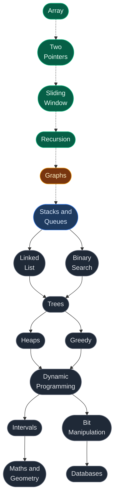

# DSA Notes

Structured notes for Data Structures & Algorithms.

Every problem note follows the same shape, so patterns stay comparable across topics:

Each approach carries commented Python and its own time/space analysis. Every note ends with a **Verify** block — the optimal solution plus asserts you can paste straight into a REPL.

## Topics

Counts are problems written, broken down by difficulty tier.

| # | Topic | Core Focus | Easy | Medium | Hard | Total | Status |
|:---:|:---|:---|:---:|:---:|:---:|:---:|:---:|
| 01 | [**Array**](01.%20Array/) | Prefix sums, Kadane, in-place rearrangement | 14 | 13 | 11 | **38** | Complete |
| 02 | [**Two Pointers**](02.%20Two%20pointers/) | Converging pointers, fast/slow, fix one + scan | 1 | 3 | 1 | **5** | Complete |
| 03 | Stacks and Queues | Monotonic stack, next greater element | – | – | – | – | Planned |
| 04 | [**Sliding Window**](04.%20Sliding%20window/) | Fixed/variable windows, at-most trick | 6 | 7 | 2 | **15** | Complete |
| 05 | Linked List | Reversal, cycle detection, merge | – | – | – | – | Planned |
| 06 | Binary Search | On answer space, rotated arrays | – | – | – | – | Planned |
| 07 | [**Recursion**](07.%20Recursion/) | Pick/not-pick, backtracking, constraints | 2 | 5 | 13 | **20** | Complete |
| 08 | Trees | Traversals, BST properties, LCA | – | – | – | – | Planned |
| 09 | Heaps | Top-K, merge K sorted, running median | – | – | – | – | Planned |
| 10 | Greedy | Interval scheduling, exchange argument | – | – | – | – | Planned |
| 11 | [**Graphs**](11.%20Graphs/) | BFS/DFS, cycle detection, bipartite | 4 | 14 | – | **18** | In progress |
| 12 | Dynamic Programming | 1D/2D states, knapsack, LIS | – | – | – | – | Planned |
| 13 | Maths and Geometry | Number theory, matrix rotation, GCD | – | – | – | – | Planned |
| 14 | Bit Manipulation | XOR tricks, masks, bit counting | – | – | – | – | Planned |
| 15 | Intervals | Merge, insert, overlap counting | – | – | – | – | Planned |
| 16 | Databases | Joins, window functions, aggregation | – | – | – | – | Planned |
| | **Total** | | **27** | **42** | **27** | **96** | |

## 01. Array

Foundation topic. Every later pattern — two pointers, sliding window, binary search — is first learned here.

**[Read the full Array guide →](01.%20Array/)** covers memory layout, operation costs, and every pattern with runnable code.

### Easy

| # | Problem | Difficulty | Key Idea | Time | Space |
|:---:|:---|:---:|:---|:---:|:---:|
| 1 | [Largest in Array](01.%20Array/01.%20Easy/01.%20Largest%20in%20Array.md) | Basic | Track the max seen so far in one scan | `O(n)` | `O(1)` |
| 2 | [Second Largest](01.%20Array/01.%20Easy/02.%20Second%20Largest.md) | Basic | Two trackers, demote before promote | `O(n)` | `O(1)` |
| 3 | [Array Search](01.%20Array/01.%20Easy/03.%20Array%20Search.md) | Basic | Linear scan, return index on match | `O(n)` | `O(1)` |
| 4 | [1752. Check if Array Is Sorted and Rotated](01.%20Array/01.%20Easy/04.%201752.%20Check%20if%20Array%20Is%20Sorted%20and%20Rotated.md) | Easy | Count the drops; at most one is allowed | `O(n)` | `O(1)` |
| 5 | [136. Single Number](01.%20Array/01.%20Easy/05.%20136.%20Single%20Number.md) | Easy | XOR cancels every pair, leaving the loner | `O(n)` | `O(1)` |
| 6 | [268. Missing Number](01.%20Array/01.%20Easy/06.%20268.%20Missing%20Number.md) | Easy | Expected sum minus actual sum, or XOR | `O(n)` | `O(1)` |
| 7 | [485. Max Consecutive Ones](01.%20Array/01.%20Easy/07.%20485.%20Max%20Consecutive%20Ones.md) | Easy | Running streak counter, reset on zero | `O(n)` | `O(1)` |
| 8 | [189. Rotate Array](01.%20Array/01.%20Easy/08.%20189.%20Rotate%20Array.md) | Medium | Reverse whole, then reverse both parts | `O(n)` | `O(1)` |
| 9 | [283. Move Zeroes](01.%20Array/01.%20Easy/09.%20283.%20Move%20Zeroes.md) | Easy | Slow pointer marks the next non-zero slot | `O(n)` | `O(1)` |
| 10 | [88. Merge Sorted Array](01.%20Array/01.%20Easy/10.%2088.%20Merge%20Sorted%20Array.md) | Easy | Fill from the back to avoid overwriting | `O(m+n)` | `O(1)` |
| 11 | [Longest Subarray with Sum K](01.%20Array/01.%20Easy/11.%20Longest%20Subarray%20with%20Sum%20K.md) | Medium | Prefix sum + first-seen index in a hashmap | `O(n)` | `O(n)` |
| 12 | [Largest subarray with 0 sum](01.%20Array/01.%20Easy/12.%20Largest%20subarray%20with%200%20sum.md) | Medium | Same prefix sum means zero in between | `O(n)` | `O(n)` |
| 13 | [Find Second Smallest and Second Largest](01.%20Array/01.%20Easy/13.%20Find%20Second%20Smallest%20and%20Second%20Largest%20Element%20in%20an%20Array.md) | Basic | Four trackers in a single pass | `O(n)` | `O(1)` |
| 14 | [First and Second Smallests](01.%20Array/01.%20Easy/14.%20First%20and%20Second%20Smallests.md) | Basic | Demote before promote | `O(n)` | `O(1)` |

### Medium

| # | Problem | Difficulty | Key Idea | Time | Space |
|:---:|:---|:---:|:---|:---:|:---:|
| 1 | [1. Two Sum](01.%20Array/02.%20Medium/01.%201.%20Two%20Sum.md) | Medium | Store complements; check before insert | `O(n)` | `O(n)` |
| 2 | [75. Sort Colors](01.%20Array/02.%20Medium/02.%2075.%20Sort%20Colors.md) | Medium | Dutch flag: three regions, one pass | `O(n)` | `O(1)` |
| 3 | [169. Majority Element](01.%20Array/02.%20Medium/03.%20169.%20Majority%20Element.md) | Easy | Pairwise cancellation leaves the majority | `O(n)` | `O(1)` |
| 4 | [53. Maximum Subarray](01.%20Array/02.%20Medium/04.%2053.%20Maximum%20Subarray.md) | Medium | Kadane: extend or restart at each element | `O(n)` | `O(1)` |
| 5 | [121. Best Time to Buy and Sell Stock](01.%20Array/02.%20Medium/05.%20121.%20Best%20Time%20to%20Buy%20and%20Sell%20Stock.md) | Easy | Track min price, best profit against it | `O(n)` | `O(1)` |
| 6 | [2149. Rearrange Array Elements by Sign](01.%20Array/02.%20Medium/06.%202149.%20Rearrange%20Array%20Elements%20by%20Sign.md) | Medium | Sign fixes the slot; cursors step by 2 | `O(n)` | `O(n)` |
| 7 | [31. Next Permutation](01.%20Array/02.%20Medium/07.%2031.%20Next%20Permutation.md) | Medium | Find pivot, swap successor, reverse suffix | `O(n)` | `O(1)` |
| 8 | [Array Leaders](01.%20Array/02.%20Medium/08.%20Array%20Leaders.md) | Easy | Running max scanning right to left | `O(n)` | `O(1)` |
| 9 | [128. Longest Consecutive Sequence](01.%20Array/02.%20Medium/09.%20128.%20Longest%20Consecutive%20Sequence.md) | Medium | Only walk runs from their head | `O(n)` | `O(n)` |
| 10 | [73. Set Matrix Zeroes](01.%20Array/02.%20Medium/10.%2073.%20Set%20Matrix%20Zeroes.md) | Medium | Row 0 and col 0 become the markers | `O(m*n)` | `O(1)` |
| 11 | [48. Rotate Image](01.%20Array/02.%20Medium/11.%2048.%20Rotate%20Image.md) | Medium | Two reflections compose to a rotation | `O(n^2)` | `O(1)` |
| 12 | [54. Spiral Matrix](01.%20Array/02.%20Medium/12.%2054.%20Spiral%20Matrix.md) | Medium | Shrink four boundaries layer by layer | `O(m*n)` | `O(1)` |
| 13 | [560. Subarray Sum Equals K](01.%20Array/02.%20Medium/13.%20560.%20Subarray%20Sum%20Equals%20K.md) | Medium | Count earlier prefix sums equal to sum - k | `O(n)` | `O(n)` |

### Hard

| # | Problem | Difficulty | Key Idea | Time | Space |
|:---:|:---|:---:|:---|:---:|:---:|
| 1 | [118. Pascal's Triangle](01.%20Array/03.%20Hard/01.%20118.%20Pascal%27s%20Triangle.md) | Easy | Each row is built from the row above | `O(n^2)` | `O(1)` |
| 2 | [229. Majority Element II](01.%20Array/03.%20Hard/02.%20229.%20Majority%20Element%20II.md) | Medium | Two candidates; verification is mandatory | `O(n)` | `O(1)` |
| 3 | [15. 3Sum](01.%20Array/03.%20Hard/03.%2015.%203Sum.md) | Medium | Fix one, scan the rest, skip duplicates | `O(n^2)` | `O(1)` |
| 4 | [18. 4Sum](01.%20Array/03.%20Hard/04.%2018.%204Sum.md) | Medium | kSum: each fixed element adds a loop | `O(n^3)` | `O(1)` |
| 5 | [Count Subarrays with given XOR](01.%20Array/03.%20Hard/05.%20Count%20Subarrays%20with%20given%20XOR.md) | Hard | Need prefix ^ k, since XOR is its own inverse | `O(n)` | `O(n)` |
| 6 | [56. Merge Intervals](01.%20Array/03.%20Hard/06.%2056.%20Merge%20Intervals.md) | Medium | Sort by start, extend the running block | `O(n log n)` | `O(n)` |
| 7 | [88. Merge Sorted Array](01.%20Array/03.%20Hard/07.%2088.%20Merge%20Sorted%20Array.md) | Easy | Never overwrite unread data | `O(m+n)` | `O(1)` |
| 8 | [Missing And Repeating](01.%20Array/03.%20Hard/08.%20Missing%20And%20Repeating.md) | Hard | Two equations recover both unknowns | `O(n)` | `O(1)` |
| 9 | [Count Inversions](01.%20Array/03.%20Hard/09.%20Count%20Inversions.md) | Hard | Count a whole left block per comparison | `O(n log n)` | `O(n)` |
| 10 | [493. Reverse Pairs](01.%20Array/03.%20Hard/10.%20493.%20Reverse%20Pairs.md) | Hard | Count in a separate pass before merging | `O(n log n)` | `O(n)` |
| 11 | [152. Maximum Product Subarray](01.%20Array/03.%20Hard/11.%20152.%20Maximum%20Product%20Subarray.md) | Medium | A negative swaps the running max and min | `O(n)` | `O(1)` |

## 02. Two Pointers

Two indices moving under a rule, replacing a nested loop. The hard part is proving the pointer you move can be discarded safely.

**[Read the full Two Pointers guide →](02.%20Two%20pointers/)** covers all four forms and the correctness argument for each.

| # | Tier | Problem | Difficulty | Key Idea | Time | Space |
|:---:|:---:|:---|:---:|:---|:---:|:---:|
| 1 | Basics | [125. Valid Palindrome](02.%20Two%20pointers/01.%20Basics/01.%20125.%20Valid%20Palindrome.md) | Easy | Skip non-alphanumerics, compare inward | `O(n)` | `O(1)` |
| 2 | Medium | [15. 3Sum](02.%20Two%20pointers/02.%20Medium/01.%2015.%203Sum.md) | Medium | Sort, fix one, two-pointer the rest | `O(n^2)` | `O(1)` |
| 3 | Medium | [167. Two Sum II](02.%20Two%20pointers/02.%20Medium/02.%20167.%20Two%20Sum%20II%20-%20Input%20Array%20Is%20Sorted.md) | Medium | Sortedness makes each move decidable | `O(n)` | `O(1)` |
| 4 | Medium | [11. Container With Most Water](02.%20Two%20pointers/02.%20Medium/03.%2011.%20Container%20With%20Most%20Water.md) | Medium | Always move the shorter line | `O(n)` | `O(1)` |
| 5 | Hard | [42. Trapping Rain Water](02.%20Two%20pointers/03.%20Hard/01.%2042.%20Trapping%20Rain%20Water.md) | Hard | Process the smaller side; its max bounds it | `O(n)` | `O(1)` |

## 04. Sliding Window

Two pointers bound a region that grows right and shrinks left. Turns `O(n^2)` subarray scans into one `O(n)` pass.

**[Read the full Sliding Window guide →](04.%20Sliding%20window/)** covers both window shapes, the universal skeleton, and the at-most trick.

| # | Tier | Problem | Difficulty | Key Idea | Time | Space |
|:---:|:---:|:---|:---:|:---|:---:|:---:|
| 1 | Intro | [Introduction to Sliding Window](04.%20Sliding%20window/01.%20Introduction/01.%20Introduction%20to%20Sliding%20Window.md) | – | The technique end to end | – | – |
| 2 | Basic | [1423. Maximum Points from Cards](04.%20Sliding%20window/02.%20Basic/01.%201423.%20Maximum%20Points%20You%20Can%20Obtain%20from%20Cards.md) | Medium | Taking both ends = leaving a middle window | `O(n)` | `O(1)` |
| 3 | Basic | [3. Longest Substring Without Repeating Characters](04.%20Sliding%20window/02.%20Basic/02.%203.%20Longest%20Substring%20Without%20Repeating%20Characters.md) | Medium | Jump `left` with a `max` guard | `O(n)` | `O(min(n,charset))` |
| 4 | Basic | [1004. Max Consecutive Ones III](04.%20Sliding%20window/02.%20Basic/03.%201004.%20Max%20Consecutive%20Ones%20III.md) | Medium | "Flip k zeroes" = "at most k zeroes" | `O(n)` | `O(1)` |
| 5 | Basic | [904. Fruit Into Baskets](04.%20Sliding%20window/02.%20Basic/04.%20904.%20Fruit%20Into%20Baskets.md) | Medium | Story for "at most 2 distinct" | `O(n)` | `O(1)` |
| 6 | Basic | [209. Minimum Size Subarray Sum](04.%20Sliding%20window/02.%20Basic/05.%20209.%20Minimum%20Size%20Subarray%20Sum.md) | Medium | Minimising: record inside the shrink | `O(n)` | `O(1)` |
| 7 | Basic | [713. Subarray Product Less Than K](04.%20Sliding%20window/02.%20Basic/06.%20713.%20Subarray%20Product%20Less%20Than%20K.md) | Medium | Valid window adds `right - left + 1` | `O(n)` | `O(1)` |
| 8 | At Most | [340. At Most K Distinct Characters](04.%20Sliding%20window/03.%20At%20Most/01.%20340.%20Longest%20Substring%20With%20At%20Most%20K%20Distinct%20Characters.md) | Medium | The parent count-map template | `O(n)` | `O(k)` |
| 9 | At Most | [159. At Most Two Distinct Characters](04.%20Sliding%20window/03.%20At%20Most/02.%20159.%20Longest%20Substring%20with%20At%20Most%20Two%20Distinct%20Characters.md) | Medium | The `k = 2` instance of 340 | `O(n)` | `O(1)` |
| 10 | Trick | [930. Binary Subarrays With Sum](04.%20Sliding%20window/04.%20At%20Most%20Trick/01.%20930.%20Binary%20Subarrays%20With%20Sum.md) | Medium | `exactly(k) = atMost(k) - atMost(k-1)` | `O(n)` | `O(1)` |
| 11 | Trick | [1248. Count Number of Nice Subarrays](04.%20Sliding%20window/04.%20At%20Most%20Trick/02.%201248.%20Count%20Number%20of%20Nice%20Subarrays.md) | Medium | Map odd to 1, even to 0, becomes 930 | `O(n)` | `O(1)` |
| 12 | Trick | [992. Subarrays with K Different Integers](04.%20Sliding%20window/04.%20At%20Most%20Trick/03.%20992.%20Subarrays%20with%20K%20Different%20Integers.md) | Hard | Same trick over the count-map template | `O(n)` | `O(k)` |
| 13 | Repeating | [1358. Substrings Containing All Three Characters](04.%20Sliding%20window/05.%20Repeating%20Characters/01.%201358.%20Number%20of%20Substrings%20Containing%20All%20Three%20Characters.md) | Medium | Add `min(last_a, last_b, last_c) + 1` | `O(n)` | `O(1)` |
| 14 | Repeating | [424. Longest Repeating Character Replacement](04.%20Sliding%20window/05.%20Repeating%20Characters/02.%20424.%20Longest%20Repeating%20Character%20Replacement.md) | Medium | Valid when `size - max_freq <= k` | `O(n)` | `O(1)` |
| 15 | Hard | [76. Minimum Window Substring](04.%20Sliding%20window/06.%20Hard/01.%2076.%20Minimum%20Window%20Substring.md) | Hard | `have == required` counter | `O(n+m)` | `O(charset)` |

## 07. Recursion

One question repeated at every level: what are my choices here, and which do I try next? This topic builds from the call stack up through pick/not-pick to full backtracking with constraints.

**[Read the full Recursion guide →](07.%20Recursion/)** covers the call stack, the pick/not-pick pattern, the duplicate-skip trick, grid backtracking, and constraint backtracking.

| # | Tier | Note / Problem | Difficulty | Key Idea |
|:---:|:---:|:---|:---:|:---|
| 1 | Intro | [Introduction to Recursion](07.%20Recursion/01.%20Introduction/01.%20Introduction%20to%20Recursion.md) | – | Call stack, base case, stack overflow |
| 2 | Intro | [Problems on Recursion](07.%20Recursion/01.%20Introduction/02.%20Problems%20on%20Recursion.md) | – | Normal order vs backtracking order |
| 3 | Intro | [Parameterized and Functional Recursion](07.%20Recursion/01.%20Introduction/03.%20Parameterized%20and%20Functional%20Recursion.md) | – | Answer as parameter vs return value |
| 4 | Intro | [Problems on Functional Recursion](07.%20Recursion/01.%20Introduction/04.%20Problems%20on%20Functional%20Recursion.md) | – | Worked functional-recursion problems |
| 5 | Intro | [Multiple Recursion Calls](07.%20Recursion/01.%20Introduction/05.%20Multiple%20Recursion%20Calls.md) | – | Branching recursion, Fibonacci, memoization |
| 6 | Intro | [Recursion on Subsequences](07.%20Recursion/01.%20Introduction/06.%20Recursion%20on%20Subsequences.md) | – | Pick/not-pick — the topic's core pattern |
| 7 | Intro | [All Kinds of Patterns in Recursion](07.%20Recursion/01.%20Introduction/07.%20All%20Kinds%20of%20Patterns%20in%20Recursion.md) | – | Taxonomy: print-all, find-one, count |
| 8 | Standard | [39. Combination Sum](07.%20Recursion/02.%20Standard%20Problems/01.%2039.%20Combination%20Sum.md) | Medium | Pick keeps the same index |
| 9 | Standard | [40. Combination Sum II](07.%20Recursion/02.%20Standard%20Problems/02.%2040.%20Combination%20Sum%20II.md) | Medium | Sort + skip-siblings dedup |
| 10 | Standard | [Subset Sums](07.%20Recursion/02.%20Standard%20Problems/03.%20Subset%20Sums.md) | Easy | Collect the sum at every leaf |
| 11 | Standard | [78. Subsets](07.%20Recursion/02.%20Standard%20Problems/04.%2078.%20Subsets.md) | Medium | Pure pick/not-pick, `2^n` leaves |
| 12 | Standard | [90. Subsets II](07.%20Recursion/02.%20Standard%20Problems/05.%2090.%20Subsets%20II.md) | Medium | Subsets plus duplicate-skip |
| 13 | Standard | [46. Permutations](07.%20Recursion/02.%20Standard%20Problems/06.%2046.%20Permutations.md) | Medium | Try every unused element per position |
| 14 | Standard | [47. Permutations II](07.%20Recursion/02.%20Standard%20Problems/07.%2047.%20Permutations%20II.md) | Medium | `not used[i-1]` dedup |
| 15 | Hard | [131. Palindrome Partitioning](07.%20Recursion/03.%20Hard%20Problems/01.%20131.%20Palindrome%20Partitioning.md) | Medium | Try every palindromic prefix |
| 16 | Hard | [79. Word Search](07.%20Recursion/03.%20Hard%20Problems/02.%2079.%20Word%20Search.md) | Medium | Grid DFS, mark and restore |
| 17 | Hard | [51. N-Queens](07.%20Recursion/03.%20Hard%20Problems/03.%2051.%20N-Queens.md) | Hard | O(1) column/diagonal safety check |
| 18 | Hard | [Rat in a Maze](07.%20Recursion/03.%20Hard%20Problems/04.%20Rat%20in%20a%20Maze.md) | Hard | Grid DFS, all valid paths |
| 19 | Hard | [M-Coloring Problem](07.%20Recursion/03.%20Hard%20Problems/05.%20M-Coloring%20Problem.md) | Hard | Graph constraint backtracking |
| 20 | Hard | [Sudoku Solver](07.%20Recursion/03.%20Hard%20Problems/06.%20Sudoku%20Solver.md) | Hard | Boolean propagation stops at one solution |
| 21 | Hard | [Expression Add Operators](07.%20Recursion/03.%20Hard%20Problems/07.%20Expression%20Add%20Operators.md) | Hard | Split + operator choice |

## 11. Graphs

The most general structure in the sheet — arrays, lists, and trees are all restricted graphs. Nearly every problem here is BFS or DFS wearing a different costume.

**[Read the full Graphs guide →](11.%20Graphs/)** covers representations, BFS vs DFS, multi-source BFS, the reversed-thinking trick, and cycle detection for both undirected and directed graphs.

| # | Tier | Note / Problem | Difficulty | Key Idea |
|:---:|:---:|:---|:---:|:---|
| 1 | Intro | [Introduction to Graphs](11.%20Graphs/01.%20Introductions/01.%20Introduction%20to%20Graphs.md) | – | Vertices, edges, representations |
| 2 | Intro | [Connected Components in Graphs](11.%20Graphs/01.%20Introductions/02.%20Connected%20Components%20in%20Graphs.md) | – | What a component is |
| 3 | Intro | [Breadth First Search](11.%20Graphs/01.%20Introductions/03.%20Breadth%20First%20Search.md) | – | Queue-based level-order traversal |
| 4 | Intro | [Depth First Search](11.%20Graphs/01.%20Introductions/04.%20Depth%20First%20Search.md) | – | Stack/recursion-based traversal |
| 5 | BFS/DFS | [547. Number of Provinces](11.%20Graphs/02.%20BFS%20and%20DFS/01.%20547.%20Number%20of%20Provinces.md) | Medium | Count connected components on a matrix |
| 6 | BFS/DFS | [200. Number of Islands](11.%20Graphs/02.%20BFS%20and%20DFS/02.%20200.%20Number%20of%20Islands.md) | Medium | Components on a grid |
| 7 | BFS/DFS | [733. Flood Fill](11.%20Graphs/02.%20BFS%20and%20DFS/03.%20733.%20Flood%20Fill.md) | Easy | Same traversal, painting instead of counting |
| 8 | BFS/DFS | [994. Rotten Oranges](11.%20Graphs/02.%20BFS%20and%20DFS/04.%20994.%20Rotten%20Oranges.md) | Medium | Multi-source BFS, one level per minute |
| 9 | BFS/DFS | [Detect Cycle — Undirected, BFS](11.%20Graphs/02.%20BFS%20and%20DFS/05.%20Detect%20Cycle%20in%20an%20Undirected%20Graph%20using%20BFS.md) | Medium | Track (node, parent) pairs |
| 10 | BFS/DFS | [Detect Cycle — Undirected, DFS](11.%20Graphs/02.%20BFS%20and%20DFS/06.%20Detect%20Cycle%20in%20an%20Undirected%20Graph%20using%20DFS.md) | Medium | Same idea, recursive |
| 11 | BFS/DFS | [542. 01 Matrix](11.%20Graphs/02.%20BFS%20and%20DFS/07.%20542.%2001%20Matrix.md) | Medium | Multi-source BFS from every zero |
| 12 | BFS/DFS | [130. Surrounded Regions](11.%20Graphs/02.%20BFS%20and%20DFS/08.%20130.%20Surrounded%20Regions.md) | Medium | Reversed: mark from the border inward |
| 13 | BFS/DFS | [1020. Number of Enclaves](11.%20Graphs/02.%20BFS%20and%20DFS/09.%201020.%20Number%20of%20Enclaves.md) | Medium | Same trick, count instead of flip |
| 14 | BFS/DFS | [Number of Distinct Islands](11.%20Graphs/02.%20BFS%20and%20DFS/10.%20Number%20of%20Distinct%20Islands.md) | Medium | Normalize shape to relative coordinates |
| 15 | BFS/DFS | [785. Is Graph Bipartite (BFS)](11.%20Graphs/02.%20BFS%20and%20DFS/11.%20785.%20Is%20Graph%20Bipartite%20%28BFS%29.md) | Medium | 2-coloring via BFS |
| 16 | BFS/DFS | [785. Is Graph Bipartite (DFS)](11.%20Graphs/02.%20BFS%20and%20DFS/12.%20785.%20Is%20Graph%20Bipartite%20%28DFS%29.md) | Medium | Same 2-coloring, recursive |
| 17 | BFS/DFS | [Detect Cycle in a Directed Graph](11.%20Graphs/02.%20BFS%20and%20DFS/13.%20Detect%20Cycle%20in%20a%20Directed%20Graph%20using%20DFS.md) | Medium | visited + path_visited, back-edge vs cross-edge |
| 18 | BFS/DFS | [802. Find Eventual Safe States](11.%20Graphs/02.%20BFS%20and%20DFS/14.%20802.%20Find%20Eventual%20Safe%20States.md) | Medium | Same machinery, memoized per node |
